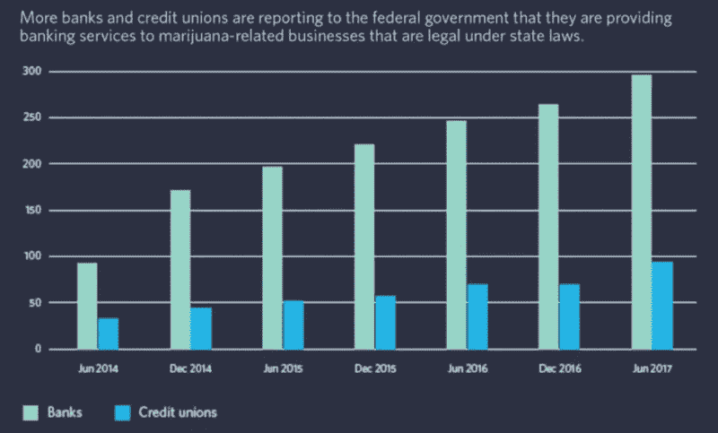

# 大麻 IPO 增长的三大催化剂

> 原文：<https://medium.com/hackernoon/three-catalysts-for-the-growth-of-cannabis-ipos-4b84e72120e6>

随着数百万美元的大麻已经流入美国和加拿大的证券交易所，新的基金和投资者进入这个领域，以及人们对娱乐性大麻日益合法化的兴奋，我们看到全球投资者对投资美国[大麻](https://hackernoon.com/tagged/cannabis)市场的强烈兴趣。

尽管美国的主要交易所有严格的上市要求，包括收入和市值障碍，但我们预计在不久的将来会看到越来越多的交易突破美国主要交易所的界限。可能对 IPO 产生真正影响的三个催化剂是:越来越多的银行欢迎大麻业务，纽约和新泽西即将到来的合法化，以及加拿大公共市场的日益成功:

# 一、越来越多的银行欢迎大麻业务:

自 2017 年初以来，积极为大麻行业提供银行服务的银行和信用社数量增加了约 18%，全国范围内从 340 家增加到 400 多家。虽然很少有机构和当地银行会宣传愿意接受大麻客户，但许多机构和银行确实与大麻相关的公司悄悄合作。

# 二。新泽西州即将到来的合法化将给纽约带来压力:

随着娱乐性大麻销售将于今年夏天在马萨诸塞州开始，以及即将上任的新泽西州州长菲尔·墨菲(Phil Murphy)准备尽快使大麻合法化，很有可能数十万纽约人很快就会进行某种逆向通勤——开车或乘火车去郊区购买合法大麻。纽约州州长安德鲁·科莫(Andrew Cuomo)最近呼吁由卫生部牵头进行一项由州政府资助的研究，探索大麻合法化对该州及其邻国的金融、医疗和社会影响。科莫已经表示，他对将娱乐性使用大麻合法化作为主要收入来源的想法持开放态度，这一想法将推动越来越多的 IPO，并将美国推向联邦合法化的边缘。

# 三。争夺美国交易的加拿大公开市场:

严格的监管和对美国联邦干预的担忧，使得加拿大交易所对美国大麻公司颇具吸引力。随着今年加拿大全国合法化的到来，加拿大公开市场提供了获得大量资本的途径，比美国交易所更具确定性和速度。随着越来越多的美国大麻公司寻求在加拿大上市，希望投资美国大麻的全球投资者现在正通过加拿大进行投资。这是美国要输的游戏。

额外收获:以下是北美四只市值达到至少 20 亿美元的顶级大麻股票，请密切关注。，[阿弗利亚公司](https://theblincgroup.us16.list-manage.com/track/click?u=f47489e8153e09b31ed9263d4&id=933678f1dc&e=ac4201bc6b)。、[树冠生长](https://theblincgroup.us16.list-manage.com/track/click?u=f47489e8153e09b31ed9263d4&id=dfa5c26a3a&e=ac4201bc6b)、[极光大麻](https://theblincgroup.us16.list-manage.com/track/click?u=f47489e8153e09b31ed9263d4&id=353b53d305&e=ac4201bc6b)