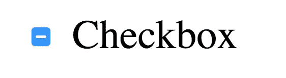
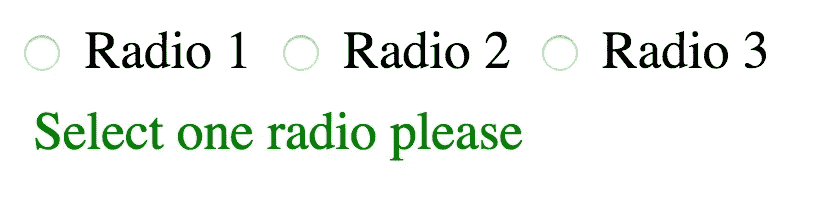
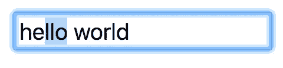

# 我在阅读 MDN 时发现的三个输入元素属性

> 原文：<https://medium.com/hackernoon/three-input-element-properties-that-i-discovered-while-reading-mdn-662ee0b4f17c>

最近我在读推特，无意中发现了丹·阿布拉莫夫的一条推文。他分享的一小段代码引起了我的注意。它包含一些 JavaScript，这些 JavaScript 从 DOM ( [文档对象模型](https://developer.mozilla.org/en-US/docs/Web/API/Document_Object_Model))中访问输入元素，并读取或更改它的一些属性。让我感到兴奋和惊讶的是房产`defaultValue`。

我立即打开 [MDN](https://hackernoon.com/tagged/mdn) 来阅读更多关于`HTTMLInputElements`的属性，并偶然发现了一些我不知道的属性，这促使我写了这篇短文。

所以我们开始吧！

# `defaultValue`

这是 Dan 的 Tweet 示例——让我们快速浏览一下，假设您有一些 HTML，并查询一个定义了`value`属性(属性在 HTML 中定义，而属性属于 JavaScript 对象)的 input 元素。

```
<input type="text" value="Hello world">
```

你现在可以抓住这个元素，开始摆弄它。

```
const input = document.querySelector('input'); console.log(input.value);        // 'Hello world'
input.value = 'New value';
console.log(input.value);        // 'New value' console.log(input.defaultValue); // 'Hello world'
```

正如您看到的，属性`value`中定义的值最初反映在元素属性`value`中。我完全理解。当您现在更改`value`时，您仍然可以使用`defaultValue`访问“初始值”(复选框`defaultChecked`也可用)。相当酷！

[对于`defaultValue`的 MDN 定义](https://developer.mozilla.org/en-US/docs/Web/API/HTMLInputElement#Properties)如下:

> *[It]返回/设置创建该对象的 HTML 中最初指定的默认值。*

如果你愿意，你可以在 [a CodePen](https://codepen.io/stefanjudis/pen/eLvMMx) 中摆弄代码。

# `indeterminate`

这个`indeterminate`属性很吸引人。您知道复选框除了选中和未选中之外，还可以有一个额外的可视状态吗？`indeterminate`是一个属性(它没有属性),您可以使用它将这个小破折号放入您可能经常看到的复选框中。

```
const input = document.querySelector('input');
input.indeterminate = true;
```



将`indeterminate`设置为`true`对 checkbox 的值没有任何影响，我能想到的唯一合理的用例是嵌套的 checkbox，就像 [Chris Coyier 在 CSSTricks](https://css-tricks.com/indeterminate-checkboxes/) 上描述的那样。

`indeterminate`虽然不仅仅适用于复选框。它也可以用于单选按钮和进度元素。让我们看一组单选按钮，其中没有单选按钮被选中。当您没有预选一组单选按钮中的一个元素时，它们都没有被选中，也没有被选中——因此它们都处于`indeterminate`状态。

酷的是，你还可以使用 CSS 伪类`:indeterminate`伪类来选择元素，当一个组中没有单选按钮被选中时，这可以方便地显示特定的 UI 组件。



```
.msg {
  display: none;
}input:indeterminate ~ .msg {
  display: block;
}
```

关于属性`indeterminate`有趣的是，您可以将它设置为`true`或`false`，这将影响复选框的伪类，但不会影响单选按钮的伪类。**处理单选按钮一组的实际选择状态总是正确的**。

为了完整起见，只提一下进度元素[当它们没有定义`value`属性时](https://developer.mozilla.org/de/docs/Web/HTML/Element/progress)也会匹配一个包含`:indeterminate`的选择器。

[对于`indeterminate`的 MDN 定义](https://developer.mozilla.org/en-US/docs/Web/API/HTMLInputElement#Properties)如下:

> *【It】表示复选框或单选按钮没有值，处于不确定状态。复选框将外观更改为类似于第三种状态。不会影响选中属性的值，单击复选框会将该值设置为 false。*

如果你愿意，你可以在 [a CodePen](https://codepen.io/stefanjudis/pen/WgpzYy) 中摆弄代码。

# `selectionStart`、`selectionEnd`和`selectionDirection`

这三个属性可以用来判断用户选择了什么，使用起来非常简单。如果用户选择了输入字段中的文本，您可以使用这些来评估所选择的内容。



```
const input = document.querySelector('input');setInterval( _ => {
  console.log(
    input.selectionStart,
    input.selectionEnd,
    input.selectionDirection;
  ); // e.g. 2, 5, "forward"
}, 1000);
```

为了测试这一点，我定义了一个间隔，每秒记录一次选择值。`selectionStart`和`selectionEnd`返回描述我的选择位置的数字，但是当你用鼠标或触控板选择东西时`selectionDirection`意外地返回`none`，而当你用 SHIFT 和箭头键或控制键选择文本时则返回`forward`或`backward`。

如果你愿意，你可以在 [a CodePen](https://codepen.io/stefanjudis/pen/yxMjWe) 中摆弄代码。

仅此而已。:)

# 快速(和简短)的结论

MDN 是一个不可思议的资源。即使在使用`input`元素八年后，现在总有新的东西要发现，这就是我喜欢 web 开发的原因。就我个人而言，我尝试定期阅读随机的 MDN 文章(我有一个每日 Slack-bot 提醒我打开[bit.ly/randommdn](http://bit.ly/randommdn))因为总有东西可以发现，我只能强烈推荐它！

感谢阅读！❤️

*原载于*[*www.stefanjudis.com*](https://www.stefanjudis.com/blog/three-input-element-properties-that-i-discovered-while-reading-mdn/)*。*