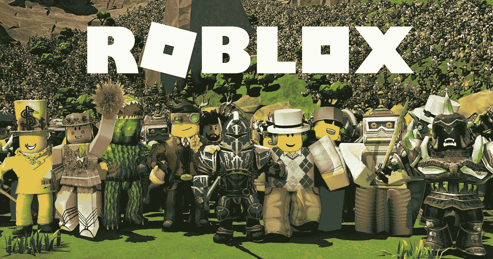
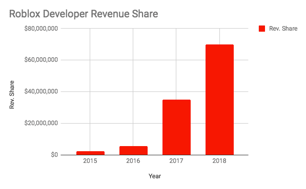
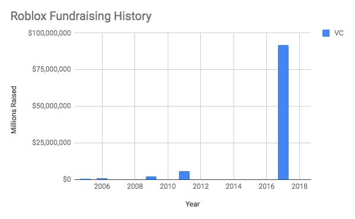

# 从 Roblox 的 24 亿美元估值中学到的三个教训

> 原文：<https://medium.com/hackernoon/three-lessons-learned-from-robloxs-2-4b-valuation-56c2d6689677>

*由* [到*约瑟夫*到](https://twitter.com/josephflaherty)

[14 岁的 Roblox](https://www.roblox.com/) ，[比《我的世界》](https://www.commonsensemedia.org/blog/minecraft-vs-roblox-how-these-games-stack-up-for-kids)稍微更社会化，稍微更成熟的替代者，去年掀起了波澜，当时它筹集了[9200 万美元的资金](https://techcrunch.com/2017/03/14/roblox-nabs-92-million-to-power-its-massive-social-gaming-platform-for-kids/)，现在，据报道，该公司正在以[24 亿美元的估值](http://www.businessinsider.com/roblox-developers-conference-developer-payout-2018-7)筹集新一轮资金。显然有些东西在起作用——这款游戏受到数百万玩家的喜爱，已经成为 400 万开发者的平台，他们已经制作了 4000 万款游戏，同时也在这个过程中造就了一些青少年百万富翁。

[Founder Collective](http://www.foundercollective.com/) 不是 Roblox 的投资者，但该公司的成功有几个值得研究的因素:

# 想法不是决定性的

Roblox 成立于 2005 年，比《我的世界》被释放整整早了四年。如果创意真的像创业生态系统中的许多人认为的那样具有决定性，那么 Roblox 应该彻底“获胜”。相反，《我的世界》引起了共鸣，并在短时间内从实验到数十亿美元的收购。

“观念神话”的信徒也倾向于认为市场是赢家通吃，但 Roblox 也是对这一理论的驳斥。尽管有很大程度上重叠的功能集，以及一个在公众认知中领先的竞争对手，但迄今为止，“数字乐高”的简单想法已被证明足以启动两家数十亿美元的初创公司。

# 产品先于平台

对于开发者来说，Roblox 已经成为一个令人印象深刻的平台，但该公司直到 2015 年才开始向开发者提供收入分成安排，这是它成立十年后的事情。在 Roblox 成为一个平台之前，它有一个单人游戏模式，这使它能够吸引其目前 6400 万用户中的第一批。该公司声称将在 2018 年向开发者支付 7000 万美元，而 2015 年仅为 250 万美元。 [Eric Paley](https://twitter.com/epaley) 以前写过“[平台悖论](https://techcrunch.com/2015/11/28/the-platform-paradox/)”的文章，但要点是公司在试图成为平台之前应该专注于解决具体问题，这似乎是 Roblox 体现的原则。

# 资金不是制约因素

在运营的头 12 年里，Roblox 仅筹集了 950 万美元。大多数初创公司会在仅仅 18 个月的时间里投入如此规模的 A 轮融资。Roblox 和《我的世界》一起提醒人们，即使在收购成本很高的典型资本密集型行业，也可以用很少的资本创造巨大的价值。通过避免“[有毒风险投资](https://techcrunch.com/2017/10/26/toxic-vc-and-the-marginal-dollar-problem/)的副作用，Roblox 能够加入 Unity、Mojang、LootCrate 和其他游戏相关公司，这些公司在[筹集到一大笔资金](https://hackernoon.com/50-big-companies-that-started-with-little-or-no-money-4ef1b68aac25)之前已经变得很大了。

祝贺 Roblox 团队，以及我们在第一轮资本公司的朋友们，用反文化的方式来提升资本！