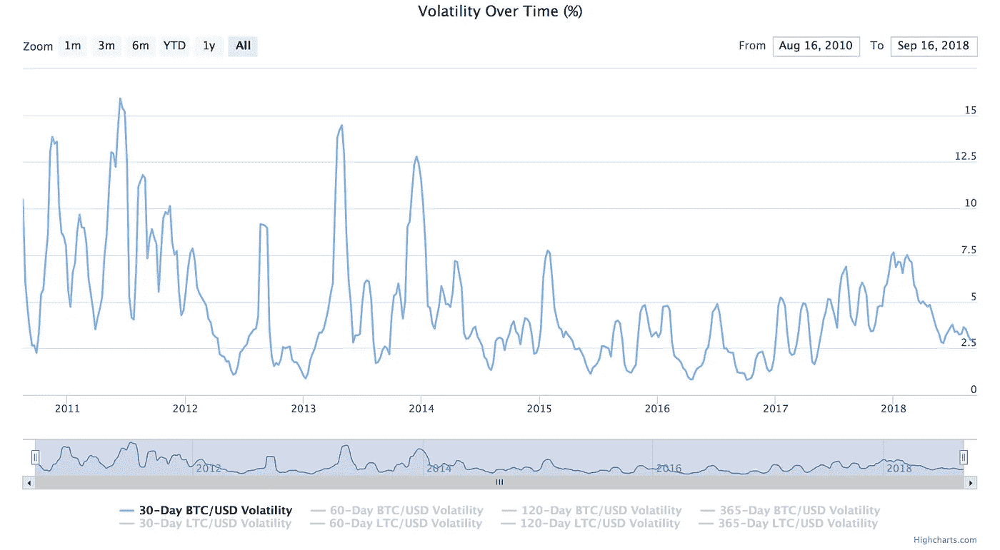
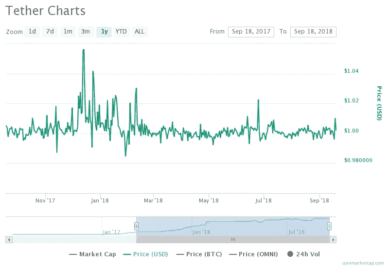

# 加密货币成为货币的三大障碍

> 原文：<https://medium.com/hackernoon/three-main-challenges-for-cryptocurrencies-becoming-money-82af828f907a>

世界上任何当前或未来的加密货币都能成为成功的货币吗？

(我们只考虑私人创建的无许可加密货币，即不由任何人都可以维护其分类账的国家创建的加密货币)

我们需要考虑我们成功的标准是什么，但是定义什么是金钱本身就有问题。有一个“金钱”的滑动尺度，而不是金钱和非金钱之间的离散划分。例如，钻石首饰可以像金钱一样具有属性，因为它是流动的，所以人们可以接受它作为支付手段，并很容易将其转换成现金。

我们在这篇文章中考虑的成功的粗略标准是国家货币的水平。这是许多[加密货币](https://hackernoon.com/tagged/cryptocurrency)社区的人对加密技术的未来抱有的雄心。

为了理解货币的基本要求，让我们先来看看货币的标准:

1.  **价值储存**:这是对我的钱在未来能够购买大致相同数量的商品和服务的预期，也就是说，它保持其购买力。
2.  **交易媒介**:货币可以用来促进双方的贸易。如果没有货币作为交换媒介，人们将不得不用一种确切数量的商品交换另一种确切数量的商品，这就需要经济学家所说的“需求的双重巧合”。
3.  **记账单位**:这是指我们可以用货币来有一个数字尺度。例如，我们用 s(或任何其他货币)来给所有东西定价，这包括商品、服务、公司账目和债务。货币是我们在经济中使用的单位。

现在，考虑到这些基本标准，我们可以看看加密货币现在和未来成为成功货币所面临的主要障碍。

加密货币在未来要像货币一样成功将面临的主要挑战是:

1.  **波动性**
2.  **可扩展性**
3.  **与现有资金的网络效应竞争**

我们将依次讨论这些问题，看看为什么它们是一个重大挑战，以及为克服这些挑战可以做什么和不可以做什么。

# 1.波动性障碍

这是加密货币最受关注的问题之一。

高波动性是不好的，因为它使加密货币无法成为一种良好的记账单位或价值储存手段。

根据定义，货币的价值储存功能受到高波动性的影响。这是不好的，因为如果一笔钱的波动性非常高，那么接受这笔钱作为付款的代理人就会因波动性而冒很大的金融风险，这总体上使得这笔钱对现实世界的代理人来说吸引力小得多。

货币的记账单位功能受到高波动性的损害，因为以这种加密货币计价的所有东西的价格水平都必须以不切实际的高速度变化。对于互联网上少数接受比特币或其他加密货币支付的网站来说，记账单位几乎都不是这些加密货币。相反，如果它是一家美国公司，帐户单位将是美元，网站上将提供大约 10 分钟的比特币价格更新，方法是查看最新的美元到比特币的转换，然后乘以美元价格。

例如，一个服装网站想在其网站上销售一件衣服，以获得足够的利润。它知道这是 20 美元，但由于比特币的高波动性，它不知道它应该是多少比特币。因此，如果有人想用比特币购买礼服，网站将使用最新的美元到比特币的转换来收取适量的比特币。这意味着在这样的网站上运行的比特币依赖于美元的记账单位，因为它本身无法成为有效的记账单位。

这种使用另一种货币作为记账单位，然后购买加密货币的依赖将加密货币归入支付轨道，一些人将其称为*支付加密资产*。支付加密资产是一种不同的 T4 货币，它们的吸引力在于提供比万事达卡或维萨卡更低的费用和更快的交易，波动性也不是那么重要，因为你不会长期持有支付加密资产。

## 这个波动性问题的解决方案是什么？

一个潜在的解决方案是希望随着加密货币成为主流和安全的用户采用，它们将在市场本身变得稳定。

另一个解决方案是创造 *stablecoins、*加密货币，其中内置了减少波动的设计结构。

第一个提出的解决方案我们称之为“*成熟抑制效应”。*经常给这个论点的论据如下:

加密货币仍然是新兴技术。它们的未来使用和采用存在很大的不确定性，因此，高波动性是完全自然的，因为市场信息的微小更新将导致市场预期的巨大变化。一旦占主导地位的加密货币出现并被所有将使用它们的人采用，它们将达到饱和点，这将使它们的价格变得更加稳定。

比特币的波动有一些令人鼓舞的轨迹。从下图中，我们可以看到波动性随着时间的推移有所下降:

Bitcoin 30 day volatility, Source:[https://bitvol.info](https://bitvol.info)

成熟度抑制论点的一个问题是，加密货币要开始被越来越多的人用作货币/交易手段，它必须已经具有低波动性，但为了具有低波动性，它必须获得更大的接受度。这似乎是一个难以克服的怪圈。

在最好的情况下，加密货币被设计成具有固定的可预测供应(如比特币和比特币分叉)，我们可以希望价格稳定的水平类似于固定供应的商品，如黄金或石油。然而，正如科宁和萨姆斯指出的那样，黄金和石油可能会有更高程度的价格稳定性，因为市场上有对价格变化做出反应的反馈机制。例如，如果黄金价格上涨，更多的努力将被投入到黄金的挖掘中，从而供应增加更多，这具有抑制价格上涨的效果。比特币没有这种机制，因此，其波动性可能注定要高于黄金或石油等固定供应商品。

稳定的债券可能是克服波动性问题的最大希望。然而，到目前为止，稳定的铜币的历史是混合的，通常在 1:1 的目标价格附近有相当大的波动。

Source: Coinmarketcap.com

人们也不信任这些稳定的收入，并且担心这些系统的激励兼容性。

未来或当前的 stablecoins 迭代将需要许多年才能出现，然后继续建立自己的可靠稳定性，使它们变得足够吸引人使用。

然而，请注意，那些试图通过与美元 1:1 平价来确立自己稳定地位的稳定货币，正在放弃拥有自己的记账单位。他们将自己与美元捆绑在一起，将自己降级为一种电子货币，就像你在贝宝账户中的钱一样。如果美元屈服于恶性通货膨胀，稳定的货币将与美元保持稳定的关系，但与经济中的其他商品不稳定。

一种依赖于使用美元或其他货币作为记账单位的稳定货币，远不如一种真正独立的加密货币那样具有革命性。

# 2.可伸缩性障碍

目前，由于当前的技术限制，所有去中心化的加密货币都无法有效扩展。我们所说的有效规模是指大幅增加交易量，而对交易速度和交易成本的影响可以忽略不计。

困难在很大程度上来自于加密货币，他们选择袖手旁观，通过无许可的区块链实现网络去中心化的承诺(正如我们在开始时所说，这些是我们在这里考虑的唯一加密货币)。XRP 等许多加密货币已经成功实现了有效扩展，然而，这是以一个集中式网络为代价的。

我们以比特币为例，更一般地理解一下可扩展性的问题。比特币的问题是，如果网络出现拥堵，它就无法有效处理试图通过区块链的交易量。这产生了两个问题:

a.它产生了很高的交易费用。这是因为，那些希望让自己的交易进入区块链的人，必须激励网络中的矿商，将自己的交易纳入下一个区块，而不是其他也在争夺区块链一席之地的交易清单。(当网络高度拥塞时，这些值可能会变得非常高)

b.这意味着交易进行的时间太长，因此不实用。当你完成一件东西的买卖时，你不得不等待很长时间。

对此通常有两种解决方案，一种是增加块大小(尽管这不是没有[成本](https://en.bitcoin.it/wiki/Block_size_limit_controversy))，另一种是第二层解决方案。

比特币和其他类似的加密货币最有希望的是第二层技术，如比特币的闪电网络和以太坊的雷电网络。简单来说，第二层允许一些交易在加密货币的区块链之外完成。例如，如果 Alice 和 Bob 在区块链上一天交易四次，他们可以选择在一天结束时结算一方欠另一方的净额。这缓解了网络的拥挤，因为他们一天只使用一次，而不是四次。这是第二层解决方案所涉及内容的卡通版本，但抓住了该解决方案的精髓。

第二层解决方案的有效性尚未明确确定，我们正处于实施的早期，因此我们无法明确评估这些解决方案是否会在不牺牲安全性和分散性的情况下解决可扩展性问题。

对可扩展性的另一个单独的关注是潜在成功的加密货币网络的规模(以 GB 为单位)。如果在区块链上进行相同数量的国家货币交易，那么加密货币的文件大小将迅速膨胀。国际清算银行(BIS)曾就此问题撰文。

下图显示了假设的分类账规模，假设中国、欧洲地区或美国的所有非现金零售交易都通过加密货币处理。假设每笔交易增加 250 字节到分类账。

**Source**: BIS — “Cryptocurrencies: Looking Beyond the Hype”

如此大的区块链分类帐可能会导致在几个月内由超过服务器内存容量大小的节点来维护变得不切实际。此外，传入事务的大小可能太大，以至于无法应付这个数量级。

# 3.与在位资金的网络效应竞争

只有当足够多的人接受并使用钱时，钱才是有用的。这是网络效应最经典的例子之一——参与者越多，网络越有价值(通常以非线性方式增长)。

我们将首先看看过去不同的货币是如何建立它们的网络的，并尝试推断未来的加密货币是如何做到这一点的。

那么，在历史上不同的货币是如何建立起来的呢？

有许多思想流派。

一个是货币的商品理论，即人们寻找普遍需要的商品，如小麦、大麦、黄金或白银，并进行交易。这些东西本身就有价值，这一事实使得它们可以作为一种货币形式使用，而不存在信任问题。然而，很长一段时间以来，我们并不依赖商品作为货币价值的基础，我们现在使用法定货币。加密货币不同于商品货币，因为加密货币本身没有价值，也不是对有价值的商品的要求权。所以，这个理论对我们没有帮助。

另一个是 money⁴的国家理论，它指出国家的强制力是决定货币的最决定性因素。论点如下:

各州有权决定必须/可以用何种货币支付税款和其他州债务。它还规定了法定货币法，因此该国的成员必须接受这种货币支付他们之间的债务。各州的这一法令在经济中创造了对某种特定货币的持续而普遍的需求，因为大多数人最终都需要这些货币中的一部分来交税。因此，一旦这种特殊的货币被一个国家定义为*记账单位，它自然就开始在更广泛的经济中被更普遍地用作交换媒介和价值储存手段。*

*如果我们今天所知的货币起源理论是准确的，那么它凸显了加密货币可能面临的巨大挑战。英国政府接受这种货币，使其在未来具有一定的保证效用价值，并使其成为一个国家经济的主要货币。*

*如果加密货币不能吸引其代币的内在价值(它不是基于商品)，也不能被政府正式接受(这将是土耳其为圣诞节投票)，加密货币如何能够与当前货币的网络效应相竞争？*

*一个答案是，这将是一个渐进的方法，越来越多的人开始使用加密货币 X，从而随着时间的推移，网络效应逐渐增加。然而，人们通常一次只使用一种货币，如果人们用 s 支付工资，用 s 交税，用 s 买东西，为什么他们会使用网络效用更小的辅助货币呢？*

*克服这一点的加密货币将类似于创建一个竞争对手社交网络，最终取代 facebook。facebook 的网络效应给了它巨大的优势。它们并非不可能克服，但考虑到现任者的网络效应，几率肯定很低，这同样适用于新资金。*

*加密货币的使用突然激增的一个原因可能是一个国家的货币失灵。人们希望一种加密货币能够取代这种失效的货币，从而为大规模采用提供一个自然的开端。*

*然而，在这种情况下，比特币或其等价物是否会成为第一选择并不明显——为什么不是像美元这样在国际上比比特币具有更高信任度和可接受性的货币呢？这一点是 Broadbent⁵.提出的*

*加密货币可能被用来代替美元之类的东西的一个原因是，如果有一场大规模的金融危机。例如，如果美元本身因为巨额政府债务而受到质疑，那么人们可能会对国家法定货币产生足够广泛的担忧，从而转向加密货币作为替代品。然而，这将留下强大的网络效应的希望被世界末日事件所建立。*

*更高的采用率的另一个原因可能是出于意识形态的原因，即人们觉得被当前的系统欺骗了，并试图通过使用加密货币来退出该系统。然而，这种意识形态立场的实际成本将是巨大的，购买食品杂货，获得报酬都变得更加困难。*

*除此之外，加密货币的另一个选择可能是为特定的用例提供资金，如用于物联网，或作为汇款的替代，而不是像当前货币那样包含所有用例。*

# *结论*

*当前和未来加密货币面临的这三大挑战相互交织。任何一种加密货币在未来被接受的不确定性使得它很难获得一个大的网络，这反过来又使它更加不稳定。*

*可伸缩性的技术问题可以被合理地克服。然而，如果没有政府的力量来帮助创造垄断——随着时间的推移，大多数货币都是这样创造的——这些挑战中的一些可能会被证明是不可克服的。*

## ****参考文献****

*科宁，j . p .(2016)。 *Fedcoin:央行发行的加密货币**

*罗伯特·萨姆斯(2014 年)。*关于加密货币稳定的说明:铸币税份额**

*国际清算银行年度经济报告(2018)。*加密货币:超越炒作*(91–114)*

*克纳普，g . f .(1924)。*国家货币论。**

*b . ⁴broadbent(2016)，*中央银行和数字货币**