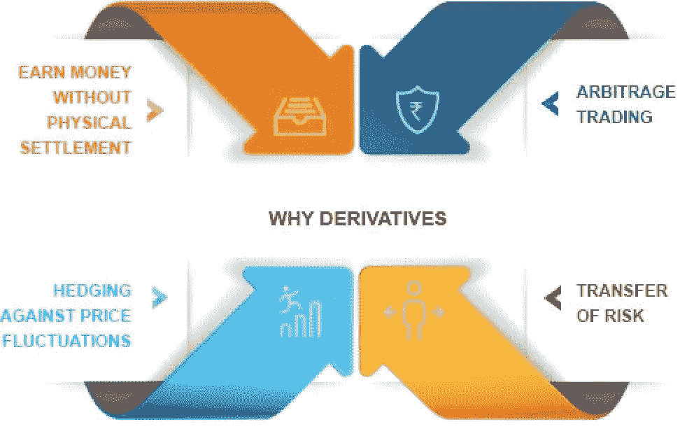
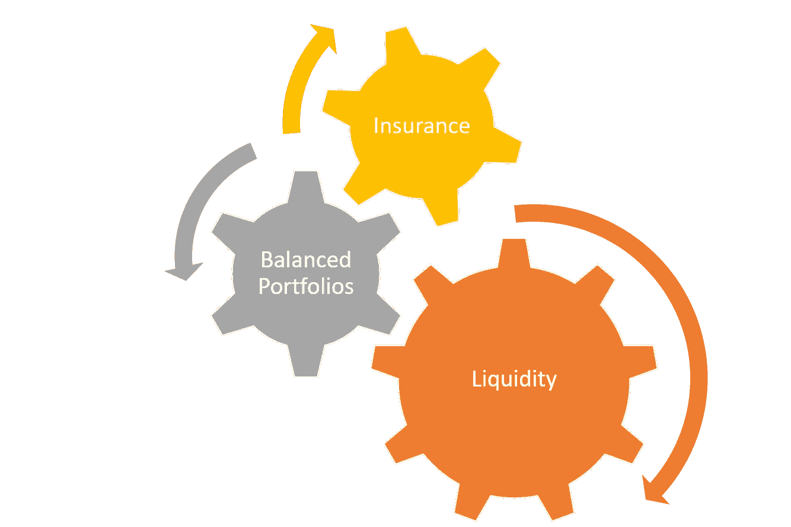

# 衍生品的三个重要功能可以释放安全令牌的潜力

> 原文：<https://medium.com/hackernoon/three-non-trivial-capabilities-of-derivatives-that-can-unlock-the-potential-of-security-tokens-f05b9807ffc8>

衍生品是一种引人入胜的金融工具，被认为在证券的未来扮演着举足轻重的角色。几个月来，我一直对衍生品和安全代币的结合非常感兴趣，这促使我在文章中发表了一些初步想法，如[这一篇](/coinmonks/security-token-derivatives-are-coming-8439555e7e5a)或[这一篇](https://hackernoon.com/security-token-2-0-protocols-part-iii-fund-and-derivative-tokens-68f594cbb438)。最初，像大多数人一样，我认为衍生品是一种将随着安全令牌空间的成熟而发展的产品。虽然我仍然认同这一论点的核心，但最近我已经将我对加密安全衍生品的想法从市场成熟的标志转移到可以释放安全令牌潜力的元素。

这种转变(我更愿意称之为进化😉)是我与数十位经验丰富的机构投资者进行长时间深入分析性对话的结果，这些投资者试图了解他们对证券代币的看法。可以说，对证券代币感兴趣的老练投资者数量有限，是这个领域的最大威胁。想想看，大型机构投资者眼中的安全代币基准不是公用代币，而是在公开市场交易的证券化产品。

当我们想到阻碍大型成熟投资者进入安全令牌领域的挑战时，我们通常会考虑合规性、披露、治理等方面。这些都是基础设施模块，最终将被构建到安全令牌平台中。然而，对于投资者来说，加密证券的金融架构还有其他的限制。如果你从一个老练的投资者的角度来分析一种证券，有三个基本问题使它成为一种引人注目的投资，不管资产的质量如何:

1) **流动性:**我能否在不受市场条件影响的情况下实现投资的流动性？

2) **平衡:**我能无缝地接触到一个平衡的、广泛的、符合我投资理念的投资组合吗？

3) **保险:**我能保护自己免受特定代币表现不佳的影响吗？

事实证明，衍生品是解决所有这些挑战的一个很好的机制，并使加密证券成为对机构投资者更具吸引力的工具。让我们更深入地了解不同的场景:

# 流动性:保证金交易的 dYdX 方式

今天，安全令牌被专门构建为一种长期交易机制。人们将一家公司的股权标记化，是因为他们期望投资者会专门持有该加密证券的多头头寸。尽管从发行者的角度来看，这种观点很有道理，但对于建立一个金融市场来说，这未必是一个健康的方法。可编程性使保证金交易和空头头寸成为安全令牌的可行工具。通常，保证金交易被视为释放金融市场流动性的关键机制之一。对一项资产同时持有多头和空头头寸的能力使其成为一种更可行的投资机制。

从市场上的加密衍生品协议来看， [dYdX](https://dydx.exchange/) 为保证金交易提供了最具创新性的解决方案之一。 [dYdX 保证金代币](https://margintokens.dydx.exchange/)是 ERC20 兼容代币，根据基础资产的表现正或负变动。每种类型的保证金令牌都有特定的利率、到期日和持有令牌的数量，这些令牌锁定在通过 dYdX 保证金头寸售出的每单位所欠令牌的头寸中。

让我们设想一个安全令牌[STX],它代表一家房地产公司的股权。使用 dYdX，我们可以创建一个裕量令牌 mSTX，其值的增加与 STX 的减少成比例。如果 STX 的价值下降 10 美元，那么 mSTX 的估值将增加 10 美元。建立保证金代币将允许投资者参与市场，对证券代币建立空头头寸，这将代表该空间流动性的倍数增加。

# 平衡投资组合:固定方式的可组合代币

在当前市场中，每个安全令牌都是其自己的投资单位。这种模式不仅难以置信地容易受到微观经济市场条件的影响，而且难以扩展，与大多数机构投资者配置资本的方式有些相悖。通常情况下，机构资本会被配置到代表宏观主题的金融产品中(例如:曼哈顿房地产债券的多头),这些产品能够很好地对冲不同的市场条件。你能想象必须对一家房地产投资信托公司的 200 栋建筑进行尽职调查吗？

[SET 协议](https://setprotocol.com/)是一个 ERC20 兼容协议，支持在一个单元下组合不同的令牌。从技术上来说，一套代币是由基础代币抵押的，而基础代币是被不信任地保管起来的。发行者可以随时创建新的代币集或赎回基础代币。集合标记可以由其他集合标记组成，这使得它非常适合于设计复杂的金融产品。

为了说明 Set 协议在加密证券环境中的价值，让我们想象几百个代表曼哈顿、迪拜和悉尼房地产权益的代币。如果一群投资者对这些房地产市场有一个宏观论断，并且他们相信他们彼此对冲得很好，他们可以创建一个由不同证券令牌组成的集合令牌，类似于房地产交易所交易基金(ETF)。这一设定标志将允许投资者对冲特定的市场低迷或特定房地产股的表现不佳。

# 保险:以可变方式出售期权

如今有了安全代币，投资者就没有办法在某个代币表现不佳的情况下保护自己。虽然这对于小额投资来说可能没问题，但对于将大量资本投入加密证券来说，这是一个巨大的障碍。通常，老练的投资者会利用衍生品来“确保”特定头寸不受市场低迷的影响。看跌期权是这种保险机制的典型例子。

[VariabL](https://variabl.io/) (以前的 StabL)是加密衍生品领域的新成员，它提出了一种基于加密资产的看涨或看跌期权建模的有效方法。VariabL 协议与保证金交易的 dYdX 非常相似，但有几个特征使其更接近于期权而不是短线交易。可变零和合约匹配多头和空头头寸，一个交易者的利润总是匹配另一个交易者的损失。利用零和合约，投资者可以创建一个看跌期权，押注某一特定令牌在一段时间内的价格下跌。

在安全令牌的上下文中，VariabL 的零和合同可用于创建相当于看跌期权的东西，作为对特定令牌性能的保险。让我们以一个安全令牌为例，它代表一组房地产租赁，每个令牌价值 1000 澳元。在这种情况下，投资者可以创建零和合约，押注价格将在一年内下跌至 500 美元，并以该价格的一小部分出售该令牌。如果代币跌破 500 美元，投资者肯定会获得高于市场水平的回报。

这些是衍生品可能成为下一代安全令牌重要组成部分的一些例子。通过实现流动性、平衡投资组合和保险等功能，衍生品使证券代币对机构投资者更具吸引力，并加速了该领域的增长。