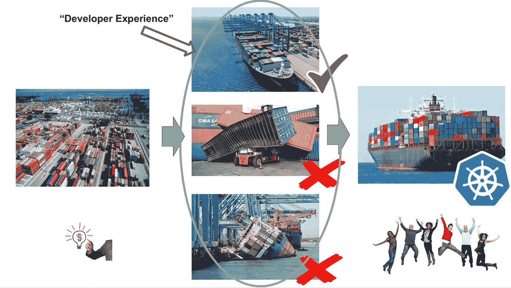

# 有效的云原生开发工作流的三种模式

> 原文：<https://medium.com/hackernoon/three-patterns-for-an-effective-cloud-native-development-workflow-6f59525f5bf1>

许多开发人员正在转向“[云原生](https://hackernoon.com/tagged/cloud-native)”[开发](https://hackernoon.com/tagged/development)，无论是利用公共云的服务和便利，还是在他们自己的内部云上部署服务。然而，作为云原生开发空间的一部分出现的新架构和技术——微服务、容器、编排器——需要[新的开发人员工作流模式](https://www.slideshare.net/dbryant_uk/cncf-webinar-series-creating-an-effective-developer-experience-on-kubernetes)。

在本文中，我将介绍三种模式，它们是我在过去几年中学习使用云技术时发现的有用模式。

# 创造一个有效的内部发展循环

将云[基础设施定义为代码](https://hackernoon.com/infrastructure-as-code-tutorial-e0353b530527)并随需应变的能力在我们部署软件的方式上是革命性的。然而，尽管基础设施的初始化很快，但它通常不是瞬时的(如您可能希望的那样，在 TDD 周期中)。这意味着需要提供基础设施以完成构建和部署周期的开发人员通常无法获得他们所需的快速反馈。这可能导致任务/上下文切换成为一个问题。对此的解决方案包括模拟本地开发基础设施、可重用的远程基础设施和本地生产开发。

使用 [AWS SAM Local](https://github.com/awslabs/aws-sam-cli) 可以看到模拟的本地开发基础设施模式。该工具提供了一个基于 CLI 和 Docker 的生产无服务器环境的复制，以支持使用相关 AWS 服务(如 Amazon API Gateway 和 DynamoDB)的 AWS Lambda 功能的高效本地开发。这个工具可以通过服务虚拟化(见下文)来进一步扩展，以模拟服务、内存中的数据存储和中间件，例如 [LocalStack](https://github.com/localstack/localstack) ，它可以用于模拟像 Kinesis 和 SQS 这样的 AWS 服务。

可重用的远程基础设施模式通常以定制的方式实现，平台团队提供多个测试环境，工程师可以按需租用这些环境。通常，当租约完成时，配置和相应的状态(数据存储)被重置，这使得下一个开发人员可以使用它。开源的 Kubernaut 工具也为 Kubernetes 提供了同样的体验，并维护了一个可以按需租用的初始化集群集合。

从本地到生产的开发模式可以说是最[的云原生模式](https://www.datawire.io/what-is-cloud-native/)，因为这涉及到开发人员针对生产编写应用程序。为了获得最准确的反馈，开发和测试环境必须尽可能地高保真，显然最像生产的环境是生产本身。Azure 提供了[开发空间](https://docs.microsoft.com/en-us/azure/dev-spaces/azure-dev-spaces)，允许工程师按需启动托管的 Kubernetes 集群，并将本地 VSCode 编辑器连接到其中。该工具管理任何代码变更到容器中的构建和部署，然后近乎实时地部署到开发空间中。

CNCF 托管的 [Telepresence](https://www.telepresence.io/) 工具允许开发人员将他们的本地开发环境代理到 Kubernetes 集群中，这允许工程师在本地运行和调试任何代码和应用程序，就像在集群中一样。这允许实时开发人员反馈循环，因为可以使用转发到[本地开发环境](http://datawire.io/guide/development/development-environments-microservices/)的实际流量(或影子流量)针对本地调试的生产应用和服务发出请求。

# 隔离测试范围:服务虚拟化和契约

云原生系统通常被开发为模块化(基于服务的)系统，这意味着测试单个服务可能具有挑战性，因为需要与外部服务依赖进行交互。显然，服务应该被设计成尽可能的[内聚和松散耦合](https://itnext.io/microservice-testing-coupling-and-cohesion-all-the-way-down-a9f100cda523)，这意味着可以独立开发。然而，当这不实际时，或者工程师想要驱动更像生产的测试时，像服务虚拟化和消费者驱动的契约这样的技术可能是有用的模式。

像 [Hoverfly](https://hoverfly.io/) 、 [WireMock](http://wiremock.org/) 和 [Mountebank](http://www.mbtest.org/) 这样的现代服务虚拟化工具充当代理，位于服务和系统之间，捕获流量供以后重放。这允许执行跨多个服务的测试，并记录来自相关服务的相关请求和响应。然后，可以在不运行实际的依赖项本身的情况下重放记录，这对于在 CI/CD 构建管道中运行隔离测试非常有价值。这两个工具还可以用来从尚不存在的服务生成虚拟响应，Hoverfly 允许注入故障，这可以用来以确定的方式测试故障的处理。

消费者驱动的契约(CDC)不仅可以用来驱动由外向内的服务设计(即 API 的 TDD)，还可以用来验证服务是否提供了所需的功能，并且不会随着服务的发展而退化。Martin Fowler 的博客[上有一篇关于这方面的优秀文章](https://martinfowler.com/articles/consumerDrivenContracts.html)，尽管这个过程乍看起来令人望而生畏，但以我的经验来看，一旦一个团队对这个方法进行了几次迭代，它就会变得相当机械。

# 用 Canary 版本验证功能

云原生系统非常复杂且不断发展，因此生产前的测试通常无法提供功能的完整验证以及与当前生产中运行的系统的交互。这个问题的解决方案是通过金丝雀来减少部署的影响——最初只针对新服务(煤矿中的金丝雀)路由一小部分生产流量，并观察行为和其他 KPI，然后逐渐增加流量的百分比，直到新服务接管所有流量。

对于与 Kubernetes 合作的开发人员来说，基于[特使代理](https://www.envoyproxy.io/)构建的开源[大使 API 网关](https://www.getambassador.io)，提供了[金丝雀测试功能](https://www.getambassador.io/reference/canary)，该功能通过 Kubernetes 服务上的简单注释来驱动。Istio 服务网格还提供了 canarying 功能，但这必须在 Kubernetes 之外进行配置。通过一点粘合代码，这两个系统都可以提供功能的自动化金丝雀发布，以及在检测到问题时的自动化回滚。

对于使用无服务器代码的开发人员，许多云供应商都提供了类似的功能。例如， [AWS Lambda 使用函数别名来提供流量转移](https://docs.aws.amazon.com/lambda/latest/dg/lambda-traffic-shifting-using-aliases.html)，可以对其进行编排以提供金丝雀展示。与上面的 Kubernetes 方法一样，开发人员可以编写一些粘合代码来基于 AWS CloudWatch 指标自动执行逐步发布和回滚。