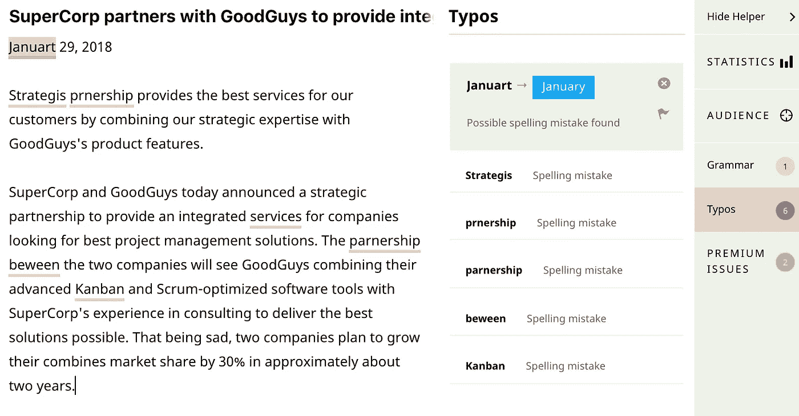
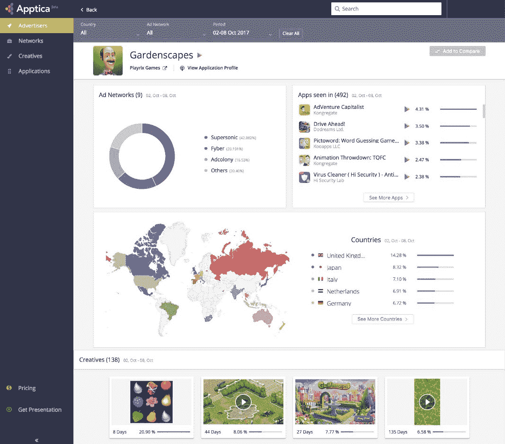
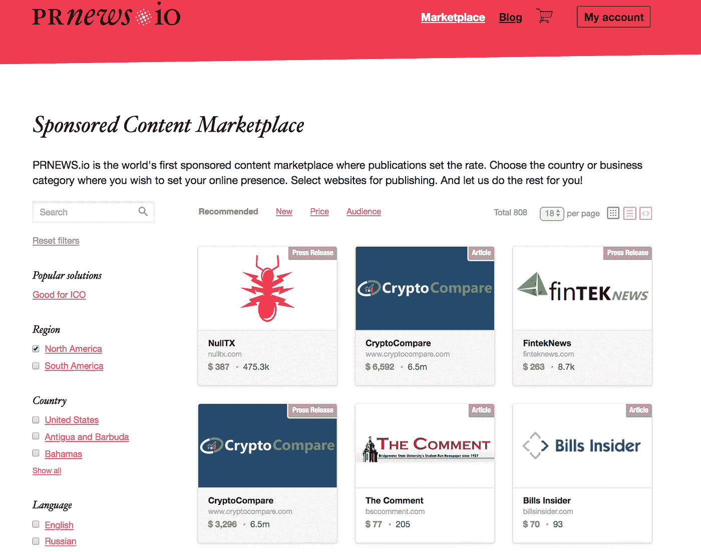

# 更好地将技术融入创业营销的三个实用技巧

> 原文：<https://medium.com/hackernoon/three-practical-tips-to-better-integrate-tech-into-your-startup-marketing-98b008779db6>

*Image credit:* [*Pexels*](https://www.pexels.com/photo/marketing-strategy-6229/)

在现代社会，对于一个成功的企业来说，营销正变得与产品和服务本身的开发一样重要。管理所有营销活动并保持高水平的有效性是很困难的，需要一种明智的方法。让我们来谈谈你如何解决这个问题，以及你的营销工具箱里应该包括什么。

# **用科技手段修改你的书面内容**

任何创业公司与外界的大部分交流仍然是通过文本进行的。这意味着你在你的网站、公司邮件或网络上的其他地方写的任何东西都应该是完美的。任何不准确都可能导致许多问题，从直接的误解到你的营销信息不完全正确和广告预算的浪费。所有这些都意味着你需要仔细检查每一件事，没有比使用专业助手更好的方法来修改书面内容了。

这个领域最有前途的工具之一是 [Textly](https://textly.ai/) 。这款写作助手拥有数百万个错别字的大型数据库，可以即时纠正语法、拼写和风格错误，更重要的是，它可以检查你的写作是否符合某个国家使用的英语。

你可以为生活在澳大利亚、加拿大、新西兰甚至南非的听众润色你的信息！当您处理多个区域，并且需要在预算紧张的情况下调整内容时，这是一个不错的选择。Textly 还提供了企业版，因此您可以在一个地方管理您的内容创建者。

# **使用高级竞争分析工具**

据统计，应用程序占用了总移动时间的 92%，而浏览器只占另外的 8%。应用下载量持续增长:Forrester 分析师[预计](https://www.forrester.com/report/Forrester+Data+Mobile+Smartphone+And+Tablet+Forecast+2017+To+2022+Global/-/E-RES138971)到 2022 年，全球智能手机用户数量将达到 38 亿，到 2017 年智能手机普及率将突破 50%,到 2022 年将达到 66%。此外，应用程序的点击率(CTR)为 0.56%，高于移动网络的 0.23%，以及桌面网络广告的 0.1%至 0.2%。

所有这些事实使得手机成为许多企业的完美营销渠道。然而，由于市场现在高度分散，有许多应用程序和广告网络，可能很难跟踪你的竞争对手在那里的活动。这种分析对于建立有效的移动营销活动至关重要。这就是为什么使用服务来帮助窥探竞争对手的移动广告是一个好主意。

这样的工具之一就是 [Apptica](https://apptica.com/) 。它为所有市场参与者提供见解，并提供关于市场上顶级广告商和出版商及其活动的信息，按类别划分的应用内广告活动，甚至顶级创意(广告格式)。

该系统将来自不同来源的数据聚合在一起，形成一种通用的格式，并以统一的格式显示统计数据。

# **自动化你的外展**

如今，你需要利用几十种营销工具在多个平台上传达你的信息。需要完成的管理工作量不断增加。为了保持效率和优化你的工作，你需要使用自动化。

对内容营销者来说，最有用的自动化工具之一是[新闻](https://prnews.io/)。它有助于以最佳的性价比自动放置贵公司的赞助内容。寻找投放资源、与每个站点协商、协调材料、准备出版以及跟踪产出都需要花费大量的时间和精力。

这一工具有助于找到符合规定标准的网站，立即查看价格，产生对出版物的请求，下载文本，等等——本地位置节省的“物流”是相当可观的。