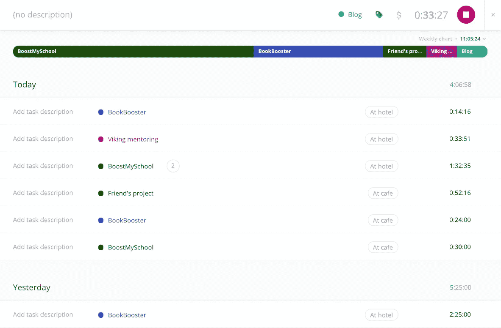

# 自雇生活方式的三大利弊

> 原文：<https://medium.com/hackernoon/three-pros-and-cons-of-the-self-employed-lifestyle-91e8d26f4a66>

Working outside: a perk of freelancing *(image by* [*Christin Hume*](https://unsplash.com/@christinhumephoto?utm_medium=referral&utm_campaign=photographer-credit&utm_content=creditBadge) *via* [*Unsplash*](http://unsplash.com/?utm_campaign=photographer-credit)*)*

两年前，我开始从事个体经营，从那以后，我更加享受我的职业生活。然而，就像生活中的所有事情一样，自主创业也有其弊端。以下是自主创业影响我日常生活的几种方式，有好有坏。

# 教授:你可以选择什么时候工作

我最喜欢自主创业的一个好处是，我的工作日程不再受他人支配。我能够围绕我的个人生活来规划我的工作生活，而大多数人恰恰相反。

这种优势的一个主要例子是我可以享受非高峰时期的福利。健身房、邮局和杂货店在白天都明显比较空，所以我不会花时间去排长队。我通常能够在非高峰日和时间旅行，这样既省时又省钱。在假期购买非高峰时段的机票对我来说特别划算。

No more long post office lines! (image via [Yelp](http://www.yelp.com/))

弹性工作时间表的另一个好处是:你工作的时间由你决定。虽然我通常喜欢每周工作 40 小时左右，但也有几周我只工作 20 小时——比如一个朋友从外地来访——因为我知道我可以在下周补上时间。这种自由太棒了，而且是培养我时间管理技能的好方法！

# 缺点:没有工作的外部压力

没有老板的一个主要缺点是，你是唯一对你的工作量负责的人。缺乏外部压力使得工作很容易推迟到以后。

在我开始自主创业的时候，我一直在为此挣扎，直到我开始[跟踪我的工作时间](https://golmansax.com/blog/posts/2017/06/08/time-tracking-my-most-effective-productivity-tool-when-self-employed/)，我才开始对我工作的时间和完成的工作量感到满意。我发现在头脑中有一个具体的工作目标也是有帮助的；例如，我的目标是每周工作 40 小时左右。

My daily Toggl screen, where I log the project, location, and time for each work session

# 利:你选择你想去哪里工作

这种好处主要适用于像我这样拥有数字技能的人(我是一名自由网络开发者)。能够在任何地方工作让我过上了高效的生活，特别是考虑到如果我工作的地方没有互联网，我可以[用我的手机](https://www.lifewire.com/how-to-tether-your-cell-phone-as-a-modem-2377918)。长途乘坐公共汽车或火车不再是浪费时间，因为我可以在上面工作。我甚至可以在公园里工作！

远程工作的另一个优势是能够更频繁、更长时间地出差。一个完美的例子:我目前正在东南亚旅行，本周仍能工作 20 个小时。如前所述，我也可以在周末旅行中增加几天，以利用工作日的航班价格。

The hipster cafe in Singapore I’m at right now (image via [AspirantSG](https://www.aspirantsg.com/))

# 缺点:假期和休假是没有报酬的

虽然自主创业允许更多的旅行，但不利的一面是，你再也不会因为这些“休假”而得到报酬。正因为如此，我总是试图在旅行期间安排一些工作会议。我不介意这一点，因为我喜欢逛当地的咖啡店，但对于那些喜欢在假期完全忘记工作的人来说，这可能很难。

无薪休假也影响假期。当我的工薪族朋友总是期待着度过愉快的长周末时，我意识到我正在失去的工作时间。我的折衷办法通常是把假期的三天周末休掉，然后要么在假期前的周末，要么在假期后的周末补上小时。

# 缺点:建立你的职业关系网更加困难

一个我没有预见到的缺点是失去了在一家知名公司工作的机会。当你在一家公司时，你不仅可以接触到你的直接同事和团队，还可以通过公司活动接触到更广泛的员工名单。为了在我的工作领域结识更多的人，我开始参加更多的聚会，但我发现很难建立持久的关系。

几个月前，我决定加入一个合作空间，并对这个决定非常满意。我选择了纽约的社会创新中心，这个中心非常棒。他们有专门为会员设计的活动，让他们相互交流和认识。(注意:并非所有的共同工作空间都是为人们见面而设计的，所以如果这对你很重要，请确保在注册前做好调查！)

The awesome co-working space that I work out of (image via [Art InFact](http://www.artinfactmag.com/))

# 教授:你选择你想做的事情

选择从事什么工作的权力是我开始自由职业的主要原因，我很高兴地说，到目前为止，我只从事我真正想参与的项目。这有助于我知道我想专注于什么:帮助早期创业公司建立他们的产品。这让我能够在[我的投资组合](https://golmansax.com/portfolio)中突出相关的经历，从而更容易获得我想要的机会。

此外，我很高兴我在选择为哪些公司工作时能够有所选择。对我来说很重要的是，我的工作被用来以我相信的方式支持社会，因为我做出了最后的决定，所以我不必在这一点上妥协。

我希望你喜欢读我关于自主创业的想法。如果你正在考虑跳槽，在我看来，要考虑的主要问题是，没有全职工作所带来的牺牲是否值得。对我来说很值得，但是每个人都不一样！

关于我向自主创业的转变，有什么问题吗？欢迎[发微博给我](https://twitter.com/golmansax)或[发邮件给我](https://golmansax.com/cdn-cgi/l/email-protection#f8909794959996b89f97949599968b9980d69b9795)！

*原载于 2017 年 9 月 28 日*[*golmansax.com*](https://golmansax.com/blog/posts/2017/09/28/three-pros-and-cons-of-the-self-employed-lifestyle/)*。*