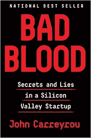

# 在分心的世界中管理注意力的三个步骤

> 原文：<https://medium.com/hackernoon/three-steps-to-manage-your-attention-in-a-distracted-world-1d922ce44ed9>

我最近读完了约翰·卡瑞鲁的《恶感》*,这是一个发生在硅谷的关于贪婪、谎言和傲慢的扣人心弦的真实故事。这本书读到一半时，我发现了一件有趣的轶事。*

**

*Write an email more than 500 words*

*一个年轻的机械工程师找到了一种方法来管理他的傲慢和讨厌的老板，阳光。每次桑尼给这位年轻的工程师发邮件询问一些信息，他都会回复一封超过 500 字的邮件。”*这通常会给他带来几个星期的安宁，因为桑尼根本没有耐心阅读冗长的电子邮件。**

*我们中有多少人会这样做？避免阅读长邮件或浏览长文章？不管我们属于哪一代，X 代，Y 代还是 Z 代，我们现在都是被称为 TL 代的一部分；(博士太长；没看)。*

*欢迎来到信息超载的时代。但是，这就是问题的全部吗？还是我们都患上了作家兼教师克莱·舍基所说的过滤失败？换句话说，我们是一直责怪其他人向我们扔了这么多信息，还是问题出在我们自己身上——我们现在已经设置了过滤器来选择性地处理信息。*

*信息过载不会消失，事实上，它将继续无情地增加，因为世界已经从非数字世界的*“过滤，然后发布”*模式转变为数字世界的*“发布，然后过滤”*模式。*

> *我们用时间作为第一个过滤器来计划我们一天的优先事项。然而，我们今天生活的世界不再是关于时间的；**是关于“注意**”。*

*在任何一天，你都有大约 8-10 个小时的工作时间，但可能只有 3-4 个小时的注意力时间。你可能会在两个小时的会议中“占用”你的时间，但你可能只“注意”了 15 分钟。“付出”这个动词恰恰说明了我们的注意力是多么有价值。*

***因此，初级过滤器需要从*“我如何管理我的时间？”*到*“我如何管理我的注意力？”****

*好消息是，建立有效的注意力管理策略是可能的，因为这将是未来工作场所最需要的技能之一。*

*管理你的注意力的第一步是，嗯，注意你的注意力。用心理学的话说，这叫做元认知，或者思考你的想法。作为正念，关注你的注意力是关于放下时间意识，建立注意力意识。如果我在开会，我在会议中的注意力有多集中？*

> *仔细思考你一天中想要实现的目标，而不是管理你待办事项列表中的任务，是一种关注注意力的方式。*

*每隔几个小时停下来检查一下自己:我现在在做什么？这对实现我为自己设定的目标重要吗？如果不是，我为什么要这么做？技术可以帮助你。有许多“反思应用程序”鼓励你在忙碌的一天中停下来，做一个快速的过滤器检查。*

*T **他管理你注意力的第二步**是注意你注意力的内容。它通常被称为临界消费过滤器，但著名的传播专家 Howard Rheingold 借用了 Ernest Hemingway 的一句话，称之为**垃圾检测过滤器**。*

*问问你自己，你所消耗的信息会有助于你实现当天的目标吗？电子邮件比看猫迷因无聊无数倍，但十有八九，它至少与你当天的一些目标密切相关。*

*管理你注意力的第三步是建立过滤器，超越简单的机器算法。通过“未在‘收件人’列表中标记”来过滤电子邮件很容易实现。然而，通过这样做，你将你的优先化过滤器外包给了一台机器和另一个人，他们决定在发送邮件时将你添加到“抄送”列表而不是“收件人”列表。邮件的内容，本来应该是最重要的过滤器，现在已经不重要了。*

*著名的生产力专家梅林·曼的“零收件箱”经常与“零收件箱”相混淆。曼恩说零收件箱*“是员工大脑在收件箱*的时间”。将你的邮箱转换成待办事项列表是选择一个最差的过滤器来管理信息。*

*在工作之外，建立你自己的基于内容的过滤器，或者让人类专家为你做，为你感兴趣的领域。如果你对技术感兴趣，Benedict Evans 的每周时事通讯是一个比各种以技术为中心的出版商的自动电子邮件好得多的信息来源。*

***你的注意力是宝贵的，为什么让它被动消耗，没有任何反思？你的注意力首先需要你的注意力。***

*这篇报道最初发表在 **Mint** daily，[here](https://buff.ly/2oxUc3u)*