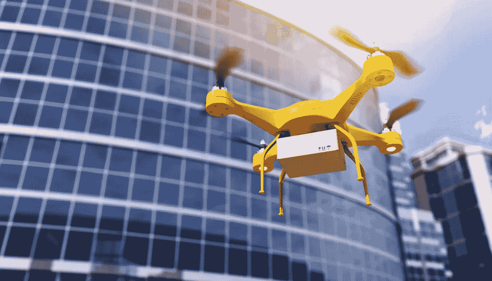

# 正如我们所知，5G 将以三种方式改变世界

> 原文：<https://medium.com/hackernoon/three-ways-5g-will-transform-the-world-as-we-know-it-2189ce09940>

到 2018 年底，[威瑞森等移动公司将开始部署 5G](https://www.engadget.com/2017/11/29/verizon-will-launch-5g-home-internet-access-in-2018/) ，这是一种无线网络技术，连接速度可达 10Gbps，比 4G LTE 快 100 倍。这项联网技术[最初将用于固定的住宅连接，但最终也会广泛应用于](https://hackernoon.com/tagged/technology)[的移动网络](https://hackernoon.com/tagged/mobile)。