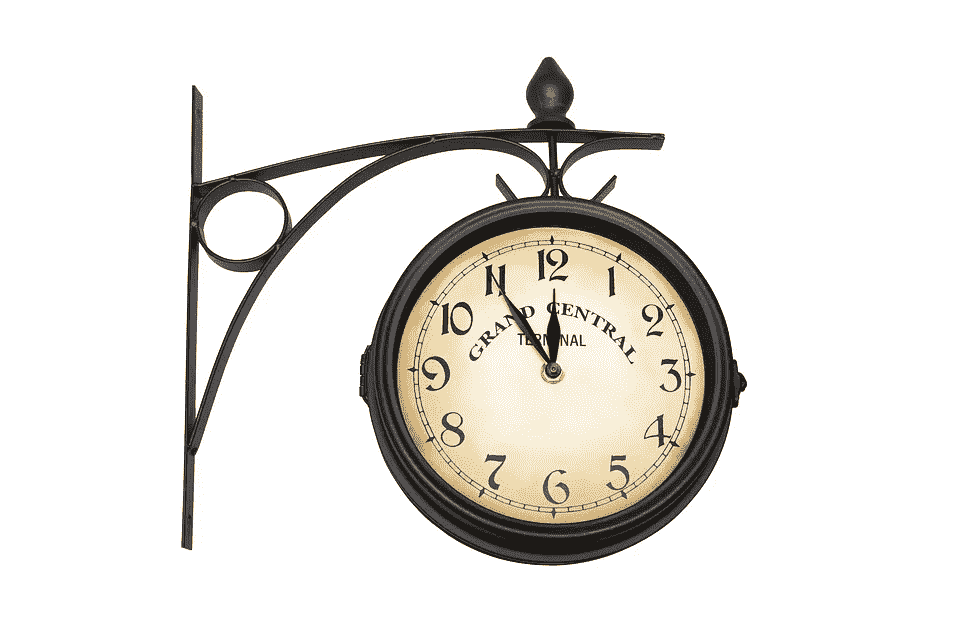

# 时间就是金钱

> 原文：<https://medium.com/hackernoon/time-is-money-80f95e13f4b6>

时间的真正价值是什么？不管任何人对如何正确评价时间的看法如何，我们都同意我们的时间是有价值的*。*因此，时间*就是*金钱。字面上。一个可以和另一个交换，只是它们之间的比例不同。每个人都在出售他们的时间，要么是通过花费他们一定时间生产的产品，要么是作为一种服务，而服务总是需要时间的。如果你是一个有稳定工资的雇员，你通常每天会卖出 8 个小时。如果你在做你真正喜欢做的事情，从某种程度上来说，这八小时仍然属于你，因为你在做你可能会做的事情，如果你有机会免费做的话。货币也通过通货膨胀与时间联系在一起。随着时间的推移，传统货币会贬值，因此使用它们的每个人都有不断花钱的动机。描述时间和金钱之间关系的等式看起来有点像“时间等于(你对时间的重视程度)除以金钱”。

输入比特币。比特币和时间的关系非常直接。它有一个预先设定好的货币政策。每四年，给予保护网络的矿工的奖励减半。这意味着通货膨胀正在减速。目前，已经开采了 1700 多万个比特币，最后一个将在 2140 年左右开采，总计 2100 万个。这使得比特币成为通货膨胀的解药。它也从根本上改变了金钱和时间的关系。如果你拥有一枚比特币，也就是说，如果你拥有一枚比特币的*私钥*，无论时间流逝多少，你仍将拥有该比特币。仅仅这一个特征就让比特币变得有价值。非常有价值，而且很有可能随着时间的推移越来越有价值。其短暂的历史已经清楚地表明，这至少是部分真实的。这颠覆了当前所有的经济模式。

我们目前的模型是由债务和利率驱动的。比特币是供求关系，仅此而已。当然，可以在此基础上建立其他模型，但尽管周围有雷鸣般的风暴，基础仍然牢固。有很多噪音。尽管如此，那些目光越过流行语的人看到了光明的未来。一个存钱会有回报并且很快就会花掉的未来只需要一点点成本。对比特币玩家来说，时间比无币玩家更有价值。比特币制造者更不愿意放弃它。这使得比特币制造者更倾向于进行稳健的长期投资。当然，你可以说比特币是一种高风险的投资，但没有任何比特币也是非常危险的。如果它起飞并真正成为世界储备货币，你很快就会花比现在多得多的钱去买一些。买比特币*就是*在这个意义上买时间。投资比特币会让财富代代相传，这完全不是不可想象的，相反，这种可能性很大。你的后代可以继承你的比特币，而没有被税务员或任何其他官僚剥夺的风险，因为他们甚至不知道你一开始就有比特币。仅这一特点就使比特币优于黄金或其他传统的 T2 价值储存手段。