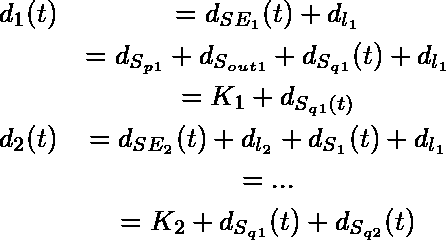

# 机器人的时间敏感网络

> 原文：<https://medium.com/hackernoon/time-sensitive-networking-for-robotics-6b43590fa923>

## 具有 TSN 标准的以太网将成为机器人领域第 1 层和第 2 层通信的事实标准。

*本文是一篇关于“机器人的时间敏感网络”的文章，可在 https://arxiv.org/pdf/1804.07643.pdf***获得，并提交给 2018 年 AHS 奥运会。同行的写有* [*卡洛斯圣维森特*](https://medium.com/u/643f220a5df6?source=post_page-----6b43590fa923--------------------------------)*[*兰德乌萨特吉*](https://www.linkedin.com/in/lander-usategui-san-juan-610700133) *和* [*伊拉蒂扎马洛乌加特*](https://medium.com/u/e9b73593e3f?source=post_page-----6b43590fa923--------------------------------) *。***

****

**Typical response-time of common robotic components. For sensors, the response-time reflects the typical time required to provide digital data of their measurements. For actuators, it states the typical control cycle. Figure shows the diversity of several robot components and their different networking requirements. Motors usually require simple data as parameters, such as set-points like position, velocity, torque; a camera system streams instead a considerably larger amount of data, which can go up to few megabytes per second.**

**机器人学领域正在迅速发展。专业、消费或工业机器人等新领域需要更灵活的技术和一套标准化的政策，以促进机器人的设计、制造和配置过程，从而实现一种以上的特定应用。先前的工作[1]，[2]强调了不同层次标准接口的相关性。**

**正如其他行业一样，机器人领域的一个主要问题是，没有标准的通信协议，而是有多种通信协议。选择一种通信协议并不简单:列表很大，而且每种协议都经过了改进，以满足特定应用领域的需求。通常，每种协议都是针对特定应用定制的，因此，在这些更复杂的用例中，需要使用多种通信协议和总线来满足不同的要求。**

****

**Classification of real-time Ethernet solutions according to their network layers.**

**事实上，许多工业协议都有共同的技术基线，但是定制上层抽象层以满足实时以太网解决方案的不同需求。在实时通信协议的情况下，链路和物理层通常被修改以实现更好的性能。这导致硬件不兼容问题，使得设备之间的通信变得麻烦。一种常见的解决方案是使用网关(或网桥)，这增加了成本和复杂性，并降低了性能。拥有一个独特的标准协议将提高机器人之间的互操作性，并促进机器人组件的集成，这仍然是机器人制造过程中的主要障碍之一，如[3]所述。机器人外围设备制造商尤其受到这些问题的困扰，因为他们需要支持多种协议，进一步增加了集成时间和成本。**

**时间敏感网络(TSN)是由 IEEE 802.1 工作组的时间敏感网络任务组定义的一组标准，旨在使以太网更具确定性。创建 TSN 子标准是为了满足行业中不同的通信要求:自动化、汽车、音频、视频等。大多数现有的实时以太网解决方案是为分布式运动控制等低数据量应用而创建的。这些解决方案通常带宽非常有限，无法达到以太网的带宽能力。随着人工智能(AI)、计算机视觉或预测性维护等机器人技术的不断集成，对实时传输高带宽数据的传感器和执行器的需求越来越大。这些组件提供的信息通常集成在控制系统中，或者需要实时监控。常见的解决方案是使用特定的总线进行实时控制，使用单独的总线进行更高带宽的通信。随着越来越多的高带宽流量的产生，具有两个独立通信的控制过程是低效的。TSN 为以太网增加了实时功能，为高带宽流量和实时控制流量提供了一个公共通信通道。**

> **时间敏感网络(TSN)将成为机器人实时通信的事实标准。**

**TSN 还将改善对机器人组件的访问，这对于预测性维护、可重新配置性或适应性尤为重要[3]。隔离的实时通信总线难以与机器人内部的传感器和致动器进行通信。在预测性维护中，需要实时监控组件，以检测可能的故障或简单地了解组件的状况。与监控系统的直接通信将增强监控系统中机器人部件的集成。**

# **时间敏感网络(TSN)**

## **标准概述**

**TSN 由一组旨在使以太网更具确定性的标准组成。这些标准中的几个处理如何实现有限延迟的问题。标准以太网不满足实时应用的确定性能力。过去，以太网端点通常是半双工的，并使用集线器进行连接。以太网面临的第一个问题是冲突域问题。数据包在发送时可能会相互冲突。为了解决这个问题，使用了一种称为载波侦听多路访问/冲突检测(CSMA/CD)的仲裁算法。随着全双工以太网交换机的引入，网络通信被隔离在不同的域中，因此它们不会争用同一条线路。其中一个主要问题得到了解决，但是导致缺乏确定性的主要原因转移到了交换机队列中的拥塞问题。**

**当今交换机中不确定性的主要来源是由于访问媒体访问控制(MAC)层的流量竞争。为了限制和控制队列中的拥塞问题，IEEE 引入了服务质量(QoS)机制，例如流量优先级。数据包优先级是由 IEEE 802.1P 任务组在 20 世纪 90 年代引入的。当使用 VLAN 标记帧时，这种 QoS 技术(也称为服务等级(CoS ))包含在以太网帧头中一个称为优先级代码点(PCP)的 3 位字段中。该字段允许指定一个介于 0 和 7 之间的优先级值，该值可用于确定 MAC 层流量的优先级。**

**对于每个网桥端口，以太网交换机可以有一个或多个传输队列。每个队列为等待传输的帧提供存储。这些帧将根据它们的 CoS 被分配给每个队列。交换传输算法然后将选择队列中具有最高优先级的下一个分组。只有在选择过程中较高顺序队列为空时，以较低优先级存储的帧才会被传输。**

****

**Transmission selection of the TSN Time-Aware Shaper**

**尽管数据包优先化是降低流量干扰的有效技术，但仍不足以保证确定性的延迟。问题之一是较低优先级的流量仍然会干扰较高优先级的流量。也就是说，高优先级帧需要等待，直到低优先级帧完成传输。延迟将取决于正在传输的数据包大小以及帧路径上的交换机数量。在低延迟要求和高跳数的应用中，这个问题变得非常重要。此外，由于以太网是异步的，共享同一链路的高优先级帧可以在它们之间共享内容。为了解决这个问题，802.1 TSN 任务组开发了时间感知流量调度，定义见 802.1Qbv [4]。时间感知调度器(TAS)基于 TDMA(时分多址)，将周期时间划分为专用于特定 CoS 的时隙。TAS 为每个队列使用传输门，门可以打开或关闭该队列的传输(图中 F*)。传输选择算法选择较高阶队列的下一帧，但只从那些门打开的队列中选择。为了防止媒体访问控制在预定帧到达时很忙，TAS 在每个时间敏感的流量时间片前面引入了一个保护带(G)。这确保了对于时间关键的流量，可以毫无延迟地访问媒体访问控制。***

***门被编程指定一个周期时间和一个门控制列表。该列表将时间片配置为打开和关闭每个队列的门。门控机制要求 TSN 网络上所有时间感知设备之间的时间同步。最常用的时间同步协议是 IEEE 1588 精确时间协议(PTP)，它通过交换带有同步信息的以太网帧来同步时钟。IEEE 802.1 TSN 工作组正在进行 IEEE 802.1AS [5]的修订工作，这是 IEEE 1588 在音频/视频系统中的一个概要。新的修订将增加其他领域所需的一些特征，如工业控制。TSN 网络中支持 IEEE 802.1AS 的设备的主要要求之一是它们之间的亚微秒同步。***

***为确定性通信开发的另一个标准是 IEEE 802.1Qbu [6]，它提供了帧抢占机制。该标准允许高优先级帧在传输中中断低优先级帧。为了决定帧是否可以被抢占，抢占机制需要帧的最小必要片段。在最坏的情况下，这个片段可以是 124 字节。这意味着单独使用抢占并不能保证端到端的确定性延迟。根据该标准，802.1Qbu 可以单独使用以减少延迟和抖动，也可以与调度结合使用。当与调度一起使用时，它可以最小化受保护的窗口或保护带，从而优化可抢占流量的可用带宽。带宽优化似乎是 802.1Qbu 的主要目的，它可能与 100 Mbps 相关。***

## ***交换式以太网定时模型***

***在本节中，我们将分析交换式以太网中的延迟。我们将定义一个分析模型，以确定在直通模式下由桥接端点组成的线性拓扑中的端到端延迟。这个模型将帮助我们更好地理解端到端延迟的非确定性来源，并且我们将在后面的部分中使用它来分析实验的结果。***

***端到端延迟的建议模型基于[7]和[8]中定义的延迟。首先，我们定义一些术语，用于概括时序模型的等式:***

*   *****帧传输延迟** ( *d_t* ):将数据包的所有比特传输到链路中所需的时间。***
*   ****传播延迟** ( *d_l* ):一个比特以链路的传播速度从源传播到目的地的时间。**
*   ****开关延迟** ( *d_S* ):一位从开关输入端口穿越到开关输出端口的时间。**
*   ****交换机输入延迟** ( *d_{S_{in}}* ):交换机入口端口的延迟，包括接收 PHY 和 MAC 延迟。**
*   ****交换机输出延迟** ( *d_{S_{out}}* ):交换机出端口的延迟，包括传输 PHY 和 MAC 延迟。**
*   ****交换机处理延迟** ( *d_{S_{p}}* ):检查数据包报头并确定将数据包定向到何处所需的时间是处理延迟的一部分。**
*   ****交换机排队延迟** ( *d_{S_{q}}* ):帧在交换机的出口端口等待开始传输到链路上的时间。**

**传播延迟取决于两个交换机之间的距离 *d* 和链路 s 的传播速度。传输延迟取决于分组长度 L 和链路容量 c**

****

**在直通模式中，切换延迟不依赖于分组长度，并且可以表示为如下等式所示**

****

**从源端点 A 到目的端点 B 的端到端延迟可以表示为路径中所有交换机和链路的延迟之和，n 为链路数量，n-1 为路径中交换机的数量。**

****

**关键思想是，上述等式的所有项都是确定性的，只有排队延迟除外，排队延迟取决于帧在时间 t 到达时的交换机队列占用率。该延迟是限制交换以太网延迟的主要问题。有不同的方法来限制这种延迟，例如 QoS 技术，如加权公平排队(QFQ)或严格优先级[9]，但仍然存在某些限制实时性能的延迟和抖动。使用 TSN 时间感知整形器和适当的调度，可以完全消除这种延迟。一旦这种延迟消失，端到端延迟变得确定，并且与切槽相结合，有可能实现非常低的延迟。**

**在机器人学的背景下，对于简单的机器人操作器，从致动器到机器人控制的最坏情况端到端延迟将决定最小可实现的控制周期时间和固定周期时间允许的致动器的最大数量。这就是为什么减少排队延迟对于缩短周期时间至关重要。**

**周期时间是衡量通信协议性能的一个重要指标。它可以被定义为在控制器和所有传感器和致动器之间交换输入和输出数据所需的时间。TAS 提供实时性能，这使得具有 TSN 的以太网在实时性能方面可以与其他实时通信协议相媲美。Jasperneite 等人[10]介绍了一种分析方法来估计以太网技术的输入和输出周期时间。他们用这种方法来比较 EtherCAT 和 Profinet IRT。**

**Bernier[11]将该方法扩展到 Modbus/TCP 解决方案和 Ethernet/IP。在他的工作中，他将周期时间定义为在控制器和所有传感器和执行器之间交换输入和输出数据所需的时间。布鲁克纳等人[12]使用这种方法来比较最常见的通信技术与基于 TSN 的 OPC UA 的性能。最后一项工作得出的结论显示了基于 TSN 的[技术](https://hackernoon.com/tagged/technology)如何使用 1 Gbit 以太网和帧聚合方法超越其他硬实时工业协议。在接下来的章节中，我们将在机器人的背景下挑战这些实验结果。**

# **实验结果**

**对于实验设置，我们选择了一个具有混合关键流量的典型机器人用例。特别是，我们选择了一个模块化机械臂，末端连接了一个高带宽传感器(下图)。这种机械臂是 TSN 的一个有趣的用例，因为它收集具有不同特征的流量。执行器需要硬实时低延迟流量，而高分辨率摄像机或激光扫描仪等传感器会生成大量数据。所提出的设置包含两个致动器 A1 和 A2、传感器 S 和机器人控制器 RC。**

****

**Exemplary modular robotic arm used for the experimental setup.**

**在实验中，我们将使用两个支持 TSN 的桥接端点和两台电脑，每台电脑都配有英特尔 i210 卡。**

****

**Experimental setup networking devices overview.**

**TSN 桥接端点模拟致动器和 PC、传感器和机器人控制器 RC。传感器 S 连接到最后一个致动器，并将向机器人控制器发送高带宽。由于传感器以链式拓扑结构连接，传感器通信量会通过每个执行器交换机。该流量将与来自致动器开关队列的时间敏感流量竞争，这将产生排队延迟。**

****

**我们把 A1 到 RC 的交通流称为 *F_{A1}* ，把 A2 到 RC 的交通流称为 *F_{A2}* ，把 S 到 RC 的交通流称为 FS，如图 7 所示。使用 i210 网卡的硬件时间戳功能在 RC 中执行测量。对于传输时间，我们利用桥接端点的 TSN 能力。我们通过配置每个端点的 TAS 来设置 TSN 桥接端点的传输时间 t_{TX_1}和 t_{TX_2}。对于执行器 i = 1，2，我们通过简单的减法计算从 A_i 到 RC 的延迟 d_i。**

****

**如上图所示，RC 的硬件时间戳测量帧起始定界符(SFD)的到达时间。这意味着帧传输延迟不包括在我们的测量中。由于交换机以直通方式配置，传输延迟既不包括在交换机延迟中，因此测量的延迟不取决于帧长度。根据该图，我们可以将测量值与前面等式中表示的延迟联系起来。请注意，在这种特殊情况下，源是交换端点。从端点通过开关 d_{SE_i}的延迟与开关延迟 d_{S_i}不同，因为它不包括输入端口延迟。用开关延迟表示测得的延迟，我们得到以下表达式:**

****

**为了生成 F_{A1}和 F_{A2}流量，我们使用了具有 256 字节有效载荷的 UDP/IP，速率为 1 毫秒。对于 F_S，我们使用 *iperf* 工具生成一个网络负载，该负载使用 1500 字节的有效载荷，1 Gbps 链路容量的流量带宽为 900 Mbps，100 Mbps 链路容量的流量带宽为 90 Mbps。为了进行计算，我们在 10 秒钟内测量了 10000 个样本。**

## **实验一。**

**相同优先级阻塞:在这个实验中，我们测量相同优先级流量的阻塞效果。所有业务流都通过最低优先级队列发送，即尽力而为队列(BE)。F_{A1}和 F_{A2}将与 A_1 和 A_2 交换机的端口 1 BE 队列中的 FS 竞争。阻塞延迟取决于所实现的交换机传输选择机制。**

****

**Timeplot delay measurements for 10s.Terms: C=Link Capacity,. Terms: A1=Actuator1 (Blue), A2=Actuator 2 (Red), BE=Best-effort queue, ST=Scheduled Traffic queue. a) Same priority blocking for C=1 Gbps b) Lower priority blocking for C=1 Gbps c) Lower priority blocking for C=100 Mbps d) Using a TAS for C=1 Gbps**

**用于此设置的交换机使用基于 FIFO 占用率信用的仲裁，从现在开始称为 CBF。CBF 优先处理来自高占用率入口端口队列的流量。这使得阻塞效应高度依赖于流量竞争源的发送速率。结果(子图 a)显示了毫秒级的最坏情况延迟，这清楚地表明延迟是无限的。增加 FS 带宽或降低 F_{A1}发送速率，我们会得到更高的延迟甚至丢包。注意，本实验的目的不是分析 CBF 的排队延迟，而只是为了说明由于相同优先级阻塞而导致的这种仲裁策略的不确定性。**

## **实验二。**

********

**低优先级阻塞:在这个实验中，我们使用严格的优先级传输来测量低优先级流量的阻塞效应。F_{A1}和 F_{A2}通过交换机的最高优先级队列发送，该队列是调度流量队列(st)。之前的工作[14]分析了低优先级阻塞的影响。每个交换机增加的最坏情况延迟由交换机允许的最大帧大小的帧传输时间(MTU)给出。对于 1500 字节的 MTU 和 100 Mbps 的链路容量，最差情况下增加的延迟为 120 s，对于 1 Gbps 为 12 s。表 II 和表 III 给出了实验结果，上面的子图 b 和图 c 显示了实验结果。这些结果证实了预期的最坏情况延迟。在 100 Mbps 的情况下，D1 的最大延迟为 127.22 s，d 2 的最大延迟为 253.33 s。结果显示了每个桥的效果是如何累积的。虽然这种情况下的排队延迟有一个上限，但它显然极大地限制了系统的实时性能和可伸缩性。对于 100 Mbps 和网络负载，A_1 的延迟大约为 3 到 120 秒，A_2 的延迟大约为 9 到 250 秒。因为 F_{A1}和 F_{A2}是异步发送的，所以 F_{A1}和 F_{A2}可以在它们之间包含内容。因此，在这种情况下，除了较低优先级阻塞之外，最坏的情况必须考虑 F_{A1}和 F_{A2}的相同优先级阻塞。**

## **实验三。**

****

**Timeplot delay measurements for 10s.Terms: C=Link Capacity,. Terms: A1=Actuator1 (Blue), A2=Actuator 2 (Red), BE=Best-effort queue, ST=Scheduled Traffic queue. a) Same priority blocking for C=1 Gbps b) Lower priority blocking for C=1 Gbps c) Lower priority blocking for C=100 Mbps d) Using a TAS for C=1 Gbps**

**使用 TSN 时间感知整形器:在这个实验中，我们配置 A1 和 A2 交换机出口端口的 TAS。由于所有 TAS 都以亚微秒级的精度同步，因此计划流量与较低优先级流量和相同优先级流量完全隔离。如子图 d 所示，端到端延迟是高度确定的，具有和不具有较低优先级流量的结果是相同的，并且实现了亚微秒抖动。**

****

**Timeplot delay measurements for 10s. Link Capacity 100 Mbps. Terms: A1=Actuator1 (Blue), A2=Actuator 2 (Red), BE=Best-effort queue, ST=Scheduled Traffic queue. a) Same priority blocking b) Same priority blocking with network load c) Lower priority blocking d) Lower priority blocking with network load e) Using a TAS f) Using a TAS with network load.**

****

**Timeplot delay measurements for 10s. Link Capacity 1 Gbps. Terms: A1=Actuator1 (Blue), A2=Actuator 2 (Red), BE=Best-effort queue, ST=Scheduled Traffic queue. a) Same priority blocking b) Same priority blocking with network load c) Lower priority blocking d) Lower priority blocking with network load e) Using a TAS f) Using a TAS with network load.**

# **结论**

**在这项工作中，我们提出了一个实验设置，以显示 TSN 的实时机器人应用的适用性。我们比较了标准以太网的以太网交换机中的排队延迟与使用 TSN 时间感知整形器时的延迟。结果显示了以太网的不确定性，以及这些问题如何限制实时机器人应用程序(如示例性模块化机器人)的可扩展性和性能。当使用 TSN 时间感知整形器时，结果显示时间敏感型流量与低优先级流量完全隔离，即使在高带宽背景流量下也能保持低延迟和低抖动。这些结果表明，有可能开发混合高带宽传感器的硬实时运动控制系统，如激光雷达和高分辨率相机。基于所展示的结果，我们认为具有 TSN 标准的以太网将成为机器人领域第 1 层和第 2 层通信的事实标准。我们认为，在机器人领域，许多现有的实时工业解决方案将慢慢被 TSN 取代。对于更高层，我们预见到一个竞争的局面，其中 TSN 在不同中间件解决方案中的集成侧重于互操作性，如 OPC-UA 和 DDS，有望提供自下而上的实时通信解决方案。**

# **参考**

**[1] V. Mayoral、A. Hernández、R. Kojcev、I. Muguruza、I. Zamalloa、A. Bilbao 和 L. Usategui，“机器人范式的转变；硬件机器人操作系统(h-ROS)；创建可互操作机器人组件的基础设施”，2017 年 NASA/ESA 自适应硬件和系统会议(AHS)，2017 年 7 月，第 229-236 页。**

**[2] I. Zamalloa，I. Muguruza，A. Hernández，R. Kojcev 和 V. Mayoral，“模块化机器人的信息模型:硬件机器人信息模型(HRIM)”，ArXiv 电子印刷，2018 年 2 月。**

**[3] V. Mayoral，R. Kojcev，N. Etxezarreta，A. Hernández，I. Zamalloa，“走向自适应机器人:从编程到训练机器”，ArXiv e-prints，2018 年 2 月。**

**[4]“局域网和城域网的 Ieee 标准—桥和桥接网络—修正案 25:计划流量的增强”，Ieee Std 802.1 qbv-2015(Ieee Std 802.1 q 2014 修正案，由 IEEE Std 802.1Qca-2015、IEEE Std 802.1Qcd2015 和 Ieee Std 802.1 q-2014/Cor 1–2015 修订)，第 1–57 页，2015 年 3 月**

**[5]“局域网和城域网的 Ieee 标准—桥接局域网中时间敏感应用的定时和同步”，IEEE Std 802.1AS-2011，第 1–292 页，2011 年 3 月。**

**[6]“局域网和城域网 Ieee 标准—桥和桥接网络—修正案 26:帧抢占”，Ieee Std 802.1 qbu-2016(Ieee Std 802.1 q-2014 修正案)，第 1–52 页，2016 年 8 月。**

**[7] J. F. Kurose 和 K. W. Ross，计算机网络:自上而下的方法(第 6 版)，第 6 版。皮尔森，2012 年。**

**[8] S. Thangamuthu，N. Concer，P. J. L. Cuijpers 和 J. J. Lukkien，“车载网络应用的以太网交换机流量整形器分析”，2015 年设计，欧洲自动化测试会议展览(日期)，2015 年 3 月，第 55–60 页。**

**[9] J. P. Georges、T. Divoux 和 E. Rondeau，“交换以太网中时间关键应用的严格优先级与加权公平排队”，第 19 届 IEEE 国际并行和分布式处理研讨会，2005 年 4 月，第 141-141 页。**

**[10] J. Jasperneite、M. Schumacher 和 K. Weber，“提高工业以太网协议性能的限制”，2007 年 IEEE 新兴技术和工厂自动化会议(EFTA 2007)，2007 年 9 月，第 17–24 页。**

**[11] C. Bernier，“工业机器人通信协议”【在线】。可用:[https://blog.robotiq.com/bid/65821/](https://blog.robotiq.com/bid/65821/)工业机器人通信协议**

**[12]m .-p . s . A . A . w . s . d . k . s . r . w . k . l . l . m . s . r . h . e .-c . l . s . r . d .布鲁克纳，R. Blair，“Opc ua tsn:工业通信新解决方案”，2018 年。【在线】。可用:【https://www.moxa.com/doc/white_papers/opc-ua-tsn.pdf **

**[13] J. Chen，Z. Wang，和 Y. Sun，“基于优先级的交换式工业以太网流量的实时能力分析”，国际控制应用会议论文集，第 1 卷，2002 年，第 1 卷，第 525-529 页**

**[14] M. Felser，“实时以太网:标准化和实施”，2010 年 IEEE 工业电子国际研讨会，2010 年 7 月，第 3766–3771 页。**