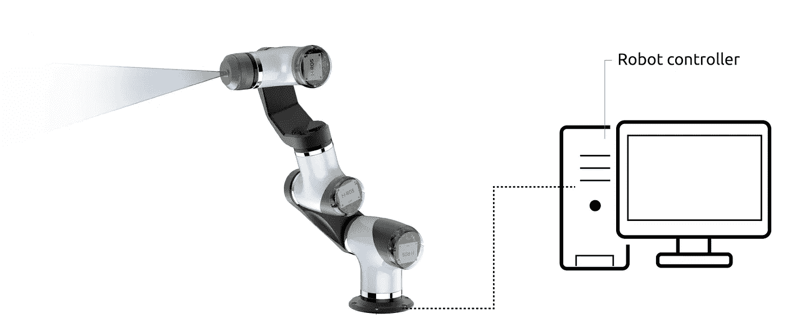
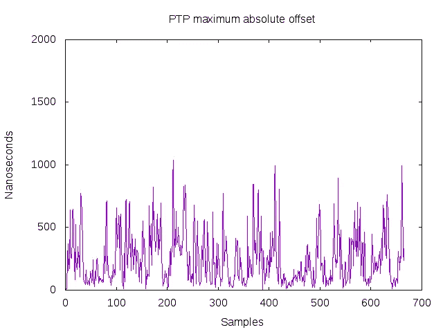
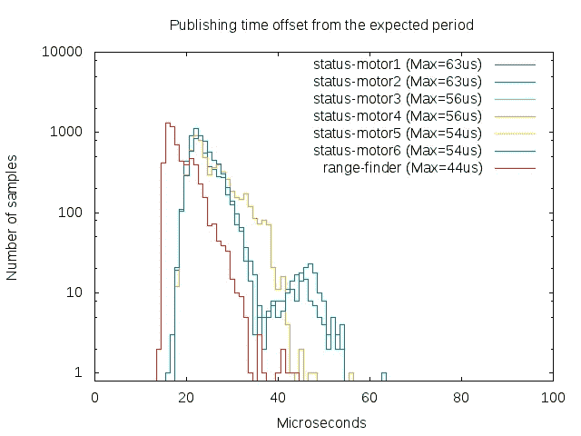
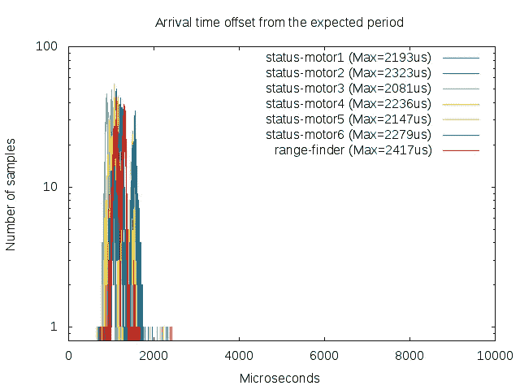

# 模块化协作机器人中的时间同步

> 原文：<https://medium.com/hackernoon/time-synchronization-in-modular-collaborative-robots-d4c218fcb66d>

## 介绍 M-cobots，模块化协作机器人

> 本文内容来源于[https://arxiv.org/pdf/1809.07295.pdf](https://arxiv.org/pdf/1809.07295.pdf)的“模块化协作机器人中的时间同步”。与 Carlos San Vicente Gutiérrez、Lander Usategui San Juan、 [Irati Zamalloa Ugarte](https://medium.com/u/e9b73593e3f?source=post_page-----d4c218fcb66d--------------------------------) 、inigo mugu ruza GoE naga、Laura Alzola Kirschgens 和 yours truly 合著的同行。

Experimental setup with a 6 Degrees-of-Freedom (DoF) M-cobot, a collaborative modular articulated arm with a range finder attached at its last joint.

> 新一代的机器人系统需要模块化、灵活和安全的人机交互。现有的协同机器人似乎只能满足后者，需要一种模块化的方法来提高它们的可重构性和互操作性。我们提出了一个新的 cobots 子类 M-cobots 来解决这些问题。特别是，我们讨论了这些系统同步的相关性，对其进行了分析，并展示了如何通过正确配置的 M-cobot，我们能够获得 a)模块间分布式亚微秒时钟同步精度，ROS 2.0 消息的时间戳精度低于 100 微秒，以及 c)毫秒级端到端通信延迟，即使在网络过载高达网络容量 90 %的情况下也是如此。

# 介绍

随着机器人的日益普及，我们开始观察这些机器是如何进入新领域的。各种应用的自动化程度正在迅速提高。食品工业是机器人技术的最新热点之一，目前的[技术](https://hackernoon.com/tagged/technology)在应对准备沙拉时出现的需求方面显示出局限性。超越新的机器人应用，回顾传统的工业自动化，技术障碍开始被认为是进一步发展的关键。Geenen [1]指出，在 Fraunhofer [2]进行的前期工作表明，生产周期的完全自动化通常效率低下，因为在混合小批量的大量产品品种时会遇到挑战。他评论说，在这种情况下实现效率需要[开发](https://hackernoon.com/tagged/development)灵活且适应性强的生产系统，可以应用于各种任务【3】，并提出了新一代机器人系统，这些系统模块化、灵活且安全，适合人机协作(HRC)。

协作机器人(通常称为 cobots)结合了人类智能和技能的优势以及复杂的机器人技术系统的优势。这一代机器人专注于建立人类和机器之间的联合工作空间。合作机器人已经在许多领域展示了它们的优势。例如，Gambao 等人强调了材料处理任务的这一方面[4]。然而，根据作者的说法，为了提高现有机器人的可重构性和灵活性，模块化方法是最佳解决方案。当前市场上可获得的协作机器人缺乏模块化，并且遵循与传统机器人相似的方法，通过各种技术强制厂商锁定。除了制造商围绕单个 cobot 供应商的小规模分裂之外，并没有真正尝试以供应商无关的方式简化与外围设备(如末端执行器或传感器)的集成过程。

受现有技术[4]的启发，我们提出了一个新的协作机器人子类，它包括本机模块化和可重构能力，以应对新的市场需求。我们称这个新类为 M-cobots；模块化协作机器人。cobot 旨在解决当前 cobot 解决方案中存在的几个相关问题，如供应商之间缺乏互操作性、缺乏灵活性、可扩展性甚至与第三方模块的同步。在这篇特别的论文中，我们讨论了同步问题，它与时间要求严格的机器人任务相关，并对通信延迟有直接影响。

传统的同步方法包括使用特定供应商的现场总线和使用不同同步原语的各种组件。这通常会导致复杂且难以维护的混合同步架构。对于 M-co bot，我们提出了一种基于 IEEE 1588 精确时间协议(PTP)标准的集成同步方法。我们展示了如何使用这种方法，我们设法获得强大的毫秒级端到端通信延迟。我们展示了我们的设置，并提供了使用 ROS 2.0 获得的时间戳准确性的实验结果。特别是，我们展示了我们的分布式和模块化设置如何能够提供亚微秒时钟同步精度。最后，我们以各种行动挑战我们的设置，并展示适当的配置如何减轻对整体通信延迟的影响。

# 背景

## A.为什么模块化机器人需要同步？

关于机器人应用中同步的重要性以及如何应用不同的方法来实现更好的性能，有大量的文献。模块化机器人系统本质上是分布式机器人系统，其需要组件之间的同步，以便协调传感器和致动器的操作。出于各种原因，需要一个公共时间基准。例如，数据记录通常需要精确的时间戳。在高速精确的运动控制系统中，不同执行器之间的同步至关重要。在多传感器数据融合的情况下，不准确的同步通常会导致不准确的数据推断。此外，从我们的实验中可以看出，同步对于减少分布式系统的整体响应时间也是至关重要的。

机器人中需要同步的一个常见例子是机器人-激光扫描仪系统。Voges 等人[5]解释了激光扫描仪和电机驱动的 3D 激光扫描仪内的致动器之间适当同步的重要性。在这种情况下，作者提出了一种被动的方法来估计传感器时间戳偏移。在[6]中，类似的方法被应用于多传感器系统，该系统包括用于同步定位和绘图(SLAM)应用的致动激光扫描仪、其电机和摄像机。正如作者所解释的，如果不存在同步，则每组扫描点的相应编码器值的偏移会导致由 SLAM 技术构建的结果点云中的大失真。

在[7]中，解释了激光扫描仪和机器人之间的同步对于激光焊接是如何至关重要的。不正确的同步将导致所需图案和焊接图案之间的几何误差。在这种情况下，所提出的方法包括实验表征和补偿测量和机器人操作之间的延迟。Graaf 等人[8]利用 UDP 通信将激光数据采集与机器人姿态同步，解决了机器人激光焊接中实时焊缝跟踪的类似问题。

Zaman 等人[9]介绍了一种移动机器人里程计和视觉数据的时间同步方法。作者解释了在没有同步技术的系统中，图像数据与里程计的结合通常需要速度限制，以减少测量误差。所提出的方法使用可由里程计和图像数据检测的运动事件。

在[10]中，使用以太网和用于通信的通信中间件(Corba)将人形机器人构建为分布式系统。这项工作强调了同步的重要性，并使用 IEEE 1588 精确时间协议(PTP)来同步网络中所有机器人组件的时钟。具体来说，在所讨论的例子中，节点需要同步，以便从传感器获取数据并在正确的时间旋转电机。

在[11]中，讨论了高级驾驶员辅助系统(ADAS)应用中多传感器数据融合的不同同步策略。这项工作的目的是以正式的方式分析传感器融合过程对系统延迟的影响。最后的结论之一是，在传感器测量频率非常不同的情况下，使传感器同步有助于大大减少融合过程的延迟。

在[12]中，分析了用于机器人控制的实时传感器数据的使用。在这项工作中，作者分解了使用机器人操作系统(ROS) [13]控制通用机器人(UR)手臂的基于传感器的控制中涉及的延迟。为了表征，考虑了最坏情况下的同步延迟。这些延迟与控制周期的周期一样长。为了补偿由于传感器和控制周期之间缺乏同步而导致的采样效应，采用了过采样策略。采用这种策略，传感器值以高于机器人控制周期的采样频率进行更新。

正如我们所看到的，在许多机器人应用中都需要同步。根据不同的用例，通常会找到不同的解决方案；其中一些是基于时钟偏移估计和补偿、校准、触发信号和时间同步标准等。

## B.ROS 中的同步

在基于 ROS 的系统中，同步的常用方法是使用系统时钟作为时间源，并使用网络时间协议(NTP)等网络同步工具同步不同组件的时钟，如 ROS 时钟文档[14]中所述。此外，ROS 提供了几个主题同步方法作为转换库的一部分[15]。tf 或更新的 tf2 库有诸如 TimeSynchronizer 和 ApproximateTimeSynchronizer 之类的方法，允许根据消息头中的时间戳同步传入的消息。ROS 2.0 时钟和转换库的实现目前正在开发中[16]，但预计它的工作方式与 ROS 类似。

当构建基于 ROS 的系统时，一个问题是同步系统时钟并不总是可行的，并且在其他情况下，所使用的方法不够精确。因此，通常会找到不同的方法来实现组件之间的同步。Olson 等人[17]对其中一些方法进行了概述，并提出了一种被动同步算法。该方法旨在当传感器不提供同步方法时，减少机器人传感器中的同步误差。在这项工作中，机器人系统建设的主要问题之一是解决；缺乏同步标准的异构传感器。例如，在许多情况下，同步方法(如 NTP)不适用，因为传感器是通过串行接口连接的。这个问题也在 2017 年 Roscon talk 利用 ROS [18]构建计算机视觉研究车辆中得到解决，其中 Fregin 解释了用于解决 ADAS(高级驾驶辅助系统)系统的计算机视觉系统的四个摄像头之间的同步问题的方法。由于摄像机缺乏共同的参考时间，他们需要实施基于 PTP 和触发信号方法的混合解决方案。这说明了在 ROS 分布式系统中集成非同步组件的复杂性。

如前所述，同步可能非常耗时，并且实现的解决方案往往是特定于应用程序的。关键问题是许多机器人组件不提供标准的同步方法，或者它们根本不提供任何同步方法。据我们所知，对于机器人专家来说，最简单的方法是使用同步 ROS 本地组件，这些组件可以通过 NTP 或 PTP 等方法轻松同步。这样，ROS 应用程序将简单地依赖于正确的系统时钟同步，而不管用于同步时钟的方法。

**C .精确时间协议(PTP)**

NTP 是一种成熟的时钟同步方法，允许通过不可靠的网络(如互联网)进行同步。另一方面，当需要更高的精度时，通常使用全球定位系统(GPS)等时钟同步协议。然而，为了克服这些协议的一些限制，IEEE 1588 精确时间协议(PTP)应运而生。PTP 提供了比 NTP 更高的精度，因为它利用了硬件时间戳，提供了亚微秒级的精度[19]。此外，与 GPS 不同，PTP 不需要接入卫星信号，这使得它适合室内应用，并且成本较低。

为了简化由 ROS 驱动的同步机器人的构造，我们利用 H-ROS [20]软件和硬件基础设施，并在每个模块中包括 IEEE 1588 精确时间协议(PTP)。此外，H-ROS 模块利用了 HRIM [21]模型，该模型允许模块具有一致的消息并无缝地互操作。每个模块包含的 PTP 标准允许亚微秒同步。这为所有的 H-ROS 模块提供了一个通用的全局时钟，例如，允许在一个一致的时间参考中给所有的消息加时间戳。

**D .时间同步和 TSN**

正如之前的工作[22]中所解释的，时间敏感网络(TSN)标准旨在使以太网更具确定性。作为这些标准的一部分，IEEE 802.1 TSN 任务组已经定义了 IEEE 1588 的正式简档，以便在标准以太网中同步时间。IEEE 802.1AS-2011 [23]标准，也称为 gPTP(通用精确时间协议)，定义了 IEEE 1588–2008 的特定配置文件，以及提高计时精度和可靠性的附加规范。802.1AS-2011 完成后，IEEE 802.1 TSN 任务组开始着手修订 gPTP，以扩大其在工业时间敏感型应用中的用途。例如，802.1AS-REV 将支持多个同步主时钟，以便在出现故障时快速恢复时间同步。该标准还旨在提供即插即用同步，这是模块化机器人组件的一个有趣特性。

802.1AS 标准提供的时间同步也是其他标准的基础，如 802.1Qbv [24]中定义的时间感知流量调度。该标准通过定义定期调度，在以太网设备的出口端口实现时间触发通信。

# 实验结果、结论和未来工作

我们小组研究了模块化机器人的时间同步问题。我们描述了机器人组件中缺乏时钟同步方法是如何成为阻碍系统集成工作并影响整体机器人性能的关键问题。在原始论文中，我们提出了完整的结果，因此，我们认为模块化机器人的最佳方法是构建依赖于标准化的基于网络的同步协议的本地同步机器人模块。我们在 H-ROS[25]基础设施中集成的先前工作[22]、[26]、[27]的基础上实现了这一点，并证明了 ROS-native 机器人组件如何转变为提供同步响应和明确定义的通信延迟的机器人模块。特别是，我们展示了支持 ROS 2.0 的硬件如何获得

a)亚微秒时钟同步精度，

b) ROS 2.0 时间跨度精度低于 100 微秒，以及

c)端到端通信延迟在 1-2 毫秒之间。

总的来说，呈现的结果表明，我们使用所描述的设置实现了准确的模块化和分布式同步。我们能够以低于 100 微秒的精度给 ROS 2.0 消息加时间戳。这对于基于时间戳的传感器数据融合特别有意义，例如 ROS 同步过滤器。我们还展示了如何通过使用 PTP，我们能够高精度地同步端到端 ROS 2.0 通信，主要受限于通信延迟。正如我们在[27]中所展示的，通信开销主要是由 Linux 网络堆栈的接收路径和 ROS-DDS 层缺乏优化造成的。针对 OPC UA over TSN 的发布/订阅通信的类似实验正在进行[28] [29]，这些实验表明，当对时间敏感的流量进行优化时，可以实现低延迟。此外，我们展示了模块以太网链路中的延迟如何在拥塞网络中增加 ROS 2.0 消息的同步抖动，并展示了应用交换以太网 QoS 优先级解决该问题。最后，我们展示了可以使用 TSN 时间感知整形器来控制消息传输，并在 ROS 2.0 节点发布时实现准确的接收时间。

在 https://arxiv.org/pdf/1809.07295.pdf 阅读全文。

# 参考

[1]“设计新一代模块化、柔性、协作机器人”，[http://fourbythree.eu/](http://fourbythree.eu/)设计新一代模块化、柔性、协作机器人/，访问时间:2018–09–12。

[2] R. Müller 等人，“在 flugzeugstrukturmontage 的基础上发展新的蒙太奇系统”。经济、社会和重新配置。斯图加特:弗劳恩霍夫出版社，2013 年。

[3] B. Corves，R. Müller，M. Esser，M. Hüsing，m . janen，M. Riedel 和 M. Vette，“用于处理大型部件的可重构装配系统”，高工资国家的一体化生产技术。柏林，海德堡:施普林格出版社，第 946-971 页，2012 年。

[4] E. Gambao，M. Hernando 和 D. Surdilovic，“新一代合作搬运机器人”，ISARC。建筑自动化和机器人技术国际研讨会会议录，第 29 卷。维尔纽斯 Gediminas 技术大学建筑经济与财产系，2012 年，第 1 页。

[5] R. Voges、C. S. Wieghardt 和 B. Wagner，“激活的激光扫描仪及其相应电机之间的时间戳偏移确定”，2018 年 5 月。

[6]“使用传感器观测值查找多传感器系统的时间戳偏移量”，摄影测量工程与遥感，第 84 卷，第 357–366 页，2018 年 5 月。【在线】。可用:[http://dx.doi.org/10.14358/PERS.84.6.357](http://dx.doi.org/10.14358/PERS.84.6.357)

[7] H. Kang、J. W. Noh 和 S. J. Kwak，“激光扫描仪和机器人的同步方法”，2012 年第 12 届控制、自动化和系统国际会议，2012 年 10 月，第 952–955 页。

[8] M. Graaf、R. Aarts、J. Meijer、B. Jonker、E. Beyer、F. Dausinger、A. Ostendorf 和 A. Otto，“机器人激光焊接中实时焊缝跟踪的机器人传感器同步”，2005 年第 1 期。

[9] M. Zaman 和 J. Illingworth，“移动机器人中传感器数据的基于间隔的时间同步”，2004 年智能传感器、传感器网络和信息处理会议论文集，2004 年。，2004 年 12 月，第 463–468 页。

[10] F. Kanehiro、Y. Ishiwata、H. Saito、K. Akachi、G. Miyamori、T. Isozumi、K. Kaneko 和 H. Hirukawa，“基于实时以太网的人形机器人分布式控制系统”，2006 年 IEEE/RSJ 智能机器人和系统国际会议，2006 年 10 月，第 2471-2477 页。

[11] N. Kaempchen 和 K. Dietmayer，“多传感器融合的数据同步策略”，2018 年 08 期。

[12] T. Andersen、O. Ravn 和 N. Andersen，“基于传感器的机器人实时控制”，丹麦技术大学电气工程系博士论文，2015 年。

[13] M. Quigley，K. Conley，B. Gerkey，J. Faust，T. Foote，J. Leibs，R. Wheeler 和 A. Y. Ng，“Ros:一个开放源码机器人操作系统”，ICRA 开放源码软件研讨会，第 3 卷，第 3.2 期。日本神户，2009 年，第 5 页。

[14]“时钟— ROS 文档，OSRF”，[http://wiki.ros.org/Clock,](http://wiki.ros.org/Clock,)访问时间:2018–09–31。

[15] T. Foote，“tf:转换库”，载于《实用机器人应用技术》(TePRA)，2013 年 IEEE 国际会议，ser。开源软件研讨会，2013 年 4 月，第 1–6 页。

[16]“ROS 2.0 时钟和时间——ROS 2 设计，OSRF”， [http://design。](http://design.)ros2.org/articles/clock_and_time.html,访问时间:2018–09–31。

[17] E. Olson，“传感器同步问题的被动解决方案”，2010 年 IEEE/RSJ 智能机器人和系统国际会议，2010 年 10 月，第 1059-1064 页。

[18]“ROS con 2017:与 ROS-Andreas freg in 一起打造计算机视觉研究工具”，[https://roscon.ros.org/2017/presentations/](https://roscon.ros.org/2017/presentations/)ROS con % 202017% 20 Computer % 20 Vision % 20 Research % 20 Vehicle。pdf，访问时间:2018 年 9 月 31 日。

[19] T. Neagoe、V. Cristea 和 L. Banica，“计算机网络时钟同步中 Ntp 与 ptp 的比较”，2006 年 IEEE 工业电子国际研讨会，第 1 卷，2006 年 7 月，第 317–362 页。

[20] V. Mayoral、A. Hernández、R. Kojcev、I. Muguruza、I. Zamalloa、A. Bilbao 和 L. Usategi，“机器人范例的转变——硬件机器人操作系统(h-ROS)；创建可互操作机器人组件的基础设施”，2017 年 NASA/ESA 自适应硬件和系统会议(AHS)，2017 年 7 月，第 229-236 页。

[21] I. Zamalloa，I. Muguruza，A. Hernández，R. Kojcev 和 V. Mayoral，“模块化机器人的信息模型:硬件机器人信息模型(hrim)”，arXiv 预印本 arXiv:1802.01459，2018 年。

[22] C. S. V. Gutiérrez，L. U. S. Juan，I. Z. Ugarte 和 V. M. Vilches，“机器人的时间敏感网络”，CoRR，第 abs/1804.07643 卷，2018 年。【在线】。可用:[http://arxiv.org/abs/1804.07643](http://arxiv.org/abs/1804.07643)

[23] IEEE，“局域网和城域网的 IEEE 标准—桥接局域网中时间敏感应用的定时和同步”，IEEE Std 802.1AS-2011，第 1–292 页，2011 年 3 月。

[24] —“局域网和城域网的 Ieee 标准—桥和桥接网络—修正案 25:计划流量的增强”，Ieee Std 802.1 qbv-2015(Ieee Std 802.1 q-2014 修正案，由 IEEE Std 802.1Qca-2015、IEEE Std 802.1Qcd-2015 和 Ieee Std 802.1 q-2014/Cor 1–2015 修订)，第 1 页

[25] I. Zamalloa，I. Muguruza，A. Hernández，R. Kojcev 和 V. Mayoral，“模块化机器人的信息模型:硬件机器人信息模型(hrim)”，arXiv 预印本 arXiv:1802.01459，2018 年。

[26] C. S. V. Gutiérrez、L. Usategui San Juan、I. Zamalloa Ugarte 和 V. Mayoral Vilches，“实时 Linux 通信:实时机器人应用的 Linux 通信堆栈评估”，ArXiv 电子印刷，2018 年 8 月。

[27]“机器人的时间敏感网络”，ArXiv 电子出版物，2018 年 4 月。

[28] J. Pfrommer、A. Ebner、S. Ravikumar 和 B. Karunakaran，“通过 tsn 实现实时工业通信的开源 opc ua pubsub”，2018 年第 7 期。

[29] J. Diesilva Sagaya，B. Jayachandran Ramesh，F. Melvin 和 K. Pavithra，“通过 tsn 使用 opc ua pubsub 的工业通信实时开源解决方案”，072018。【在线】。可用:[https://www.osadl.org/uploads/media/](https://www.osadl.org/uploads/media/)实时-开源-工业-通信解决方案-使用-OPC-UA-公共订阅-通过-TSN。可移植文档格式文件的扩展名（portable document format 的缩写）