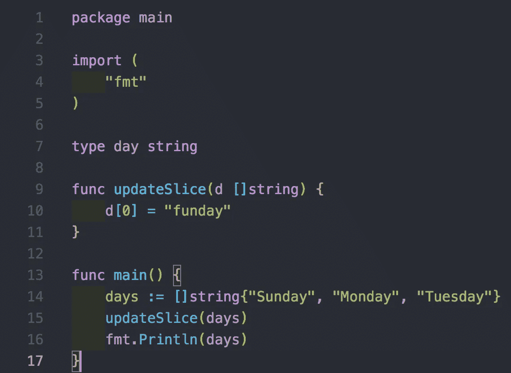
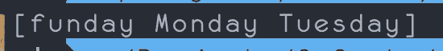

# 该走了！通过示例学习 Golang

> 原文：<https://medium.com/hackernoon/time-to-go-learning-golang-through-examples-480a90c5e7f9>

我最近对区块链开源社区产生了兴趣。我注意到的第一件事是，我遇到的大多数项目都是用 Go 编写的。围棋已经在我的雷达上很长时间了，因为社区对它非常兴奋，并对它大加赞赏。

## 为什么要去？

**Go** 是一种静态类型的编译语言，类似于 C++和 Java。它遵循了 C 语言在语法和语义上的简单性，并具有一些额外的特性。

***戈鲁丁斯***

与旧的[编程语言](https://hackernoon.com/tagged/programming)相比(Python、Java 等。)Go 是 2009 年最近才发布的。Go 的构建考虑到了并发性和高效利用多处理器的能力。 [Rob Pike (Go 创造者)对此有深入的探讨。](https://vimeo.com/49718712)最终结果是运行并发 go 例程比用 Java 等其他语言线程化要便宜得多。这允许我们同时运行数千个***go routine***(甚至在单个处理器上！)毫无顾虑，并使其成为需要扩展的问题的完美解决方案。

***代码的性能***

Go 直接在底层硬件上运行。Go 不在虚拟机上执行，这意味着我们的代码被直接编译成二进制文件，在我们的处理器上运行。消除中间的 VM(例如 Javas 中的 JVM)意味着 perf 是尽可能低的级别，我们有能力通过消除不必要的抽象和性能影响来微调和优化我们的代码，以获得最大的回报。

***职能是一等公民***

在 Go 中，函数和其他数据类型一样。这意味着函数可以返回函数，接受函数等等。这使我们能够利用函数式编程范例(这是我喜欢的！！)，并写出更干净、更清晰的代码。

***维修性***

Go 语法简洁。此外，它有一个优秀的格式化程序，以单一的方式格式化代码。这听起来可能很痛苦，但实际上解决了许多关于编码约定等令人头疼的问题。Go 去掉了很多(IMO)使代码难以理解的语言特性，比如继承、构造函数、注释、泛型等等。

## 包装

Go 允许对包中的相关代码进行分组。编译时，包共享一个命名空间。因此，您可以在单独的文件中编写代码，但仍然可以调用位于不同目录或文件中的代码。随着您的项目变得越来越复杂，您可以创建大量的包，每个包代表您的应用程序的一个不同的逻辑单元。然而，我们用一个特殊的名字来告诉 Go 我们想把它变成一个可以执行的文件。那个名字叫*【总管】。*

**

*所以将一个包命名为“main”告诉 Go 我们希望它是可执行的。一旦 Go 知道这个文件是可执行的，它将要求我们定义一个名为***“main”***的函数。该`main` 功能将在程序运行时自动调用。*

*Go 有一个非常健壮的标准库。为了访问，我们只需在包声明下添加 import 语句。开始应该是这样的:*

```
*package mainimport ( "fmt"
)func main() { fmt.Println("Hello world") // Amazing logic here}*
```

## *变量*

*在 Go 中使用变量是熟悉的，但又是不同的。让我们检查一下变量赋值，稍后我们将看看通过值和通过引用使用变量。这是在 Go 中初始化变量的普通方法。*

```
*var currentDay string = “Saturday”*
```

*在一个示例中，它看起来像这样:*

**

*但是这太冗长了。Go 允许将变量声明和赋值简化为:*

```
*currentDay := “Saturday”*
```

*Go 在这里推断‘current day’是一个字符串，因此没有必要明确说明它。同样，Go 知道下面是一个“整数”声明。*

```
*luckyNumber := 3*
```

*因此，为了把这些放在一起，下面两种声明和初始化 Go 变量的方法是等效的。*

```
*luckyNumber := 3var luckyNumber int = 3 // oops! This will cause an error!*
```

*不过要小心！在 Go 中，一个变量只能初始化一次。所以上面的代码片段会编译失败！*

**

## *功能*

*Go 是一种静态类型的编程语言，所以我们需要标注每个函数返回值的类型。下面的代码不会编译，因为我们还没有注释返回类型:*

```
*func greetUser() { // function declaration is missing return type! return “Hey friend!”}*
```

*要修复这个错误，我们只需在函数声明中添加一个返回类型。*

**

*从 main 方法中调用这个函数如下所示:*

**

*酷毙了。让我们来看一个例子，在这个例子中，我们把到目前为止看到的所有东西都联系起来。让我们在不同的文件中声明 greetUser，但是使用相同的包并调用它。回想一下，同一个包中的文件共享一个名称空间，可以自由地相互调用。*

**

*我们用以下方式构建上述内容*

```
*go run utils.go main.go*
```

*我们得到以下结果:*

**

*from our stdout*

## *切片和 for 循环*

*在 Go 中，数组是静态的，它们的长度需要在创建时指定。如果你想处理一个动态大小的数组，你需要使用一个 ***片*** 。声明一个切片非常简单:*

```
*fruits := []string{“Mango”, “Cherry”, “Apple”}*
```

*请注意，切片中只能有一种类型的值。因此，声明一个带有 int 和 string 的片将不会被编译。*

*现在让我们对水果切片进行一次基本迭代，并记录每个元素。*

**

```
*Don’t forget to build with go run main.go*
```

**

*一个问题是 Go 要求我们在代码中使用所有声明的变量。如果我们不想要这个索引，我们可以告诉 Go 忽略它，将它命名为“下划线”，如下所示:*

****

## *切片是如何工作的*

*Go 如何处理创建这些动态切片？Go 的做法还是挺有意思的。当一个片被创建时**，两个数据结构被创建**。第一个是数组，第二个是记录切片长度、切片容量和对该数组的引用的结构。*

## *Go 是面向对象的语言吗？*

*根据文件是和不是(耶，多么清晰的答案！).围棋采取了不同的方法，试图取得相似的结果。在围棋中，没有“类”。相反，Go 允许我们为特定的数据类型声明“接收函数”。理解这一点最简单的方法是查看一些代码。*

**

*因此，尽管我们不能创建一个 Day 类(就像我们在经典的 OOP 语言中那样——想想现在的 Java、Python 甚至 JS ),我们仍然可以很容易地为这些类型声明新的数据类型和方法。*

*因此，让我们把 Go 术语桥接起来，并把它与经典 OOP 中的一些东西进行比较。*

> *通过创建一个带有接收方的函数的新类型，我们为该类型的任何值添加了一个“方法”。(斯蒂芬·格里德)*

## *多个返回值*

*我非常喜欢 Go 的一个特性是从一个函数返回多个值的能力。让我们看看实际情况:*

**

***结构***

*Go 的结构是可变字段 的 ***类型集合。如果你来自 JS、python 或 Java，它本质上是一个对象。它们对于将数据组合在一起形成记录很有用。****

****

## *地址和指针*

*Go 区分两种不同的数据类型。*

****值类型*** —包含原始数据类型的实际值的类型。想想 *int，float，strings，*等等。*

****引用类型*** —包含对实际基础记录列表的引用的任何数据类型。*

*这是对话开始变得更有趣的地方。默认情况下**当传递参数类型——如 int、float、string 或 struct 到函数中时，Go 复制每个参数并通过值传递。有了这些知识，下面的例子通过值传递。你希望它打印什么？***

**

*因为 Go 复制“值类型”，并且不向它们发送引用，所以上面的输出:*

**

*我们刚刚看到 Go 中的变量是按值传递的。就像我们之前提到的，当 ***片*** 被创建时，片上带有元数据的附加数据结构被创建。这包括对 ***切片*** 的引用。每当我们谈到切片时，都会用到和提到这个参考。因此，下面的示例将成功地改变切片的内容。*

****

*但是如果我们想改变发送给函数的结构数据，会发生什么呢？我们需要通过引用来传递它。Go 在这个概念上有点低级，需要我们传递变量和解引用指针的地址。*

> *旁白:指针只是计算机内存中变量的地址。如果我们发送变量的地址而不是值，我们可以直接操作它。*

## *获取变量的地址*

*我们总是可以通过使用&操作符来获取变量**T3 的地址。***

**

*这将输出物理内存 中变量的 ***实际地址。****

**

*现在我们有了对变量(它的地址)的引用，我们可以通过 ***取消对指针*的引用并赋予新的内容**来轻松地改变它的值。*

> *旁白:*解引用是从地址中提取一个值的行为。我们用*运算符取消对地址的引用。**

*因此，如果我们希望我们的函数接收一个指向 ***类型的日期的指针(我们上一个例子中的结构)*** 然后记录它的值，我们可以这样做:*

**

*让我们看一个使用接收函数时**通过引用传递的例子。***

**

*那么，为什么这种方法现在行得通呢？我们已经修改了 updateDaySuccess 接收函数，以接受一个指向 day 类型的指针。*

> **重要提示:当调用方法时，Go 识别出它需要一个指针，并隐式地为我们发送一个对该值的引用(谢谢 Go！)然后，updateDaySuccess 接收指针，用*运算符对其解引用，并赋一个新值。**

## *地图*

*最有用的数据结构之一是哈希表。它们提供快速查找、添加和删除。Go 提供了实现哈希表的内置映射类型。在 Go 中，键和值可以是几种不同的类型，有一个空的接口。[在这个 Go playground 链接中，声明了一个带有几种不同类型键的地图。除此之外，它们的工作方式也和你想象的非常相似。](https://play.golang.org/p/-s76LSSTEqI)*

****

***接口***

*Go 中的接口使代码更加灵活。接口允许我们指定一些需要的行为，而不是要求特定的类型。在 Go 中，接口是隐式满足的。也就是说我们不需要写*implements blahBlah***(我看的是你们 Java ppl) **之类的东西。当我们说一个类型满足一个接口时，我们的意思是这个类型实现了接口定义中包含的所有功能。让我们来看一个基本的例子:*****

******

***因此，这里我们会说 day 结构满足 dayDetails 接口，因为它定义了一个返回字符串的接收函数 getDay。因此，如果你遇到了任何其他语言的接口，其基本原理和好处将继续下去。***

*****戈鲁丁*****

***goroutine 是与其他函数或方法同时运行的函数(接收器或普通)。goroutine 基本上是一个线程，但是开销较小。因为 goroutines 比线程轻，所以 go 程序同时运行数千个例程是很常见的。启动 goroutine 很简单！只需在前面加上 go 关键字，就可以自动得到一个并发运行的 go 例程。尽管开始一个围棋程序很简单，但还是有一些问题。让我们看看这个例子:***

******

***您期望的输出是什么？***

******

*****它为什么不输出“星期六”？*****

***当创建一个新的 go 例程时，调用会立即返回。与函数不同的是，**控件不会等待 goroutine 完成执行。**所以在这种情况下，程序的流程继续并结束，主程序终止自己和它拥有的 goroutine。让我们通过休眠我们的程序来克服这个问题。这将给我们的 goroutine 足够的时间来完成执行。***

************

***这是可行的，但是非常不安全，我们不应该采用这种做法。渠道让我们做得更好。***

*****频道*****

***我们已经看到，生成围棋程序很容易。通道是允许 goroutines 进行通信的工具。通道允许我们将数据从一个 goroutine 传输到另一个 go routine(甚至使用管道操作符！).每个通道都有一个与之关联的数据类型。与通道相关联的数据类型定义了我们可以通过管道传输哪些数据。例如下面的通道允许可以发送和接收布尔值:***

```
***boolChannel := make(chan bool)***
```

*****通过通道发送和接收数据是阻塞动作，因此我们可以很容易地重写上面的程序，忽略睡眠黑客。*****

***让我们看看如何重写我们的程序！***

************

## ***结论***

***这是对 Go 功能的一个快速概述。显然，这只是冰山一角，还有很多有待发现:)我对 Go 的最初印象是简洁而强大。最近，我越来越喜欢静态类型语言，因为它允许开发速度更快，没有运行时错误，并且消除了一整类耗时的错误！我对学习区块链相关项目、服务器和任何需要并发性的东西的 Go 很感兴趣，因为它看起来很有趣也很强大！***

*****我的下一篇博文将探索区块链，敬请关注！*****

## ***如果这篇文章有帮助，请订阅并点击鼓掌👏按钮以示支持！⬇⬇***

***你可以在 [Instagram](https://www.instagram.com/omeragoldberg/) 、 [Linkedin](https://www.linkedin.com/in/omer-goldberg-680b40100/) 和 [Medium](/@omergoldberg) 上关注我。***