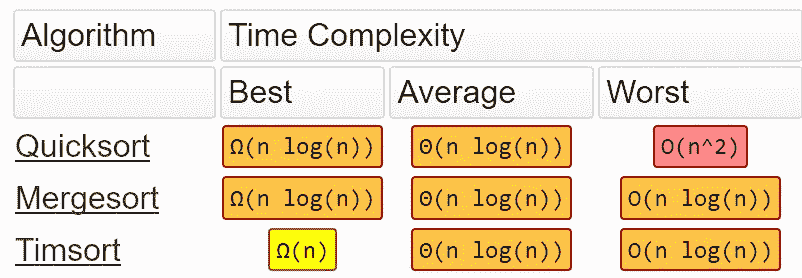
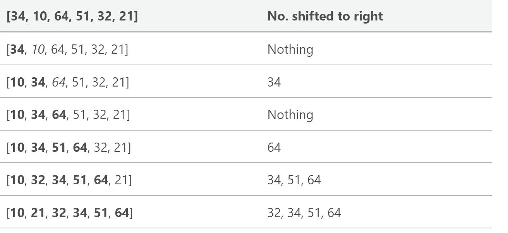
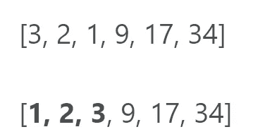
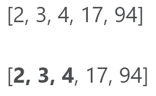
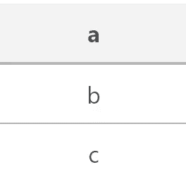
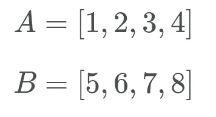

# timsort——你从未听说过的最快的排序算法

> 原文：<https://medium.com/hackernoon/timsort-the-fastest-sorting-algorithm-youve-never-heard-of-36b28417f399>


Photo by [Marc Sendra martorell](https://unsplash.com/photos/-Vqn2WrfxTQ?utm_source=unsplash&utm_medium=referral&utm_content=creditCopyText) on [Unsplash](https://unsplash.com/search/photos/fast?utm_source=unsplash&utm_medium=referral&utm_content=creditCopyText)

Timsort:一种非常快速、O(n log n)、稳定的排序算法，专为现实世界构建，而不是在学术界构建。

**点击此处查看更新文章:**

[](https://skerritt.blog/timsort-the-fastest-sorting-algorithm-youve-never-heard-of/) [## timsort——你从未听说过的最快的排序算法

### Timsort:一个非常快速、O(n log n)、稳定的排序算法，为现实世界而构建——不是在学术界构建的…

skerritt.blog](https://skerritt.blog/timsort-the-fastest-sorting-algorithm-youve-never-heard-of/) 

Image of Tim Peter from [here](https://www.youtube.com/watch?v=1wAOy88WxmY)

Timsort 是一种排序算法，对于真实世界的数据非常有效，而不是在学术实验室中创建的。Tim Peters 在 2001 年为 Python 编程语言创建了 Timsort。Timsort 首先分析它试图排序的列表，然后根据对列表的分析选择一种方法。

自从该算法被发明以来，它已经被用作 Python、 [Java](https://bugs.java.com/bugdatabase/view_bug.do?bug_id=6804124) 、 [Android](http://www.kiwidoc.com/java/l/x/android/android/5/p/java.util/c/TimSort) 平台和 GNU Octave 中的默认排序算法。

Timsort 的大 O 记法是 O(n log n)。要了解大 O 符号，请阅读[这个](https://hackernoon.com/you-need-to-understand-big-o-notation-now-4ada3d2ec93a)。



From [here](http://bigocheatsheet.com/)

Timsort 的排序时间和 Mergesort 一样，比你可能知道的大多数其他排序都要快。Timsort 实际上利用了插入排序和合并排序，您很快就会看到这一点。

Peters 设计 Timsort 是为了使用大多数真实数据集中已经存在的有序元素。它称这些已经有序的元素为“自然运行”。它遍历数据，将元素收集到运行中，同时将这些运行合并成一个运行。

# **数组中的元素少于 64 个**

如果我们试图排序的数组中的元素少于 64 个，Timsort 将执行插入排序。

插入排序是一种简单的排序，对小列表最有效。对于较大的列表来说很慢，但是对于较小的列表来说非常快。插入排序的思想如下:

*   一个一个看元素
*   通过在正确的位置插入元素来构建排序列表

下面是一个跟踪表，显示了插入排序将如何对列表[34，10，64，51，32，21]进行排序



Image taken by me, from my website [skerritt.tech](https://skerritt.tech)

在这个例子中，我们将新排序的元素插入到一个新的子数组中，这个子数组从数组的开头开始。

这里有一个显示插入排序的 gif:


Taken from [here](https://upload.wikimedia.org/wikipedia/commons/9/9c/Insertion-sort-example.gif)

# **关于运行的更多信息**

如果列表大于 64 个元素，则算法将首先遍历列表，寻找严格增加或减少的部分。如果该部分正在减少，它将反转该部分。

因此，如果游程在减少，它将看起来像这样(其中游程以粗体显示):



Image from my website, [skerritt.tech](https://skerritt.tech/)

如果不减少，它会像这样:



Image from my website, [skerritt.tech](https://skerritt.tech/)

最小游程的大小是根据数组的大小确定的。该算法选择它，使得随机数组中的大多数游程在长度上等于或变成最小游程。当运行次数等于或略小于 2 的幂时，合并 2 个数组更有效。Timsort 选择 minrun 来确保这种效率，方法是确保 minrun 等于或小于 2 的幂。

该算法从 32 到 64(包括 32 和 64)的范围内选择 minrun。它选择 minrun，使得原始数组的长度除以 minrun，等于或略小于 2 的幂。

如果游程的长度小于 minrun，则计算该游程远离 minrun 的长度。使用这个新的数字，您可以在运行之前获取这么多的项目，并执行插入排序来创建一个新的运行。

因此，如果最小游程是 63，游程长度是 33，则 63–33 = 30。然后，从运行结束前获取 30 个元素，因此这是运行[33]中的 30 个项目，然后执行插入排序以创建新的运行。

在这部分完成后，我们现在应该在一个列表中有一堆排序的运行。

# **合并**

Gif from [Giphy](https://gph.is/18RPLoO)

Timsort 现在执行 mergesort 将运行合并在一起。然而，Timsort 确保在合并排序时保持稳定性和合并平衡。

为了保持稳定，我们不应该交换两个等值的数字。这不仅保持了它们在列表中的原始位置，而且使得算法更快。我们将很快讨论合并平衡。

当 Timsort 找到游程时，它将它们添加到堆栈中。一个简单的堆栈如下所示:



Image from my website, [skerritt.tech](https://skerritt.tech/)

想象一堆盘子。你不能从底部拿盘子，所以你必须从顶部拿。堆栈也是如此。

当 mergesort 运行时，Timsort 试图平衡两个相互竞争的需求。一方面，我们希望尽可能延迟合并，以便利用以后可能出现的模式。但是我们更希望尽快进行合并，以利用运行刚刚发现的仍然在内存层次结构中处于高位的运行。我们也不能将合并延迟“太久”，因为它会消耗内存来记住仍未合并的游程，并且堆栈有固定的大小。

为了确保这种折衷，Timsort 跟踪堆栈中最近的三个项目，并创建了两个必须适用于这些项目的定律:

1.A > B + C

2.B > C

其中 A、B 和 C 是堆栈上最近的三个项目。

用蒂姆·彼得斯自己的话说:

> *一个好的折衷方案是在堆栈条目上保持两个不变量，其中 A、B 和 C 是最前面三个还没有合并的片的长度*

通常，合并不同长度的相邻线路是很困难的。更困难的是，我们必须保持稳定。为了解决这个问题，Timsort 留出了临时内存。它将两次运行中较小的一次(同时调用运行 A 和 B)放入临时内存。

# **飞奔**

Gif from [Giphy](https://giphy.com/search/galloping)

当 Timsort 正在合并 A 和 B 时，它注意到一个 run 已经连续“赢”了很多次。如果结果是运行 A 包含的数字完全小于运行 B，那么运行 A 将会回到原来的位置。合并这两个项目需要做大量的工作，但却一无所获。

通常情况下，数据会有一些预先存在的内部结构。Timsort 假设，如果很多 run A 的值低于 run B 的值，那么很可能 A 将继续具有比 B 小的值。



Image from my website, [skerritt.tech](https://skerritt.tech/). Image of 2 example runs, A and B. Runs have to be strictly increasing or decreasing, hence why these numbers were picked.

Timsort 随后将进入飞奔模式。Timsort 对 a[0]中 b[0]的适当位置执行二分搜索法，而不是对 A[0]和 B[0]进行核对。这样，Timsort 可以将 A 的整个部分移动到位。然后，Timsort 在 B 中搜索 A[0]的适当位置。然后，Timsort 将一次移动 B 罐的整个部分，并放置到位。

让我们来看看实际情况。Timsort 检查 B[0](即 5)，并使用二分搜索法在 a 中查找正确的位置

嗯，B[0]属于 A 列表的后面。现在 Timsort 在 B 的正确位置检查 A[0](也就是 1)。所以我们要看看数字 1 去了哪里。这个数在 B 的开头，我们现在知道 B 属于 A 的结尾，A 属于 B 的开头。

事实证明，如果 B[0]的合适位置非常靠近 A 的开头(反之亦然)，那么这个操作是不值得的。因此，如果没有回报，疾驰模式很快就会退出。此外，Timsort 注意到了这一点，并通过增加连续 A-only 或 B-only 获胜的次数来增加以后进入疾驰模式的难度。如果 gallop 模式有回报，Timsort 会让重新进入变得更容易。

简而言之，Timsort 做了两件非常好的事情:

*   在具有预先存在的内部结构的阵列上实现出色的性能
*   能够保持稳定的排序

以前，为了实现稳定的排序，您必须用整数压缩列表中的项目，并将其作为元组数组进行排序。

# **代码**

如果您对代码不感兴趣，可以跳过这一部分。这一部分下面还有更多信息。

下面的源代码是基于我和 Nanda Javarma 的工作。源代码并不完整，也不像 Python 官方的 sorted()源代码。这只是一个简化的 Timsort，我实现它是为了对 Timsort 有一个总体的感觉。如果你想看到 Timsort 的原始源代码，请点击这里查看[。Timsort 是用 C 实现的，而不是 Python。](https://github.com/python/cpython/blob/master/Objects/listobject.c)

Timsort 实际上内置在 Python 中，所以这段代码只是作为一个解释器。要使用 Timsort，只需编写:

```
list.sort()
```

或者

```
sorted(list)
```

如果你想掌握 Timsort 的工作原理并有所体会，我强烈建议你尝试自己实现它！

本文基于 Tim Peters 对 Timsort 的原始介绍，在这里找到。

## 你喜欢这篇文章吗？在社交媒体上与我联系，讨论所有与计算机科学相关的事情😁

[推特](https://twitter.com/brandon_skerrit)|[insta gram](http://instagram.com/brandon.codes)|[LinkedIn](https://www.linkedin.com/in/brandonls/)

别忘了点击那个👏拍手声👏按钮，以示感谢！

我写这篇文章没有得到报酬。如果你想支持我，请在下面给我买杯咖啡什么的😁

[](https://paypal.me/BrandonSkerritt) [## 用贝宝支付布兰登·斯凯里特。我

### 去 paypal.me/BrandonSkerritt 输入金额。既然是 PayPal，那就简单又安全。没有 PayPal…

paypal.me](https://paypal.me/BrandonSkerritt) [](https://monzo.me/brandonskerritt) [## 通过 Monzo.me 即时支付 Brandon

### 点击链接向布兰登付款。你不需要创建一个账户，而且完全免费。

monzo.me](https://monzo.me/brandonskerritt)