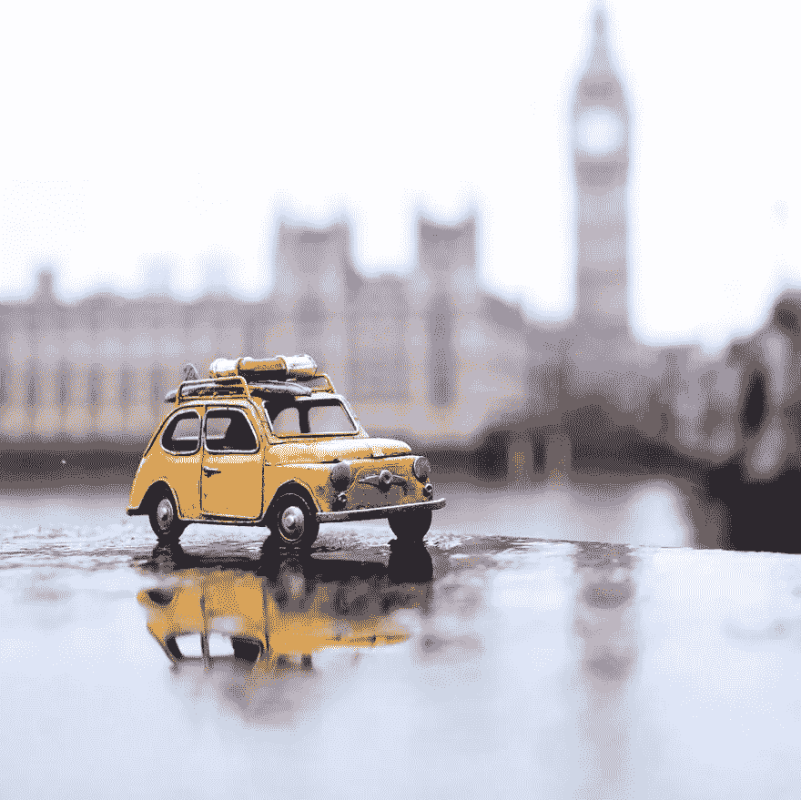
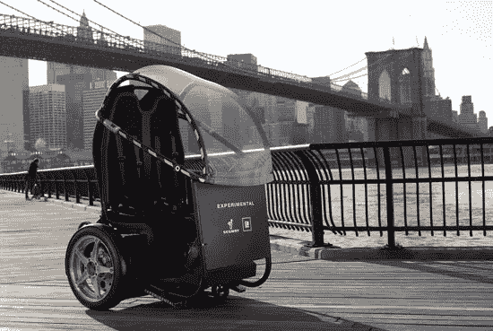
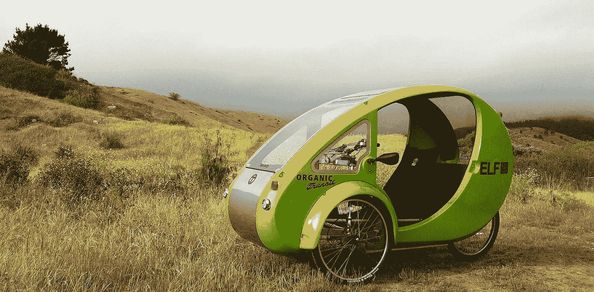

# 小型车，更好的机动性？

> 原文：<https://medium.com/hackernoon/tiny-cars-better-mobility-742706d57580>

(Photo c*redit: Kim Leuenberger)*

## 赛格威的重生以及私人和共享交通的未来。

大约 10 年前的 2009 年，赛格威和通用汽车联手创造了一种新型的个人交通工具，被称为 PUMA 项目(个人城市移动和无障碍)。当时，两轮电动汽车——本质上是加大和改进的 Segway 滑板车，有两个座位——在纽约汽车展上推出。

正如布拉德·斯通最近在《T2》和《彭博》中所写的:“17 年前，发明家迪安·卡门[开着他的赛格威](https://www.youtube.com/watch?v=Tppv2NgZOQU)出现在《早安美国》的片场，并载入了企业家声名狼藉的史册。传奇风险投资家约翰·杜尔登和 Amazon.com 公司创始人杰夫·贝索斯当时对电动两轮车的市场机会充满热情。多尔预测，赛格威的销售额将达到 10 亿美元，创下历史新高。

它没有发生。

17 年后，赛格威滑板车几乎消失了——如果不是为了购物中心和城市旅游的话——取而代之的是该公司现在为 Bird、Lime 等初创公司生产的电动滑板车。但是这只快 10 岁的美洲狮又出现在了我的 LinkedIn feed 上，它发布了一段视频，视频由切达奶酪公司总裁兼首席执行官乔恩·斯坦伯格发布。

> 这辆小车是专为城市设计的。

 [## 乔恩·斯坦伯格(Jon Steinberg)在 LinkedIn 上写道:“这款微型汽车是专为城市设计的。(通过切达干酪)

### 2018 年 8 月 10 日:乔恩·斯坦伯格在 LinkedIn 上发帖

www.linkedin.com](https://www.linkedin.com/feed/update/urn:li:activity:6433674370043912192) 

一定会喜欢的！主要是因为在过去的 17 年里，赛格威抵制了市场并幸存下来……或者它尝试了，如 2015 年被中国制造商 Ninebot 收购。现在它正在经历重生。我不确定 10 年后 PUMA 微型汽车是否会发布，但许多新的交通初创公司正在翻新同样的概念。

Segway and GM’s PUMA

Organic Transit 的创始人 Rob Cotter 向[进行了解释](https://medium.com/u/23741ee96a9e?source=post_page-----742706d57580--------------------------------)小型电动汽车如何在智能城市中发挥核心作用，充当广泛网状网络中的节点，充当微型蜂窝塔、电池组以及空气污染、坑洞检测等传感器套件。例如，即将推出的 5G，电信公司将需要安装比今天的 4G 更多的塔，以实现承诺的高带宽。他们也许可以像 ELF 一样给小型电动汽车布线，让它们充当漫游塔，而不是试图到处安装固定塔，从而创建一个可立即部署的网络，而不是花费几个月或几年的时间到处安装固定塔。”

The ELF by Organic Transit

精灵是一种微型汽车。这是一辆太阳能和脚踏混合动力车。Organic Transit 将其称为“地球上最高效的交通工具”, TreeHugger 的萨米·格罗夫最近指出，尽管私人使用 ELF 非常昂贵，但它将是共享的完美选择。

初创公司 Lime 的车队已经包括电动滑板车和自行车，它正在关注新的交通产品，据彭博报道，[正在开发它所谓的“运输舱”](https://www.msn.com/en-us/finance/companies/this-scooter-sharing-company-wants-to-fill-the-streets-with-e2-80-98transit-pods-e2-80-99/ar-AAx3uRl)。Lime 的联合创始人兼董事长 Brad Bao 告诉《彭博》,目前还不清楚它是有三个还是四个轮子，但它可以在正常的街道交通中行驶，最高时速可达 40 英里。

鲍说，城市需要豆荚车，因为传统汽车对于大部分城市驾驶来说是多余的。大多数旅行由一个人组成，希望旅行 3 英里或更少。“他们不需要五座或七座，再加上所有的汽油消耗，”他说。“但没有这样的产品来满足他们的需求。”他说。“我们的目标是成为领先的多式联运公司，”联合创始人兼首席执行官 Toby Sun 表示。

 [## 其他电动滑板车和超越

### 关键是多式联运——我们城市中的移动性可以受益于电动铲车和电动助力车。

hackernoon.com](https://hackernoon.com/the-other-electric-scooters-and-beyond-c05c4aa09cb4) 

几周前，我写过关于多模态和移动性的文章。

在 [Medium](https://medium.com/u/504c7870fdb6?source=post_page-----742706d57580--------------------------------) 的一篇文章中，Scoot [的创始人兼首席执行官 Michael Keating](https://medium.com/u/5bc6944776b4?source=post_page-----742706d57580--------------------------------) 将多式联运定义为“21 世纪的地铁系统”Scoot 目前正在向其电动助力车和电动自行车车队引入电动脚踏式踏板车，与 Lime 一样，它也是 eyes 电动四轮车。

The Microlino by Micro Mobility Systems

最近，Microlino 引起了我的注意。这款古怪的小型电动城市汽车首次在 2016 年日内瓦车展上亮相，现在已经通过了最后的测试，现在可以合法在欧洲道路上行驶。据创造 Microlino 的瑞士公司 Micro Mobility Systems 称，生产将很快开始，此后将在瑞士交付，2019 年进入德国市场。Microlino 计划始于 2016 年 4 月，与意大利汽车制造商 Tazzari 成立了一家合资企业。