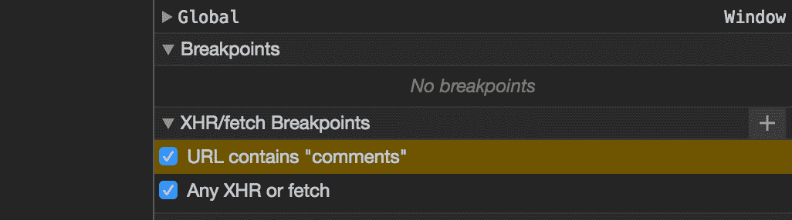
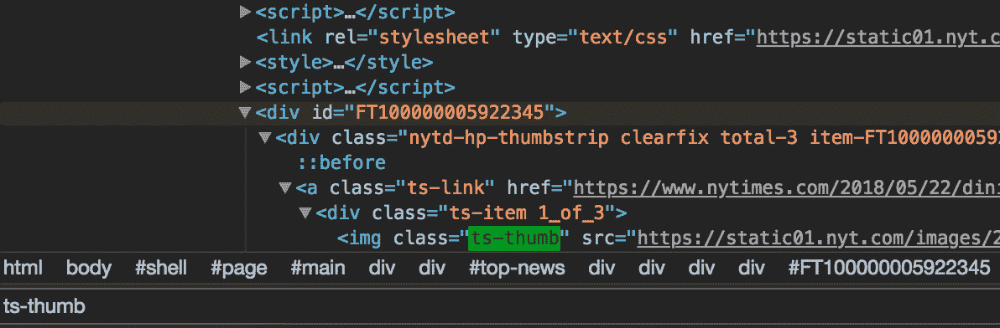

# 在 Chrome 开发者工具中调试的技巧和诀窍

> 原文：<https://medium.com/hackernoon/tips-and-tricks-for-debugging-in-chrome-developer-tools-458ade27c7ab>

我喜欢使用 Chrome 开发工具进行开发和调试。我发现开发工具一般都很容易使用，有很好的文档记录，并且不断有新的和实验性的特性出现。我经常使用开发工具来暂停代码执行，检查变量，并执行移动优先 web 开发。在这篇文章中，我将重点介绍一些提高你工作效率的技巧和捷径。

注:这些提示仅适用于 mac 用户。

## **漂亮的印花**

让我们把事情做得漂亮一点，开始行动吧！你好华丽，我的意思是漂亮的打印:)

点击左下方的“{ }”将会打印出你的 js、css 或 html

另一个很棒的显示技巧是 console.table. Console.table 将数据显示为表格，这可以大大提高可读性。

在开发工具的“Source”选项卡中，您可以将一个表达式添加到观察列表中。这非常有帮助，因为它让您可以看到变量是如何随时间变化的。

您可以在 url 包含特定字符串的任何时候或在任何 XHR/获取请求上，在右侧的源选项卡中设置 XHR/获取断点。这将在 xhr 调用时中断。

另一个巧妙的断点技巧是在元素的任何子元素被修改时中断。这就是选择“子树修改”时发生的情况。

在“元素”选项卡中，右键单击一个元素，“打开”，“子树修改”来设置它。当脚本遍历该元素的子元素时，调试器将停止。

您也可以直接在树中修改 html。在“元素”标签中，一旦你选择了一个元素，你可以右键点击并编辑/改变 html 内嵌。

如果你在 html 中搜索，遇到一个元素，想看看它是什么样子，点击元素，右键，选择“滚动到视图”，这将显示元素。当您已经调试了一段时间，但忘记了您在哪里或者似乎无法在页面上找到该元素时，这尤其方便。

你想看看某个元素上的伪状态是什么样子吗？找到元素，右键单击，选择“强制状态”并选择要强制的伪状态。这对于查看元素的悬停或访问状态非常有用。

通过 CURL 重放网络请求可能会有所帮助。这里有一个链接，链接到我找到的一篇文章，它会带你经历这个过程。

https://umaar.com/dev-tips/3-copy-as-curl/

## **快捷键:**

开放开发工具:⌘ +选项+ j

打开文件:⌘ + p

在开发工具停靠位置之间切换:⌘ + shift + d

导航到特定的代码行:Control + g

清除控制台:⌘ + k

切换设备模式:⌘ + shift + m

getEventListeners($('selector '))返回一个包含绑定到该元素的所有事件的对象数组

引用控制台中当前选定的元素:键入“$0”

从控制台获取上一次操作的值:键入“$_”

在控制台中编写跨多行的命令:shift + enter

在页面上找到一个 html/css 元素:⌘ + f

在下面的截图中，我正在搜索“ts-thumb”。

捕捉屏幕截图:在您想要捕捉的元素上按 command + shift + p

如果你对实验性的 Chrome 开发特性感兴趣，请访问 chrome://flags/。它允许你打开和关闭某些 Chrome 功能。

以下是一些使用 Chrome 开发工具进行调试的附加资源:

[https://developers . Google . com/web/tools/chrome-dev tools/JavaScript/](https://developers.google.com/web/tools/chrome-devtools/javascript/)

https://flaviocopes.com/chrome-devtools-tips/

[https://developers . Google . com/web/tools/chrome-dev tools/shortcuts](https://developers.google.com/web/tools/chrome-devtools/shortcuts)

[https://umaar.com/dev-tips/](https://umaar.com/dev-tips/)

[https://blog . angular-university . io/JavaScript-debugging-tips-using-chrome-dev-tools-deb-js-and-more/](https://blog.angular-university.io/javascript-debugging-tips-using-chrome-dev-tools-deb-js-and-more/)

调试愉快！