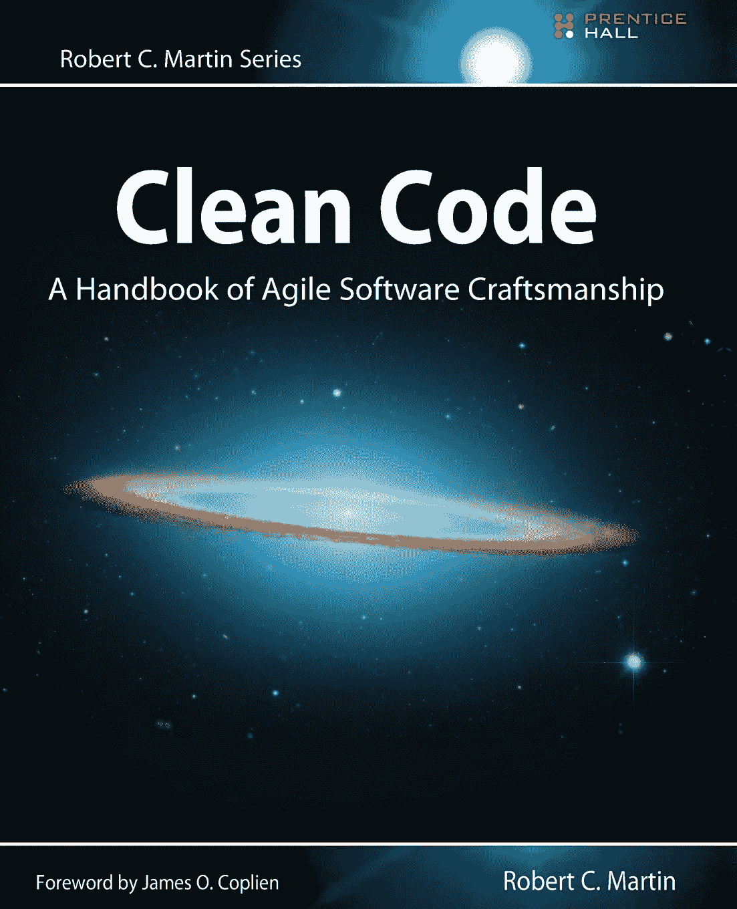

# 每个程序员都应该阅读的书中的提示

> 原文：<https://medium.com/hackernoon/tips-from-the-book-every-programmer-should-read-425fb77873f8>

## 成为一名程序员不仅仅要写代码，还要写出好的、可维护的代码。有一本必读的书，是公司出钱让员工读的。而这是每个程序员都应该读的书。

编写其他程序员能理解的代码是一项艰巨的任务，只有 20%的程序员有。当你写软件时，你不能只考虑机器是否能阅读，人类也能。

> “任何傻瓜都能写出计算机能理解的代码。优秀的程序员会写出人类能理解的代码。”—马丁·福勒


Photo by [Claudia](https://unsplash.com/@kaimantha?utm_source=medium&utm_medium=referral) on [Unsplash](https://unsplash.com?utm_source=medium&utm_medium=referral)

这本书是罗伯特“鲍勃叔叔”马丁写的，书名是 [**《干净代码:敏捷软件工艺手册》**](https://amzn.to/2MF8ES7) 。这本书为代码读者解释了更多的编程概念。这个读者可能是:

*   未来的你
*   你的同事
*   机器

你要写这三个都能理解或者维护的代码。

> 即使是糟糕的代码也能运行。但是如果代码不干净，它会使开发组织陷入困境。每年，都有无数的时间和大量的资源因为糟糕的代码而被浪费。但不一定非要这样。

以及如何像一个干净的编码员一样编码？我将列出一些原则，它们会帮助你，并说服你阅读这篇精彩的文章。


# 1.写有意义的名字

变量、类、函数和方法必须按语义命名。不要缩写名字，给你的代码起一个有意义的名字。

```
// bad :(
def dvd(v1, v2)
  return v1 / v2
end
res = dvd(10, 2)// good :)
def divide(dividend, divisor)
  return dividend / divisor
end
quotient = divide(10, 2)
```

通过赋予代码更多的语义，您将能够在下一次编辑会话中理解它。

除了有意义的名字，一个干净的编码者还会写可搜索的名字，比如:

```
// bad :(
wait(foo, **86400000**)// good :)
MILLISECONDS_IN_A_DAY = 86400000;
wait(foo, **MILLISECONDS_IN_A_DAY**)
```

# 2.不要添加不必要的上下文

例如，如果你在一个类中编写一个方法或字段，你不需要在方法/字段名称中引用类上下文。

```
# bad :(
class Person
  property :person_name
end# good :)
class Person
  property :name
end
```

# 3.让你的代码说话

好代码胜过注释。这是规矩。注释是必要的，但是如果你的代码能自我解释，你就不需要注释了。

## 评论可能是邪恶的

我相信他们可以…

```
# always returns true
def available?
  return false
end
```

## 注释代码可能很难阅读

在快速代码审查中，一个注释的代码行可能会把一切都搞砸。

```
employee.work
boss.promote(employee)
# employee.party
employee.work
```

# 为什么要看[干净码](https://amzn.to/2MF8ES7)？



程序员读代码的时间比写代码的时间多。这是事实。如果代码基础写得不好、过时或遗留，阅读代码可能会令人困惑。为了减少混乱和时间损失，有一些公司付钱让他们的员工阅读这本书。

通过教授如何写好软件， [Clean Code](https://www.amazon.com/gp/product/0132350882/ref=as_li_tl?ie=UTF8&camp=1789&creative=9325&creativeASIN=0132350882&linkCode=as2&tag=vnbrs-20&linkId=1c4f2ca4d176d1ae3a22c6d976b92b29) 正在创造一个庞大的程序员群体，他们关心自己写的东西以及谁会去读它:clean coders。

除了语义，马丁还谈到了错误处理，如何阅读代码等等。

如果你确信要买这本书，就去 Amazon.com 的 **看看吧。**

> *感谢您的阅读！别忘了关注我上* [*中*](/@vnbrs) *和*[*LinkedIn*](http://linkedin.com/in/vinicius-brasil/)*。*