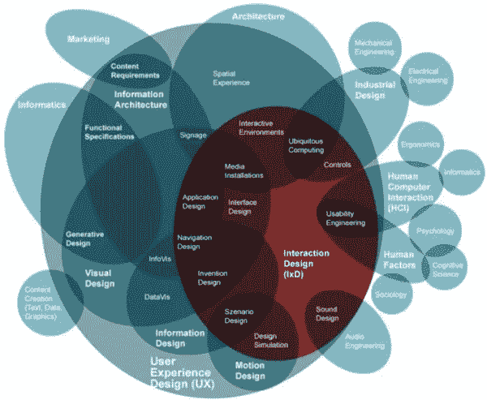
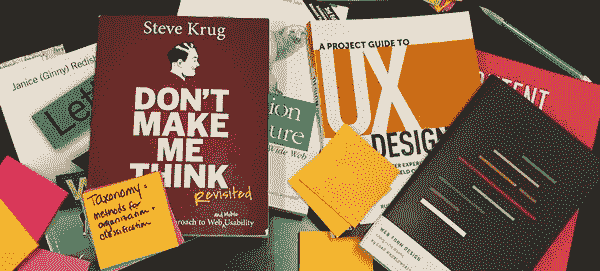
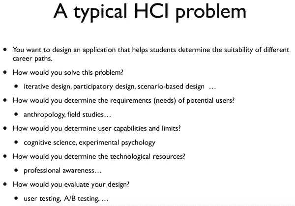
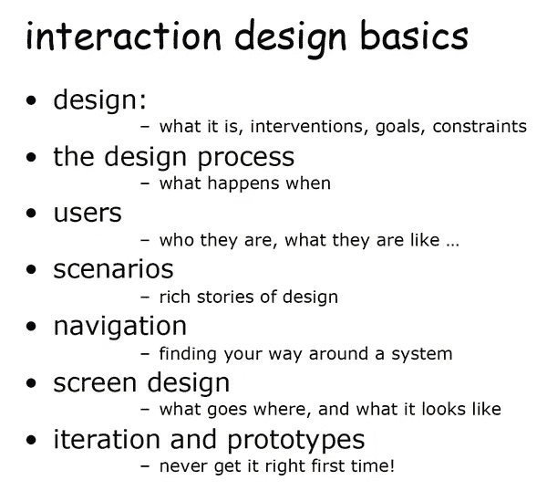

# 初学者如何学习 UI/UX 设计的技巧

> 原文：<https://medium.com/hackernoon/tips-on-how-to-learn-ui-ux-design-for-beginners-ba79f7ad185c>

关于 UX，首先要理解的是，这不仅仅是创造一个原型。许多人接近 UX 完全专注于原型创作，但创造原型只是 UX 学科所能提供的一小部分。在这篇文章中，我将涵盖成为 UX 专业人士的三个基石:学习 UX，实践 **UX 设计**，培养你自己的 UX 人脉。

# 第一部分:学习 UX 的技巧

1.适合初学者的经典书籍及资源列表: [**阅读我的适合初学者的 UX 资源列表**](http://www.mockplus.com/blog/post/12-design-tools-websites-for-uiux-designers/?r=cherry)

2.设计师最新书籍:[**2018 年设计师必读的好书**](https://www.mockplus.com/blog/post/the-best-uiux-design-books-resources-for-designers/?r=cherry)

[**免费 UX & UI 值得你阅读的书籍**](http://www.mockplus.com/blog/post/12-free-ux-ui-books-that-worth-your-reading-for-2016/?r=cherry)

3.听有用的播客: [**我的博文关于我最喜欢的 UX 播客**](https://www.mockplus.com/blog/post/designers-routine-25-uiux-design-websites-you-must-know/?r=cherry)

4.你应该关注的[**【UX】设计博客和资源的列表**](https://www.mockplus.com/blog/post/146-top-20-ux-design-blogs-and-resources-you-should-follow-in-2016/?r=cherry) ，一些收藏如 [UX — UI 阅读](https://link.zhihu.com/?target=https://medium.com/ux-ui-readings)在 Medium 上，以及 [**用户体验设计师的灵感和有用链接**](https://goo.gl/2wkYDt)

5.伟大的参考工具:Adobe，Photoshop，Illustrator，以及一些其他的原型制作工具如[**Axure**](http://www.axure.com/)[**Justin mind**](http://www.justinmind.com/)[**mock plus**](http://www.mockplus.com/?r=cherry)等。使用什么样的工具取决于。顺便说一下，你可以通过这三个网站学习如何使用这些工具: [Design tuts](https://link.zhihu.com/?target=http://design.tutsplus.com/) 、 [Lynda](https://link.zhihu.com/?target=http://www.lynda.com/Photoshop-tutorials/279-0.html) 和 [Skillshare](https://link.zhihu.com/?target=http://www.skillshare.com/search?query=user+experience+design) 。

# 第二部分。实践 UX 设计的技巧

认为 UX 等同于创造原型是荒谬的。你必须清楚什么是 UX 设计，并通过实践来提高。无论如何，熟能生巧。

[最佳免费 UI/UX 设计资料](https://www.mockplus.com/resource/post/free-mega-collection-of-infographic-vectors)

[下载](https://www.mockplus.com/resource/post/free-mega-collection-of-infographic-vectors/?r=cherry)

UX 设计的流程和要点:

1.分析热门应用和网络

1).谁是目标客户，以及他们的特点。

2).核心功能是什么，根据使用场景区分功能的优先级。

3).分析每一个使用场景的交互方式，做出是否合理、方便用户满足需求的判断。

4.)分析目标产品及其竞争产品的优缺点。然后，你知道如何改进。

2.模仿是练习的好方法

有很多很好的资源供初学者模仿运球和行为，但是你必须意识到模仿和复制之间的区别。值得注意的是，在模仿的过程中，你应该记住了解和吸收伟大的互动模式的优点。最重要的是，做一个有创造力的设计师。

3.尝试自己创造一个产品

经过一系列的准备，你完全可以尝试自己创建一个 app，从最开始的市场调研，客户划分，使用场景。有经验的设计师会推荐一个作品集，这对你申请新工作会很有帮助。无论你在哪里发布你的作品，在[运球](http://www.dribble.com/)或[行为](http://www.behance.com/)，那都是非常有益的。

# 第三部分。培养你在 UX 的人脉

毫无疑问，要成为一名专业的 UX 设计师，拓展你自己在 UX 的人脉是必不可少的。在信息时代，通过互联网存档非常容易。

1.社交网络上有很多专业团体和网站，你可以加入其中与资深设计师互动。他们在脸书和 LinkedIn 上积极分享资源，与他人交流。

2.在运球和 Behance 上跟着一些资深设计师，尽量和他们保持联系。同时，保持你自己的博客更新，这样人们就能看到你对设计的热情。

3.加入 meetup 小组和研讨会，结识专家。

— — — — — — — — — — — — — — — — — — — — — — — — — — — — — — — — — — — — — — — — — — — — — — — — — — — — — — — — — — — — — — — — — — — -

您可能还对以下内容感兴趣:

[**UI/UX 设计师应该了解的原型工具**](https://www.mockplus.com/blog/post/top-11-uiux-design-inspiration-websites-tools-for-designers/?r=cherry)

[**为什么产品思维是 UX 设计的下一件大事**](http://www.mockplus.com/blog/post/why-product-thinking-is-the-next-big-thing-in-ux-design_156/?r=cherry)

[**如何创造出令人印象深刻的设计的技巧**](http://www.mockplus.com/blog/post/134-tips-on-how-to-create-an-impressive-design/?r=cherry)

-