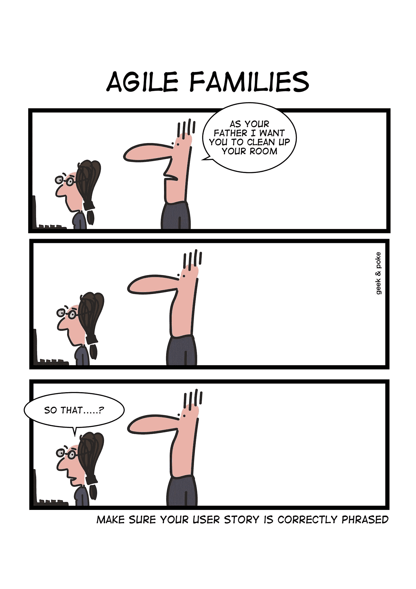
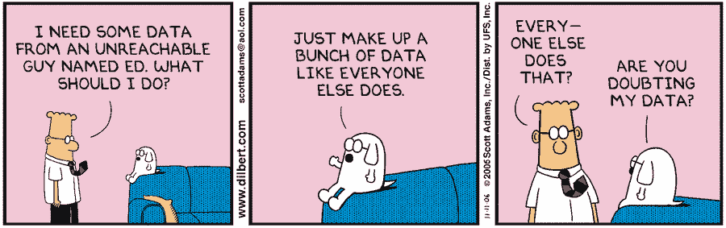

# 关于如何最大化您的数据科学团队投资回报的提示

> 原文：<https://medium.com/hackernoon/tips-on-how-to-maximize-your-data-science-teams-roi-370ab230a1d5>

利用数据做出合理而准确的决策的价值并不新鲜。从将军到伟大的虚构侦探，人们已经依靠数据做出正确的决定并找到答案。就像过去一个世纪里企业一直在做的那样。

甚至在数据科学成为一个术语或词语之前，数据驱动的决策就已经在每个董事会会议室里出现了。使用数据做出更好的选择和理性的决定。为什么？因为它有效。随着计算能力的增强和易于使用的[分析编程库](http://www.acheronanalytics.com/acheron-blog/8-great-python-libraries-for-machine-learning)分析大量数据变得更加容易。

那么，为什么我们有这么多的库来帮助分析师、数据源、增加的计算等等，对于一些团队来说，产生具体的 ROI 仍然是困难的呢？

即使有了所有改进的功能和工具，执行良好的数据分析和数据科学仍然不容易。发生这种情况有几个原因。其中包括缺乏经验、目标不明确、对主题缺乏理解以及沟通不畅。

由于难以执行良好的数据分析，我们的团队希望分享一些我们遵循的技巧，以帮助有经验的和新的团队成员更好地处理任何类型的数据问题。无论是[数据科学](https://en.wikipedia.org/wiki/Data_science)还是[数据工程](http://www.acheronanalytics.com/acheron-blog/how-to-engineer-your-data-for-data-science)。

# **陈述明确的问题以及最终用户将如何使用答案**

我们注意到的一个问题是，特别是对于新员工，他们经常会回避一个问题，甚至不知道他们实际上正在解决的问题是什么。他们有解决问题的伟大意图，但他们只是还没有抓住它。

回想一下你的英语老师给你提示的时候。也许你或你的一个朋友曾经读过这个提示，并且对这个提示在问什么有了一个先入为主的想法。然后你根据你的理解写了一篇漂亮的文章。这篇文章在各方面都很完美，如果你真的是为了提示而写的话，它会是 A+。然而，你没有，突然你得到了一个 C 或更低的分数，因为你从来不明白实际上问的是什么。

这是一些数据专业人员面临的类似问题。他们将开发出一个各方面都很漂亮的最终产品，除了它实际上没有回答客户的问题。通常这是在与客户会面的早期发现的。这对双方都是令人沮丧的。一方为开始开发一种产品投入了大量的工作，而另一方却觉得无人问津。在这种情况下，尽早发现问题以便解决问题是非常重要的。

从一开始，目标就是确保开发人员和涉众对问题有相同的看法。做到这一点的一个方法是确保他们都致力于[用户故事](https://www.mountaingoatsoftware.com/agile/user-stories)。现在，这可以通过让开发人员花时间与利益相关者一起弄清楚他们将如何使用数据系统从而导致开发人员编写故事或者让最终用户编写一些用户故事来实现。用户故事是关于最终用户如何看待一个特性的描述，或者在这种情况下是一个指标或算法输出。他们将如何利用数据点做出决策？这个决定会影响谁？

对于一些工程师来说，这看起来就像写一篇论文的大纲，并仔细检查它是否符合提示一样毫无意义。在大多数情况下，无论如何采取这一步骤是有帮助的。

对问题以及如何使用答案有一个清晰的理解，可以让数据团队在开发最终产品时有所检查。这样，他们可以确保他们开发的指标和算法与利益相关者想要采取的步骤相匹配。如果度量标准没有回答问题，或者没有为涉众采取下一步行动提供正确的信息，那么就需要花费更多的时间来返工和重新开发最终产品，以满足每个人的需求。这就是为什么从一开始就理解问题和最终用户故事很重要。

# **分析你的数据，总结你的发现**

作为数据专业人员，我们有一个坏习惯，那就是在与利益相关者一起工作时，试图浏览我们分析的每一个图表、数字、图表和行项目。这是不必要的。作为数据工程师和数据科学家，我们希望展示我们的工作来描绘价值，并展示我们的发现的可信度。然而，通过展示大量的数据和图表[，我们造成了混乱而不是清晰。](https://www.forbes.com/sites/jeffboss/2015/03/20/how-to-overcome-the-analysis-paralysis-of-decision-making/)

为了避免混淆利益相关者，并让他们更多地认同你的结论，避免隐藏线索是有帮助的。不要太在意细节。有一个易于解释的清晰结论和三到四个具体的数据点来支持它。与十页纸的研究相比，这对利益相关者更有帮助。

这并不是说去掉十页纸的研究。这十页的研究对未来的项目非常有帮助，万一利益相关者想要更多的细节。关键是要避免给利益相关者提供过多的信息，而且提供的数字越多，就越有可能被误判，从而导致缺乏信任。

# **根据指标采取行动并跟踪结果**

一旦系统真正开发出来，让使用它的最终用户了解什么在工作，什么不在工作是很重要的。为了计算出该工具当前版本的投资回报率，数据团队需要与利益相关者合作来评估他们的成果。

对于正在工作的东西，数据团队或涉众可以进一步分析，看看他们是否可以改进它。如果他们的目标是欺诈行为，那么该算法目前可能有 70%的准确性。数据团队可以通过查看模式的% 30%假阳性，然后使用更精确的算法或另一种后续算法删除聚类，将准确度提高到%80 或%90。这种反馈循环方法可以提高准确性和用户满意度。

对于工作不好的度量和算法，这种方法与找出如何改进已经做得很好的算法没有什么不同。除了查看什么不工作和误报之外，另一个好办法是联系[的主题专家](https://www.thebalancecareers.com/subject-matter-expert-2275099) (SME)。希望这不是数据团队第一次接触中小企业。这一次，该团队实际上有数据与中小企业共享，这些数据可以显示中小企业习惯于视为误报的模式。这反过来有助于更快地纠正算法问题，而不仅仅是让数据团队试图寻找新的相关性或可能的解决方案。

数据工程师和数据科学家都是聪明人。这并不意味着他们什么都知道，也不意味着他们不会过度兴奋。我们也需要指导和提示！

这些只是帮助您的数据团队提高执行力的一些技巧。这些技巧都不是火箭科学。它们只需要花点时间思考问题，创建健壮且易于重用的系统，并通过利益相关者和数据团队之间的交流获得进一步的洞察力。您的许多数据团队和项目管理专业人员都有适当的流程。如果您的团队在建立流程方面需要帮助，或者您正在寻找一个团队来承担整个项目的开发，请随时联系我们，我们很乐意提供帮助！

[如何成长为一名数据科学家](https://hackernoon.com/how-to-grow-as-a-data-scientists-f27c9114fefb)
[助推装袋并构建更好的算法](https://towardsdatascience.com/how-to-develop-a-robust-algorithm-c38e08f32201)
[如何作为一名数据科学家在企业政治中生存](https://www.theseattledataguy.com/top-30-tips-data-science-team-succeeds/)
[机器学习的 8 个顶级 Python 库](http://www.acheronanalytics.com/acheron-blog/8-great-python-libraries-for-machine-learning)

[机器学习在医疗保健中的问题](https://hackernoon.com/the-problem-with-machine-learning-in-healthcare-406c97cb311)
[如何使用 R 开发预测模型](https://www.youtube.com/watch?v=8cKeAH2aGVI&t=6s)
[用 Google Sheets 进行网页抓取](https://hackernoon.com/web-scraping-with-google-sheets-20d0dce323cc?source=activity---post_recommended_rollup)
[4 数据科学家必须具备的技能](https://www.theseattledataguy.com/4-skills-data-scientist-must-have/)

