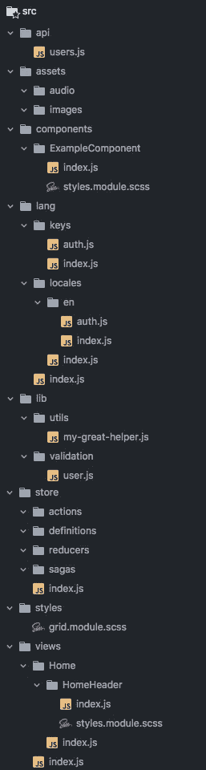

# 对大型项目作出反应的技巧

> 原文：<https://medium.com/hackernoon/tips-on-react-for-large-scale-projects-3f9ece85983d>

## 如何不迷失在自己的应用中

> 声明:这是一个非常老的帖子。从那以后，我对项目结构的看法发生了很大的变化，这里的工具也是如此。请对这篇文章有所保留。

我已经认识 React 两年了，并很快爱上了它。React 的工作方式是，作为一个声明性的、不太大的库，专门用于构建丰富的用户界面，提供一切必要的东西(加上一个包含大量附加组件的丰富的生态系统)。正如在[文档](https://reactjs.org/docs/faq-structure.html)中所读到的，React 对于如何构建项目和选择库栈并没有给出明确的建议，尽管上面提到的文档给出了一些建议。

本文旨在为前端开发人员提供有启发性的建议，告诉他们如果您想让项目感觉不那么痛苦，并且更具可伸缩性/整洁，应该如何组织项目。不过，我不认为这是一条规则。请随意使用，或者，如果你知道更好的方法或有建议，请在评论中留下！:)

## 文件夹结构

在我目前的项目中，在我工作的公司，我使用了这样的东西:

Wow!

你一定在想:“管它呢？”

我知道。发生了很多事情。别担心:我们会熬过去的。

让我们从头开始:

## /api

不言自明。应该作为放置调用外部资源(通常是 REST apis)的函数的文件夹。例如，`users.`文件必须有一个`export default`语句。

## /资产

也能解释这一切。没什么可做的。如果你使用的是`webpack`和`create-react-app`，应该很容易导入并捆绑在你的 JS 中或者解压到`public`文件夹中它们自己的文件中。

## /组件

全局/通用组件文件夹。可能在两个或更多视图中使用的每个组件都放在该文件夹中。每个组件都有自己的文件夹，`index.js`和`styles.module.scss`用于组件样式。我稍后会谈到`styles.module.scss`部分。现在，继续读下去。

我喜欢保持组件简单，声明为箭头函数。通过这种方式，我设法“礼貌地对待自己”，避免滥用组件责任(即过度使用状态)。组件使用状态的情况很少，但有时这是必要的。此外，有些可能包含嵌套组件(如下拉菜单等)。

## /lang

现在，只有当你考虑国际化你的 React 应用时，才推荐这一部分。稍后我会谈到堆栈，但现在它很重要:我使用的是 [i18n-js](https://github.com/fnando/i18n-js) ，因为它很容易使用。`lang`文件夹的`index.js`看起来像这样:

例如，`keys`文件夹中的常量是为了防止打字错误，并让它们在运行中带有一个标记。一个基本的`keys`文件夹`index.js`文件是:

并且，在`auth.js`文件中:

定义好之后，当您想要使用本地化的消息时，只需导入默认函数、所需的键，然后调用该函数。像这样:

让我们不要忘记在相应的文件夹中定义翻译。为了简洁起见，我只用英语来说:

现在，在`en/auth.js`文件中:

关于为什么你应该使用常量，在[这个堆栈溢出回答](https://stackoverflow.com/questions/34965856/what-is-the-point-of-the-constants-in-redux)上有一个清晰的解释。够 i18n 用了。让我们继续前进！

It's the same image. I'm saving you from some scroll time!

## /库

这与 React 并不完全相关，但我特别喜欢有一个 lib 文件夹来存放诸如验证、一些助手/实用程序等东西。有些人可能会争辩说`api`文件夹可能也在那里。很公平！由你决定。

## /商店

只有在使用 Redux 时才需要这个文件夹。不太了解 MobX——没用过——但应该不一样。

> 请记住，虽然 Redux 是一个很好的补充， [*你可能不需要它*](/@dan_abramov/you-might-not-need-redux-be46360cf367) 。

这些子文件夹应该是不言自明的，但是有一些问题。忍耐一下！

**/动作**:动作创建者文件夹。在该文件夹中，我们必须放置绑定到连接组件的函数。

**/定义**:基本上就是“动作类型”[常量](https://stackoverflow.com/questions/34965856/what-is-the-point-of-the-constants-in-redux)。但是我更喜欢称它为“定义”,并把它放在`actions`文件夹之外，因为这些定义可能会在 reducers 和 sagas 中使用。

**/reducers**:reducers 文件夹。每个减速器都应该有自己的文件，而`index.js`文件负责将它们组合成一个文件。

**/传奇**:和还原者一样，只是对传奇而言。`index.js`文件包含了`rootSaga`，这是一个负责连接这一切的传奇。示例:

> 注:如果不想用 Saga 也是可以的。不是必须的！

随着我们的 reducers 和 sagas 的设置，是时候创建我们的商店了，这在`store`文件夹的`index.js`中定义:

这样，和中央集权的国家一起工作就会变成一种乐趣！干杯！是时候去:D 了

## **/样式**

这和`components`文件夹的工作方式完全一样，但是是跨组件或视图的通用样式，比如你的网格系统！

## **/观点**

对于`components`文件夹，我们定义了我们的可视(或表示)组件，它很少依赖于状态和/或另一个组件编排。然而，在 views 文件夹中，我们定义了我们的[容器组件](/@dan_abramov/smart-and-dumb-components-7ca2f9a7c7d0)，正如您所猜测的，它将作为我们应用程序的视图。正如你可能想到的，这些组件大部分时间依赖于状态，所以这里没有箭头功能，建议从`React.PureComponent`而不是`React.Component`扩展！

这些视图可能有子组件。为了避免定义太多的“全局组件”,在相关视图文件夹中声明它们是很好的。如果我在两个或更多视图中使用组件，我通常会将它移动到`components`文件夹中。

对于 views 文件夹的`index.js`文件:大部分时候我把它定义为我 app 中的`Main`组件，因为它通常包含 app 的`router`。示例:

看完风景了！我们最后一个文件的时间:`src`的文件夹`index.js`:

现在，显而易见的是，只有当你想将 Redux 绑定到你的应用时，才需要`Provider`这个东西。没有就无视吧。这就是你拥有的:一个组织良好的文件夹结构和应用程序！现在你应该可以通过调用`ReactDOM.render`在 *DOM* 中渲染它了！

在谈论堆栈(也就是我和我希望你使用的库)之前，我们先来谈谈 CSS。

# React 的 CSS 战争

你知道，我们知道，在 React 中有大量的帖子和库可以与 CSS 一起工作。我喜欢使用 CSS 模块。它是 CSS 的兴奋剂，我也可以和 SASS 一起使用，所以我真的不明白为什么要换成样式化的组件和其他组件。在本文中，我不会教你如何操作/安装 CSS 模块。但是如果你想的话，可以读一下这个。

但是…我做了一些不同的东西。虽然我喜欢使用 CSS 模块，但有时它并不适合:例如，对于第三方组件的全局样式。因此，我正在使用模块，并且仍然在我的`[webpack.config.js](https://gist.github.com/zaguiini/174122d57c6c933dd7fd1b01ab8e6d5b)` [文件要点上使用这种配置来使用全局导入的样式。看看这个](https://gist.github.com/zaguiini/174122d57c6c933dd7fd1b01ab8e6d5b)！

我只和萨斯合作。对让它与普通 CSS 一起工作不感兴趣，但它应该是几乎相同的配置。现在，在我的组件中，我是这样做的:

好吧，这是一个人为的例子，但它应该确切地表明我所说的，并使用惊人的`[classnames](https://www.npmjs.com/package/classnames)`在一起。

# 最后:基础栈！

现在，有一些我喜欢使用的库，我发现它们非常有用:

*   *当然总是最新的* `react`和`react-dom`；
*   `classnames`进行无痛的类名申报；
*   `i18n-js`为国际化；
*   `color`用于颜色操纵；
*   `lodash`或`underscore`用于一组实用函数(这可能会使我们的`lib/utils`文件夹变得不必要)；
*   `ramda`而不是`lodash` / `underscore`如果你完全喜欢纯函数式编程和组合；
*   如果你喜欢`ramda`，你可能也会喜欢`recompose`(适合从纯函数中组合组件)；
*   `dinero.js`用于货币操纵/展示；
*   `moment`或`date-fns`用于日期/时间操作/显示(我会选择后者，因为`moment` [不是纯粹的](https://github.com/moment/moment/issues/1754)，这并不好——感谢提醒，[马塞洛·卡马戈](https://medium.com/u/f8c552d9732b?source=post_page-----3f9ece85983d--------------------------------))；
*   `react-helmet`用于`<head>`标签的操纵；
*   `react-table`和`react-virtualized`都可以，因为有时候一个比另一个简单，当你不想显示多得离谱的行数时`react-table`非常适合。另外，`virtualized`看起来更像一个`list`渲染器，而不是一个表格；
*   `react-redux`、`redux`、`redux-saga`、`redux-logger`为集中状态。这两个中间件配合得很好。必须的！
*   `react-router-dom`如果你是为 web 构建，而`react-navigation`如果你使用 React Native。

现在，这应该让你继续运行一个良好的大规模项目！这篇文章是针对 React DOM 的，但是通过一些调整，您应该可以让它与 React Native 一起工作！

## 感谢阅读！