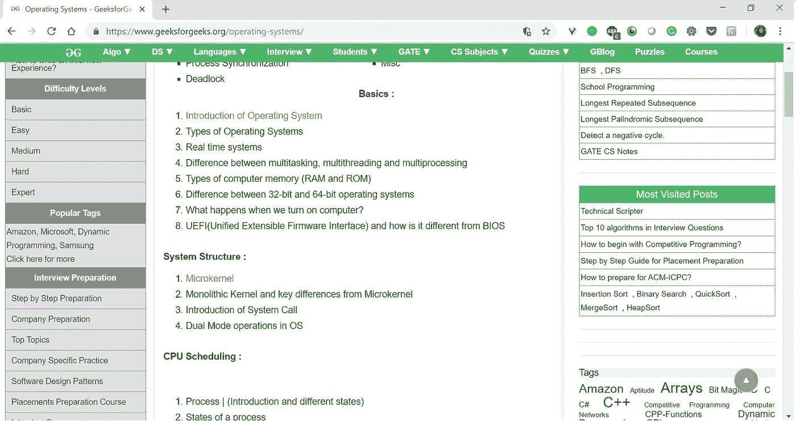
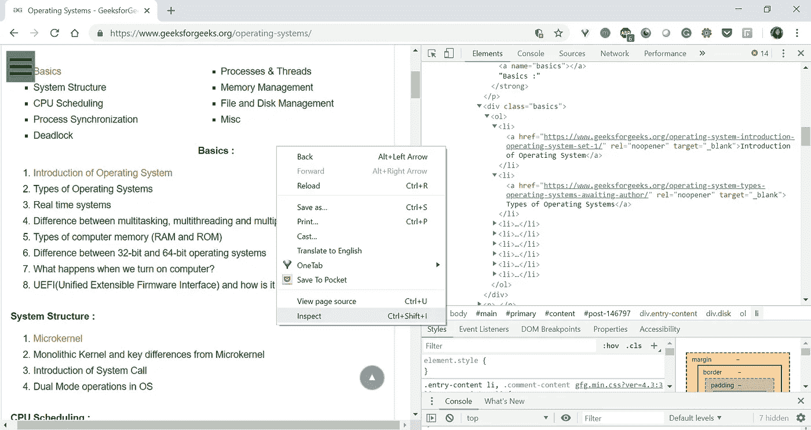
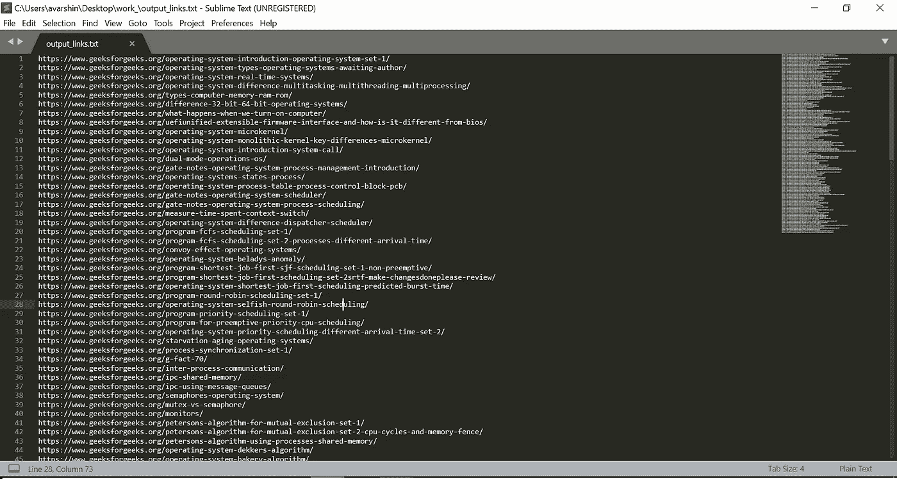
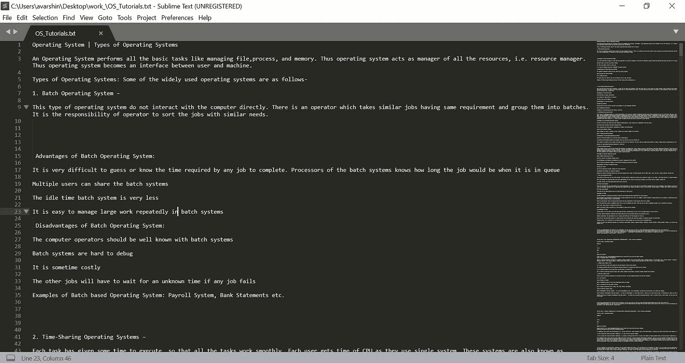

# 厌倦了给网页添加书签？改为刮…

> 原文：<https://medium.com/hackernoon/tired-of-bookmarking-pages-scrap-it-instead-b398622f77d>

我为[给](https://hackernoon.com/tagged/bookmarkting)做了大量的教程书签，却再也没有打开它们而感到内疚。我是那些喜欢 pdf 版本或书籍，而不是堆积如山的网页作为书签或标签存储在 OneTab 中的人之一。

我最近在我最喜欢的网站[https://www.geeksforgeeks.org/operating-systems/.](https://www.geeksforgeeks.org/operating-systems/)更新我的操作系统概念

虽然我喜欢学习操作系统，但我不喜欢根据主题一个接一个地打开网页链接。我想将所有页面的内容作为一个单独的文件供我阅读。接下来是我尝试自动化“从网站提取文本”的过程，也就是网络抓取。网络抓取的用例是无限的。比如查询机票价格、监控股票价格、产品价格比较，甚至为你的下一个分析项目收集数据……还有什么比使用 [Python](https://hackernoon.com/tagged/python) 更好的方法呢？



The web page we are extracting

正如您从上图中看到的，网页包含许多主题和相关的嵌入链接。我的要求是提取这些链接，并进一步解析它以从中获取数据。

# **要领:**

1.  在你的系统中安装 Python。

我在电脑上安装了 Anaconda(Python 发行版)程序，它会自动安装 Python。它还负责环境变量的配置。

2.安装 BeautifulSoup4，这是一个用于从 HTML 和 XML 文件中提取数据的 Python 库。

从[https://anaconda.org/anaconda/beautifulsoup4](https://anaconda.org/anaconda/beautifulsoup4)下载库。运行`conda install beautifulsoap4-4.6.7-py37_0.tar.bz2`。根据下载的包名进行修改。

3.从这里了解 HTML 的基础知识和标签如何工作。

# 实施:

1.  我们首先需要下载网页，以便抓取它。为此，我们使用请求模块。导入脚本中需要的所有模块。

```
from bs4 import BeautifulSoup
import requests
import os
```

2.在 page_link 变量中指定要提取的网页。请求模块向 web 服务器发送一个 GET 请求来提取我们的 web 页面

```
page_link ='[https://www.geeksforgeeks.org/operating-systems/'](https://www.geeksforgeeks.org/operating-systems/')
page_response = requests.get(page_link, timeout=7)
```

3.现在我们最终使用我们的 BeautifulSoup 库来解析上面的响应。

```
page_content = BeautifulSoup(page_response.content, "html.parser")
```

4.检查 web 页面并找到您需要提取的内容的类名(也可以使用 id 名或标记名)。为此，右键单击您的元素并选择 Inspect。



Using Inspect

5.我找到了我需要的类名。现在使用 find 方法从上一步创建的嵌套数据结构中提取这些类。

使用 try-except 块是一个很好的实践，因为可以捕获错误，这样它们就不会停止程序的后续执行。

6.因为我需要嵌入在这些类中的链接，所以我编写了一个函数来单独获取链接，并将它们保存在 *output_links.txt* 中。“ *a* 标签包含了我所寻找的 *href* 属性。使用 *find_all* 搜索' *a* '标签，使用 *get* 获取 *href* 。

7.这一步是为我们提取的所有类调用上面定义的函数。

看看 output_links.txt 文件，它包含了我们提取的所有链接



The extracted links

8.现在，我们实际上需要从每个链接中获取内容，并将它们存储在一个文件中。提取内容的代码是，

同样，这取决于您正在解析的 HTML 页面的结构。在我抓取的页面中，所有内容都在文章标签中。当在 get_links_topic()函数本身中提取链接时，我调用这个函数。

为了提高可读性，我还使用*分解*功能删除了一些不必要的内容。此外，我删除了输出中的广告行和不必要的新行。最终输出现在存储在 OS_Tutorials.txt 中

完整的代码是:

OS_Tutorials.txt(现在大小约为 159KB)如下所示:



在开始解析您最喜欢的 web 内容之前，请注意以下几点:

1.  避免将提取的信息用于商业目的。我不会分享提取的文件来代替这个。
2.  通过激进的抽取来破坏你喜欢的网站是不酷的。

3.网站的布局可能会随着时间的推移而改变。您可能需要相应地修改您的代码。


Just kidding

参考资料:

[https://beautiful-soup-4.readthedocs.io/en/latest/](https://beautiful-soup-4.readthedocs.io/en/latest/)
https://hackernoon.com/web-scraping-bf2d814cc572

注意:

请评论是否有此方法的任何替代方案，以及是否有任何代码优化。如果你用这种方法提取了任何站点，也请评论:)