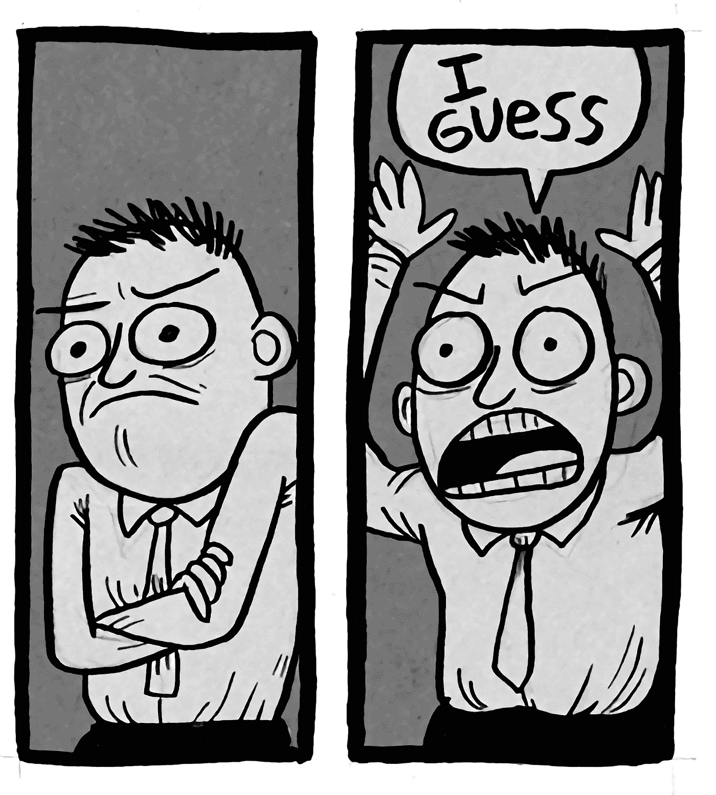

# TL；施莱姆皮博士现在支持币安

> 原文：<https://medium.com/hackernoon/tl-dr-shrimpy-now-supports-binance-47d0ece21531>

[Shrimpy](https://www.shrimpy.io) 网站最近发布。这很好，每个人都同意。直到他们注意到我们明显的缺陷。我们没有支持币安。我们希望没人会注意到，但是你注意到了。

我们最初并不打算支持币安，但在所有这些问题之后，我们不得不再次问自己…我们应该支持币安吗？

所以我们现在在这里，写一篇文章只是想说我们支持币安。你不需要读这篇文章，我认为标题很好地总结了这一点。这就是我们宣布的全部内容。

既然你还在读书，那就来个头脑风暴吧。我们最近一直在思考一些功能，所以让我们在墙上扔一些想法。你可以评论让我们知道你有什么共鸣。

1.  一个简单的功能，看看再平衡和购买和持有之间的比较。本质上，它可以是仪表板图表上的另一条线，显示您当前的投资组合价值与您未进行再平衡时的投资组合价值之间的比较。通过这种方式，你可以对再平衡如何帮助你的投资组合有一个更明确的看法。
2.  在投资组合中添加和删除硬币时进行实时回溯测试。我们仍在制定细节，但基本上每当你在你的投资组合中添加或删除一枚硬币，网站都会进行回溯测试，让你了解该投资组合在最近的过去表现如何。这可以帮助你决定在你的投资组合中放入哪些硬币。
3.  单个帐户的多个 exchange 集成。这是一个简单的功能，可以在您正在重新平衡的不同交易所之间切换。这样你就不需要注册多个账户来管理与 Shrimpy 的多次交流。

好的，我现在就给出这么多。请评论您希望在 Shrimpy 的下一个版本中看到哪些特性。

不要忘记查看 [Shrimpy 网站](https://www.shrimpy.io/)，关注我们在 [Twitter](https://twitter.com/ShrimpyApp) 和[脸书](https://www.facebook.com/ShrimpyApp)的更新，并向我们在[Telegram](https://t.me/ShrimpyGroup)&[Discord](https://discord.gg/gXyy95y)上的惊人、活跃的社区提出任何问题。

留下你的评论，让我们知道你的平衡经验！

*捕虾队*