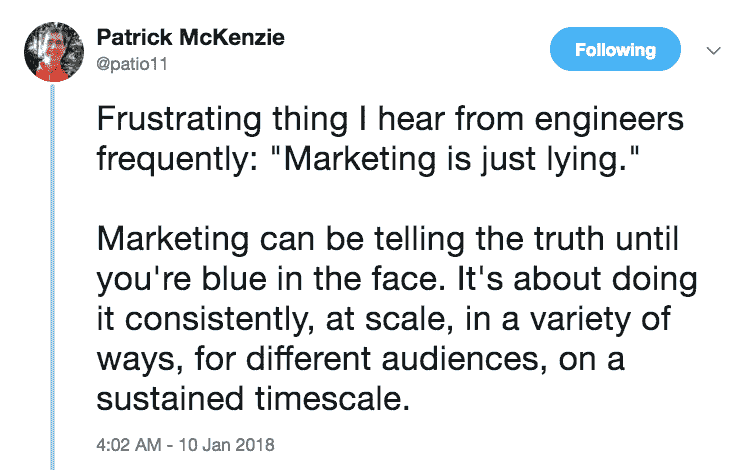

# 成为火箭船上的产品经理

> 原文：<https://medium.com/hackernoon/to-be-a-product-manager-on-a-rocket-ship-c0dcee7dae4e>

## 推手面试

> 披露:[为开发者提供实时 API 的 Pusher](https://goo.gl/52hnDL) ，此前曾赞助过黑客 Noon。

今天，我们将与 [Pusher 产品经理 Jordan Harp](https://www.linkedin.com/in/jordaneharp/) 一起讨论实时基础设施的本质、Pusher 的进展，以及一些关于科技公司应该和不应该变得政治化的问题。

[感觉作为产品经理没有两天是一样的。关于如何成为一名优秀的产品领导者，有这么多建议，试图掌握所有这些并每天实践每一个原则可能会令人生畏。](https://medium.com/u/7f91547ce9c9#BlueMonday，我们的运营团队在办公室里建了一个球坑，让我们大吃一惊。

 在推特上关注 [@jordan_harp](https://twitter.com/jordan_harp) 。请务必[注册](https://goo.gl/EXH5FA)我们新的测试版产品仪表板，带他们去兜风，并告诉乔丹你的想法！