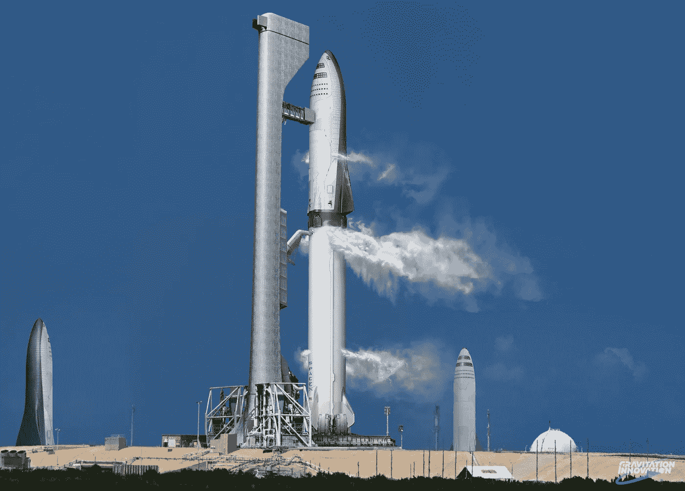
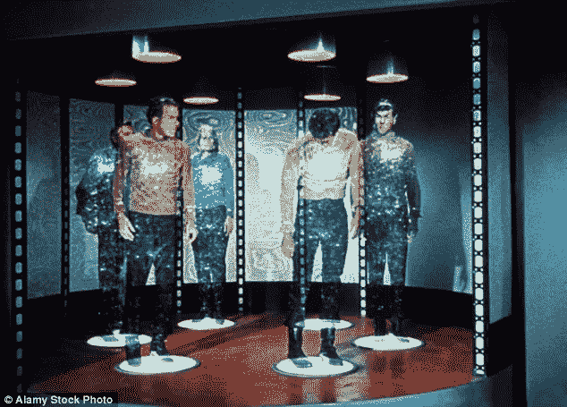
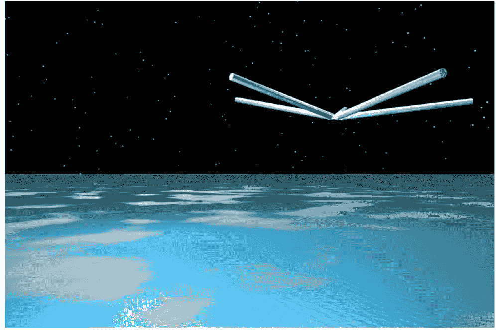
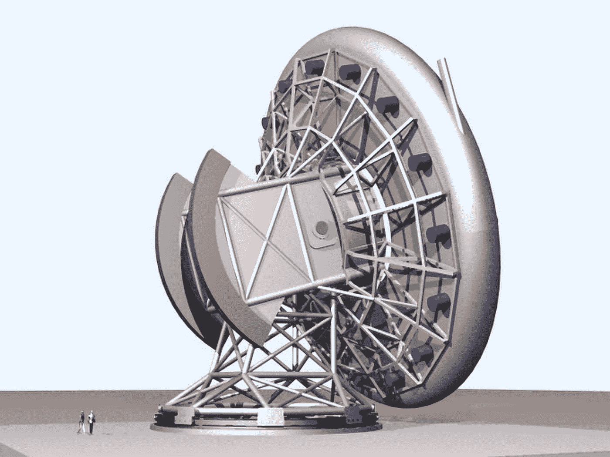
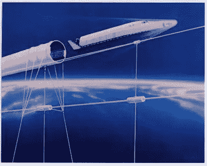
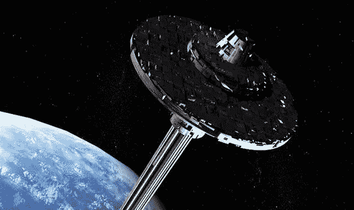
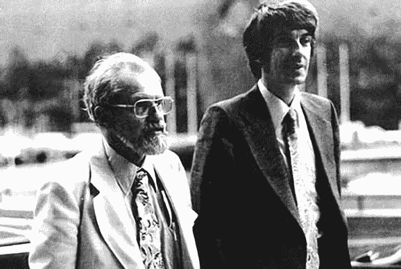

# 要成为太空文明，我们需要超越火箭，包括 SpaceX 和蓝色起源

> 原文：<https://medium.com/hackernoon/to-become-a-space-faring-civilization-we-need-to-move-beyond-rockets-including-spacex-and-blue-ff6b4aa11a1d>

> “今天，太空探索完全是火箭科学。应该是吧？”

最近，人类成为太空文明的想法受到了很多关注，特别是像 SpaceX 公司创始人埃隆·马斯克这样的亿万富翁，亚马逊的蓝色起源杰夫·贝索斯，以及理查德·布兰森爵士的维珍银河。随着这种兴趣的增加，出现了空间私有化的大趋势，表明我们基于空间的未来可能根本不依赖政府，而是依赖私营公司。

在这个新兴产业中，人们谈论最多的短期目标是以更低的成本发射更小的卫星、太空旅游、运送到空间站、绕月飞行，以及最终定居火星。

自从航天飞机计划在 2011 年关闭以来，美国宇航局已经放弃了发射火箭将卫星送入轨道的业务——它正在将合同授予波音公司和诺斯鲁普·格鲁曼公司等大型国防承包商，以及 SpaceX 公司的猎鹰火箭等较小的公司，以及火箭实验室等其他初创公司，火箭实验室刚刚在 2018 年进行了首次商业发射。

太空旅游是一个非常有前景的领域，尽管目前只对超级富豪开放。它始于百万富翁支付 2000 万美元乘坐俄罗斯火箭和联盟号太空舱在和平号空间站呆一段时间。在太空旅游方面，维珍银河获得了 X 奖，因为他用可重复使用的交通工具“宇宙飞船一号”旅行到了太空边缘，并且现在有望以每人 25 万美元的价格让游客乘坐“宇宙飞船二号”。不幸的是，2014 年的一场崩盘延缓了他们的进展。SpaceX 现在正在宣传一个载人模块，它将使用他们的可重复使用火箭将第一批乘客送上月球(日本亿万富翁 Yusaku Maezawa 已经支付了一笔“巨额存款”)，尽管日期，像所有火箭发射一样，还不确定。

这让我们想到了所有这些私人(和公共)计划都依赖的一件事:火箭。

任何看过火箭发射的人都知道为什么这是一种将物体和人送入太空的危险、不可靠和极其有限的方法。例如，看看土星五号火箭，这是迄今为止建造的最大的火箭，它发射了阿波罗登月任务，你可以看到 95%的空间被点燃并向下推动的火箭燃料所消耗。

今天的太空技术依赖于强大的火箭，这意味着基本上我们正坐在一个非常大的爆炸的顶部，祈祷我们不会受伤！

Even SpaceX’s BFR is still just a big F’in rocket!

即使是航天飞机，作为第一个可重复使用的运载火箭，它被认为可以更容易地将卫星和人送入地球轨道，也依赖于非常大的火箭(其中三个是航天飞机连接的主要宽体“外部油箱”，其中有液态氧和氢，以及两个使用固体燃料的较小的火箭助推器)。事实上，正是其中一个助推火箭(技术上是其中一个助推器上的一个环)的故障导致了 1986 年挑战者号的爆炸，这使航天飞机停飞了两年。

虽然 SpaceX 和 BlueOrigin 等公司在可重复使用的火箭方面取得了进展，但这并没有改变一个事实，即他们仍然基本上依赖于美国宇航局和苏联在 20 世纪 50 年代和 60 年代开发的相同技术。50 年后，你会认为我们已经造出了一些替代品。

基于 Robert Goddard 和 Werner von Braun(他从纳粹德国带来了他的专业知识)等先驱的工作，一般来说，火箭(无论使用液体燃料还是固体燃料)的有效载荷平均只占总重量的几个百分比(即有效载荷是太空舱的重量和/或它们携带的东西，与火箭的总重量或体积成比例)。土星五号的比例是 4%，航天飞机是 1%。这些小数字是因为过时的技术，可燃火箭发动机需要大量的燃料。

## 通过第一个 100 公里

到目前为止，成为星际物种最困难的部分是集体离开地球进入轨道，我们可以称之为“第一英里”问题。事实上，由于最被接受的空间分界线是卡门线，它距离地表 100 公里(或 62 英里)，所以这真的是第一个“100 公里”问题(尽管最近有一些建议认为空间实际上从更低的地方开始，大约 40 英里)。

一旦我们进入太空，我们就可以通过各种推进技术和宇宙飞船接触到太阳系的其余部分，甚至银河系。

但是，由于我们对火箭的依赖，以及火箭的爆炸性(字面上的意思)、不可靠性和有限的运载能力，将很难让大量的人(或大量的设备)离开地面。

***前 100 公里是成为航天物种的瓶颈。那我们怎么到这里呢？***

有时(事实上，经常)科幻小说可以成为寻求科学未来的一个地方，太空旅行也不例外。以免我们忽略这一点，科幻作家亚瑟·C·克拉克被公认为普及了轨道通信卫星的概念。

In science fiction, ships like the Discovery in 2001: A Space Odyssey are always assembled in space

在同样由 Clarke 撰写的《2001:太空漫游》中，星际飞船*发现号*在轨道上组装，组件由不需要火箭的“航天飞机”从地球上送来。出于各种原因，为星际和(有一天)星际任务组装大型船只是有意义的，月球上和月球周围的基地也是如此。这些是更大的太空探索任务的自然停止点。

大多数科幻小说用未来派的尚未发明的技术来掩盖进入轨道的技术——比如可以像飞机一样飞行的航天飞机，使用一些尚未发明的反重力设备，飞向母船。在 20 世纪 60 年代的原始《星际迷航》系列中，船员使用心灵运输来规避飞入和飞出轨道的费用(和所需的时间)。当然，在《星际迷航》中，传送方案是为了效率而做的——拍摄穿梭上下的场景太昂贵了。

Transporters were invented in the original Star Trek to help solve the “first 100 km” problem

事实上，这是对我们未来作为一个太空物种的一个很好的比喻。如果我们找不到一种更便宜、更可靠、破坏性更小的方法来解决“第一个 100 公里问题”，我们未来的“星际旅行”将仅限于极少数人。

我认为，投入太空研究的数亿美元，如果不是数十亿美元的话，更大数量的美元*应该*投入到非火箭发射的替代方案中。这包括(主要)从地球这里发射，但也可能包括未来从月球或火星发射，这些地方的重力较低，因此我们在这里可以工作的任何东西都可能在其他天体上工作。

那么，除了直接进入轨道的火箭，还有什么其他选择呢？

以下是一些讨论最多的替代方案，从容易到困难，以及一些正在探索这些替代方案的初创公司或项目。我按照从容易理解到比较深奥的顺序列出了它们(这意味着我们还不知道如何构建一个):

## ***气球和混合方案。***

气球提供了一种有趣且经过验证的到达亚轨道高度的方式，或许能够在我们到达太空时给我们一个助力。

2009 年，当我参观史密森尼航空航天博物馆时，一本书吸引了我的眼球，书中展示了一艘漂浮在地球上的 V 形飞船。这不是不明飞行物，而是 JP 航空航天公司创始人约翰·鲍威尔的工作，他提出了一个有趣的三阶段方法，将人类(和设备)送到近轨道，并最终进入轨道，前两个阶段使用气球。V 形飞船是一个巨大的气球(第一阶段)，它将漂浮到天空中的漂浮城市，或黑暗之星站，这是一个 2 英里长的大型气球城市。它将在 110，000 英尺的高度，足以看到头顶的黑暗和下面地球的弯曲。

The Darkstar suborbital station concept from JP Aerospace is a two mile balloon city at 100,000 feet up

此外，与太空舱或基于火箭的解决方案的狭窄条件不同，这将是一次舒适、缓慢的旅行，也许是地球上的游客从“几乎是太空”看地球的理想方式。JP 航空航天公司仍然存在，鲍威尔一直在建造三个阶段的原型。第三阶段是什么？这是一艘使用化学和电力推进的飞船，从暗星站进入低地球轨道。

World view brings space tourism to the masses using a balloon — for only $75k

另一家最近成立的气球公司是 World View，这是一家位于亚利桑那州塔克森的公司，该公司开发了气球技术，利用平流层中不同的盛行风保持在理想的位置。他们做广告说，花 75，000 美元，游客就可以漂浮到 100，000 英尺的高空，在看起来像外太空的地方呆上两个小时，一边舒服地喝着香槟，一边欣赏地球的曲率和外面的世界。

他们还在试验用一个较小的火箭将卫星拖到发射高度来发射卫星。除了飞机发射火箭的混合模型(这基本上就是维珍银河的宇宙飞船一号)，NASA 还尝试了混合方法。西班牙一家名为 Blooster 的公司正在研究一种气球/火箭混合体来发射小型卫星。这些混合方法仍然依赖于火箭，这使得它们很危险，尽管它们飞得越高，需要的燃料就越少。

## **基于自旋的 Slingatron。**

现在，我们远离成熟的技术，探索真正的新概念，这需要更好地理解自然的原理，并建立创新的解决方案来利用这种力量。

2007 年，Derek A. Tidman 发表了《Slingatron——一种机械超高速质量加速器》,并提出了这样一个想法，即你可以利用向心运动将一个物体“抛”入太空，而不需要火箭。从概念上来说，它被描述为类似于你可以通过来回摇动酒杯来摇晃酒杯中的酒。他有一些很酷的图片，展示了这可能会是什么样子。

速度将超过 1 千米/秒，并有 20，000 个 G(每个 G 相当于地球重力)。虽然这可以用于向太空发射某些类型的物体，但显然不适用于运送人类。

Slingatorn concept drawing

这可能吗？2013 年，一家名为 Hyper V Technologies 的公司通过 Kickstarter 建立了一个 slingatron 的比例模型。它没有筹集到所需的 25 万美元。最近，就在 2018 年，硅谷初创公司 Spinlaunch 从 Kleiner Perkins、Airbus ventures 等顶级风投那里筹集了 4000 万美元，用于建造“太空弹射器”。该公司一直对其可重复使用的发射器的确切性质保密，据该公司称，他们可以将小型卫星的发射成本降至每次 50 万美元，这将比今天的成本有很大的改善。

这些利用几何学的创新解决方案可能会解决“卫星”发射问题，也许一些创新者会发现如何以这样一种方式发射人类。

## ***电磁发射器。***

电磁发射器的想法是使用超导磁体在大轨道上加速运载火箭。磁悬浮的爱好者会认识到这种方法，它类似于磁悬浮列车轨道，除了它向上。利用“车辆”和轨道上磁铁的反极性，车辆通过斥力和吸引力的交替作用加速到下一个磁铁。

电磁发射器属于几个类别之一，包括质量驱动器，轨道炮，线圈炮。质量驱动器的概念，基本上是由电磁加速的长轨道，末端向上弯曲，是由亚瑟·C·克拉克在 1950 年提出的，作为实现升空的一种方式。杰拉德·k·奥尼尔进一步发展了这一理论。这个概念通常被认为是用于从月球或其他低重力环境中发射物体。

concept of an electro magnetic launcher on the moon

这在地球上可行吗？有一些科学家是这样认为的。障碍之一是，为了达到所需的速度，轨道必须很长——一位科学家估计超过 100 英里。实际上，具有讽刺意味的是，发射人类需要更长的轨道，这样加速度对普通乘客来说就不会太大，所以可以建造一个更小的轨道来发射卫星，可以以许多 G 加速。

1994 年，美国国家航空航天局高级概念研究经理约翰·c·曼金斯提出了磁悬浮升降机的概念，这基本上是一种将物体发射到太空的磁悬浮列车。后来，在一个名为 StarTram 的更雄心勃勃的项目中，利用 MagLifter 的概念，将问题分成几个阶段，第 1 代升降机(用于卫星和物体)，第 2 代升降机(用于人类)，其中包括一个更长的轨道，它将悬浮在空中，就像一辆真正的火车进入大气层。还有一个 Gen 1.5，它是两者的组合，具有中等大小的履带。该团队估计，使用第二代发射器，他们每年可以将 400 万人送入太空！

建造每一座这样的建筑的成本估计都有数十亿美元。截至目前，我还不知道有任何初创公司获得了资金来探索这一概念。一种变化是使用 Hyperloop(基本上是真空中的磁悬浮列车)作为管道来获得电磁发射器。创新型创业公司可能会找到方法来改进这些早期的估计和概念，这些估计和概念预计会得到政府的资助。

A concept for a Hyperloop type electro magnetic launcher

## **太空塔和电梯。**

在他 1979 年的小说《天堂的喷泉》中，无处不在的亚瑟·C·克拉克详细描述了 22 世纪太空电梯的建造。由于这种电梯的理想地点是赤道附近，而克拉克的后半生生活在斯里兰卡，所以这部小说中关于人类历史上最大的建筑工程的大量内容都发生在那里。选择的地点是亚当峰，斯里兰卡最高的山，也是一个宗教场所。[顺便说一句，如果你是克拉克的粉丝，你可能会喜欢“[我在亚瑟·C·克拉克在斯里兰卡的书架上找到的东西](https://hackernoon.com/what-i-found-on-arthur-c-clarkes-bookshelf-in-sri-lanka-71c602bc1fdc)”。

1895 年，俄罗斯作家 K.E. Tsiolkovsky 在他的《关于地球、天空和灶神星的思考》中首次描述了这一概念，他还提出了地球静止卫星的想法。这个概念被称为太空塔——一个从地面向上建造的实际结构或塔。随着时间的推移，科学家们逐渐意识到，要建造一座真正的直塔，需要塔的底部太大，不切实际，所以克拉克和更多现代概念的追随者将其修改为超强系绳，从空间站下来，像电梯一样，在重心上方有一个配重，将在地球静止轨道上？

A space tower concept drawing

这样的电梯能造出来吗？直到最近，还没有任何具有抗拉强度的物质可以作为电梯的“系绳”或电线。最近，基于碳纳米管的纤维被认为具有进入外层空间所需长度的拉伸强度。

据 space 报道，日本公司 Obayashi Corp .在 2012 年宣布，计划在 2050 年前建造太空电梯。最近，静冈大学的一个团队在 2018 年 9 月发射了小型立方体卫星，这些卫星将在强拉伸绳索上做一些实验，看看它们是否可以为太空电梯工作。2018 年初，来自清华大学的一个中国团队表示，他们已经开发出一种非常强的纤维，这种纤维甚至可以用在太空电梯中。

The Fountains of Paradise told the story of the biggest human construction project ever — a space elevator!

虽然太空电梯可能看起来像科幻小说，可能是“替代”方法中最昂贵的一种(它可能需要大量的预算，可能与阿波罗任务的数量级相同)，但私营公司的创新者有望获得积木，然后找到资金来探索这个想法。一旦建成，太空电梯可以将物体和人运送到地球同步轨道上的空间站(或途中的中间“基地”)。虽然它比火箭慢，需要几个小时或更长时间才能到达目的地，但它是 100%可重复使用的，每天(或者如果技术足够好，每小时)往返的想法最终可能成为现实。

## ***量子隐形传态。***

这是一个很远的想法，只是最近才得到一些关注。我们提到了《星际迷航》的心灵运输方法。这真的能实现吗？最近，在 2017 年，一个中国研究团队首次将一个粒子(一个光子)从地面“量子隐形传态”到地球轨道。英国广播公司的标题是“[首次从地球传送到轨道](https://www.bbc.com/news/av/science-environment-40573621/first-teleportation-from-earth-to-orbit)”。

虽然它确实发生了，但真正发生的是光子的“状态”，或其量子信息被传送。粒子本身被传送了吗？对于光子来说，这可能是一个哲学问题，因为一个和另一个几乎一样。如果我们能够传送其他原子或亚原子粒子，最初是电子(至少是它们的量子态)，但质子和中子呢？毕竟《星际迷航》里的麦考伊博士之所以不想用传送点，是因为担心自己的“原子散落在银河系各处”！

这提出了一个严肃的问题:什么是物质，它是固体/物理的，还是能量，或者仅仅是信息？

## **反重力和电引力。**

我们终于来到了一个有些人可能认为更遥远的领域，但我认为值得一些认真的考虑。与太空电梯不同，在太空电梯中，没有人见过正常工作的电梯，成千上万的人声称看到过使用无声反重力推进方式的物体。它们被称为 UFO，经常发出特定的颜色，是圆形的(臭名昭著的“飞碟形状”)，没有声音，通常有一部分飞碟部分在旋转，并且似乎无视惯性定律，立即停止和加速到高速或从高速加速。

Whether you believe in Aliens or secret government programs, something has to be driving these silent craft that have been reported all over the world

在你妄下结论之前，证人包括军事飞行员，他们看到物理飞行器在空中盘旋，并加速到很高的速度，证明了神秘的飞行器能够无视惯性定律，因此有“反重力”的绰号。

保罗·希尔是美国宇航局的一名工程师，他认真对待这些发现和性能特征，并写了一本关于它的书(这本书是他女儿死后出版的，因为在他为航天局工作期间，美国宇航局和出版商都不愿出版这本书)，名为*非常规飞行物:科学分析*。希尔并不古怪——他不仅有工程学学位，而且在加入后来成为美国国家航空航天局的组织之前，他是奥克兰的一名航空学教授。他在书中的结论是，该飞行器以某种方式使用等离子体和旋转场来加速和减速，它们发出的颜色与等离子体的颜色一致。感兴趣的人值得一读。

这个主题的大部分兴趣是在由 T. Townsend Brown 开创的*电引力*领域，他发现通过在碟形物体的边缘使用高压电，他可以获得电磁推进力并获得升力，发现了电和引力之间的关系，这就是众所周知的 Biefield-Brown 效应，或更通俗地说“反重力”。布朗也不是车库发明家，他是一名为海军工作的工程师，参与了许多机密项目，并像该领域的其他投资者一样，试图获得资金来启动反重力项目。

在 20 世纪 50 年代，主流航空航天工业中多次提到反重力，声称这些设备将“在几年内准备就绪”。但是，在 20 世纪 50 年代的某个时候，有指控称这些说法都“变黑了”，并突然从所有主流航空航天出版物中消失了。这与 20 世纪 40 年代初曼哈顿计划开始时关于核裂变的论文没有什么不同，导致许多人认为这项工作成为了机密。例如，我们知道静电电荷被用在隐形战斗机上。

即使你不相信有外星人，也没有理由不去调查这些神秘的反重力装置。如果事实上，它们是政府的高度机密项目，正如洛克希德公司臭鼬工厂的前负责人本·里奇所说，那么就有科学是“禁忌”的，不为当今大多数科学家所理解。最令人难以置信的理论可能是，训练有素的军事飞行员看到的飞行器实际上是“沼泽气体”！

事实上，作为蓝皮书计划的一部分，最初提出 T4 理论揭穿不明飞行物目击真相的科学家 J·艾伦·海尼克，一位在芝加哥东北大学备受尊敬的天文学教授，开始相信这些飞行器是真实的，需要调查。他和他的助手雅克·瓦莱，在 1963 年为美国国家航空航天局开发了第一张计算机化的火星地图，后来成为一名风险投资家，据说是斯皮尔伯格的《第三类亲密接触》中法国科学家的灵感来源。

J. Allen Hynek and Jacques Vallee

事实上，大多数主流科学家，甚至那些认为他们是误认政府飞机的人，都不屑于提及 UFO 或反重力。他们应该问这样一个问题:“是什么让这些工艺运转？”。我们现在知道五角大楼想揭穿不明飞行物目击事件，所以他们不必认真对待；我们也知道在 1969 年后，虽然国防部声称已经“停止调查不明飞行物”，他们继续秘密调查这些异常物体。这足以让你怀疑:是否有人有兴趣将这一领域排除在严肃的科学研究之外？？

## 结论

好了，现在你知道了——一些短期和一些非常长期的想法，关于如何实现非火箭运载火箭，使我们成为太空文明。

就像电动汽车超越“内燃机”需要很多年一样，我们可能需要一段时间才能超越可燃火箭作为进入轨道的主要方法。然而，从长远来看，这将是非常值得的——无论是从成本(例如，可重复使用性)，还是从危险，以及从我们可以发射的总有效载荷来看。

想象一下，如果我们需要大规模疏散地球上的人们，因为一些即将发生的灾难。世界上没有足够的火箭能力让我们接近我们想要离开的人数。这不仅仅是一个成本的问题，这也是这些火箭的每一个能力的问题。

像 SpaceX 这样的公司拿走了亿万富翁埃隆·马斯克自己的一亿多美元(顺便提一下，特斯拉也是)。虽然我们已经从政府资助一切转向私人资助，但仍然没有足够的风险投资基金或其他人愿意在新的发射技术上冒险。

应该有一个 X 奖或 moonshot 奖来鼓励创业公司建造非火箭、非可燃的运载火箭。事实上，安萨里 X 奖是鼓励维珍一号开发他们的宇宙飞船一号的一个因素。一项奖励被用来鼓励飞行员飞越大西洋。

尽管空中客车风险投资公司(Airbus ventures)和凯鹏华盈(Kleiner Perkins)为 Spinlaunch 提供资金令人钦佩，但这些风险投资所需的资金将达到数亿或数十亿美元，目前没有足够的风险投资基金来实现这一目标，无论是种子阶段(启动资金为 100 万美元或 200 万美元)还是 A 轮或 B 轮(3000 万美元以上)。应该有！

今天基于火箭的解决方案就像去西部旅行的公共马车，对愿意冒着生命危险和感到不舒服的极小群体来说是好的，但是西部的发展使铁路带来了可靠、工业化、定期和安全的运输来运送大量的公民。

外层空间也是如此，获胜者尚未选出。如果有亿万富翁读到这篇文章，他们真的希望我们成为拥有新技术的太空物种，我们需要无畏的人，他们不仅愿意资助对过去技术的渐进改进，而且愿意真正发明未来！

如果你喜欢你所读的，请鼓掌 20 次，并给我一个中等的跟进。