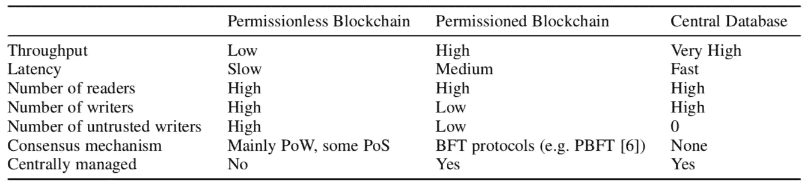
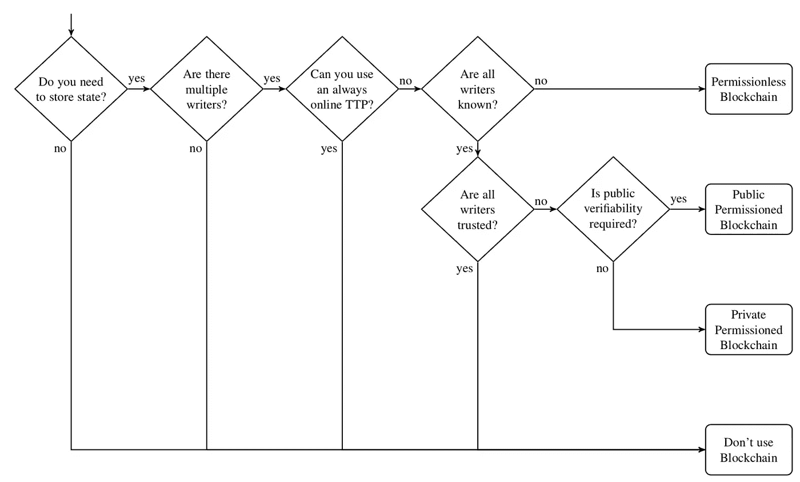
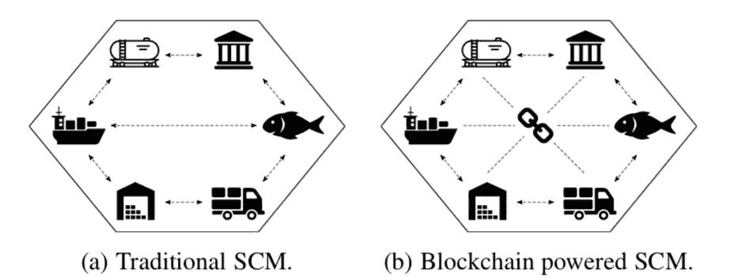

# 到区块链还是不到区块链

> 原文：<https://medium.com/hackernoon/to-blockchain-or-not-to-blockchain-45004a23e8a7>

围绕区块链的大肆宣传夸大了这项新技术的现实能力和应用。这种狂热让企业、开发商和投资者很难理解实际限制，也很难确定适合[区块链](https://hackernoon.com/tagged/blockchain)或分布式账本技术的正确应用。

[苏黎世联邦理工学院](http://www.syssec.ethz.ch/people/kwuest.html)[的 Karl Wüst](https://en.wikipedia.org/wiki/ETH_Zurich) 和 [Arthur Gervais](http://arthurgervais.com) 最近发表了一篇经过同行评审的论文，提出了一种结构化的方法，可以帮助确定解决特定应用问题的合适技术解决方案。在这篇博文中，我们将介绍这种方法，并解释文中应用的一些例子。

# 技术比较

Comparison between the main different types of state persistence¹.

区块链是只追加的分类帐，基本上保持(保存)状态。状态可以是事务信息、程序数据或散列文档等。基本上，任何需要持久化的信息。几十年来，数据库一直在执行这项任务。此外，区块链提出了一种用于状态持久化的新技术——具有包括数字签名和防篡改的附加功能。让我们修改三个主要技术:

## 数据库

首先，**数据库**(单个、并行或分布式)已经使用了几十年来持久化状态和查询数据。为了优化不同层次的查询处理和状态持久性，已经投入了几十年的研究。

*   自然，它们在事务吞吐量和查询延迟方面具有最高的性能。
*   但是，一直以来，它们都被设计为由一个机构集中管理。因此，不同缔约方之间不需要共识机制。

## 未经许可的区块链

无许可区块链是不由中央机构管理的公共分类帐(状态)。也就是说，分类帐分布在对等体的动态网络中，该网络也可以包括非法实体。

*   Satoshi 的聪明之处在于，他提出了一种设计，这种设计在一个动态的、不可信的网络中的分布式状态上保持**共识**。这意味着未经许可的区块链可以容忍一个(部分)具有拜占庭式或不可信行为的网络。
*   **因为任何东西都有价格**，这里的权衡是**性能成本(吞吐量和延迟)**。在[比特币](https://hackernoon.com/tagged/bitcoin)中，性能的急剧下降是因为 POW 协议本身的设计速度很慢。与普通数据库相比，在任何无权限的区块链中，性能下降是不可避免的。因为无论如何，为了保持分布式状态的一致性，在(地理上分布式的)网络中的不同对等体之间必须有通信。

## 被许可的区块链

许可区块链代表一种混合设计选择。特别是，它们没有被集中到单个实体，但是它们被授权给一小组预先选择的可以写状态的可信对等体。

*   由于数据库网络不会像无权限区块链那样扩展到大量公共节点，因此它在吞吐量和延迟方面的性能要好得多。
*   尽管如此，它的性能无法与集中式数据库竞争。

在查看了这些不同的系统之后，很容易意识到没有一个放之四海而皆准的解决方案。一切都是有得有失。不同的应用有不同的要求，因此相应的解决方案也不同。

# “需要区块链吗？”流程图

Flowchart for choosing the right technology¹. TTP represents Trusted Third Party and a writer is an instance that writes state to a database or Blockchain.

本节描述了本文中介绍的通用高级流程图，以便为您的应用找到合适的技术。请注意，编写器是将状态写入数据库或区块链的实体。

1.  如果您的应用程序不需要持久化状态，那么显然就不需要区块链或任何数据库。
2.  类似地，如果**有一个写入者**(状态)，那么**一个区块链不会提供比常规数据库**更多的保证。相反，数据库会更合适，因为它在性能方面更高效。
3.  否则，如果有一个以上的状态写入器，我们就走另一条路。那么问题就变成了，**有一个在线 TTP(可信第三方)就足够了吗，或者换句话说，它需要防篡改吗**。如果应用程序不能依赖单个可信实体，我们可以进一步向前看，看看我们是否还需要一个区块链。**否则，不需要区块链，**就性能而言，依靠集中式实体会更有效。
4.  下一个问题是**“所有状态书写者的身份都是已知的吗？”**。如果它们不像在动态的不可信网络(如互联网)中那样为人所知，那么**无许可区块链**是正确的选择。
5.  否则，如果身份已知，那么下一个问题就是**“写手之间相互信任吗？”**，如果是【是】，**，则不再需要区块链**，具有共享写访问的数据库就足够了。否则，如果作者彼此不信任，那么要使用的正确技术就是**许可的区块链**。
6.  最后，如果是许可的区块链，根据是否需要公共可验证性，任何人都被允许读取状态(公共许可的区块链)或一组读者也可能受到限制(私人许可的区块链)。

# 应用示例

让我们通过这里的一些例子来理解哪些应用程序在区块链上有意义，哪些没有意义，为什么。

## 不需要区块链的应用

Supply Chain Management Systems¹

*   **供应链管理:**这确实是该领域反复出现的应用之一。让我们按照流程图来确定哪种技术最适合它。

1.  SCM 当然需要存储数据。
2.  涉及多个作者，即拥有最终产品一定份额的供应链管理的不同参与者。
3.  继续我们的方法，SCM 在技术上可能总是使用在线 TTP。例如， [Skuchain](http://www.skuchain.com) 承认只需要一个单一的信任源，然而这将去除区块链的分散组件，从而相当于一个可信的中央服务器。
4.  如果这是不可能的，至少所有的作者都会被知道，这让我们在获得**许可或没有区块链之间做出选择。**
5.  SCMs 有数字和物理世界接口的固有问题。一个人或在单个作者控制下的一些机器通常被要求登记某个商品已经到达仓库，以及例如其质量是否合适。如果对这些员工的操作缺乏信任，那么整个供应链在技术上就会受到损害，因为恶意的作者可以提供任何数据。另一方面，如果所有写入者都是可信的，**不需要区块链，**因为可以使用具有共享写访问的常规数据库来代替。

请注意，如果通过一些技术手段，可以以安全的方式实现数字世界和物理世界之间的连接，那么之前的推理可能会改变。

*   **物联网:**许多人提出了区块链技术在物联网(IoT)中的可能使用案例，结合智能合同，旨在提供自主系统，为他们消耗的资源付费，并为他们提供的资源付费。由于系统本质上是分散的，实体之间互不信任，因此使用区块链似乎很自然。然而，正如供应链管理一样，**现实世界和数字世界之间的接口带来了一个潜在的问题。**如果计算机向区块链提供从传感器读取的数值，区块链不保证这些数值的正确性。如果只需要自动化，如果可以使用可信方来代替，则区块链可能是不必要的。

## 适用于区块链的应用

*   **银行间和国际支付**:对于金融应用来说，区块链技术似乎总体上非常适合，因为各方一般都厌恶风险，不想依赖强信任假设。跟随我们的

1.  在银行间支付中，我们有多方(银行)作为作者，他们希望交换价值和交易。所以有状态要坚持。
2.  银行是作者，因此有不止一个作者。
3.  在单一货币体系的情况下，央行可以像 TTP 一样运作。
4.  否则，还有另一种情况，即中央银行不希望充当每笔交易的验证者，而只是充当一个认证机构，向银行发放加入该系统的许可证。这意味着系统的所有作者都是已知的，我们可以使用和**许可的区块链**

*   **交易和公平交易协议:**同样，在没有可信的争议调解人的情况下，数字商品的交易可能是可行的，因此它非常适合区块链，而实物商品的交易仍然需要可信的第三方以防争议。
*   **电子投票:**同样，电子投票也有区块链可以帮忙的地方。例如，一方面，隐私是一个主要要求，因为投票应该是匿名的，以防止胁迫。另一方面，电子投票应该提供某种公共可验证性。由于这些要求，区块链技术有助于实现这些期望的特性似乎是合理的。

# 结论

与传统观点相反，区块链并不能解决所有的技术问题。事实上，它们更适合满足一组需求的一类应用程序。**特别是那些牺牲性能来支持去中心化和防篡改的一致状态。**尽管如此，**许多“承诺”的应用目前仍然不适用于区块链，例如供应链管理。**当热情的开发人员和企业主来找你时，你应该非常小心，他们对宣传有强烈的偏见，并且不会真正质疑他们解决方案的基本技术和必要性。**迄今为止，处理数字商品和服务、需要信任的应用程序似乎最适合区块链。**

# 参考资料:

1- [你需要区块链吗？](https://eprint.iacr.org/2017/375.pdf)

 [## 专家讲解的区块链——黑客正午

### 区块链是所有加密货币交易的数字化、去中心化的公共分类账。区块链已经…

hackernoon.com](https://hackernoon.com/blockchain/home) 

# 如果你喜欢这篇文章，或者如果你有任何进一步的问题或建议，请通过 [Twitter](https://twitter.com/Drmelseidy) 或 [LinkedIn](https://www.linkedin.com/in/mohamed-elseidy/) 联系我。

***免责声明:本文信息仅供教育之用，不能作为投资建议。***

