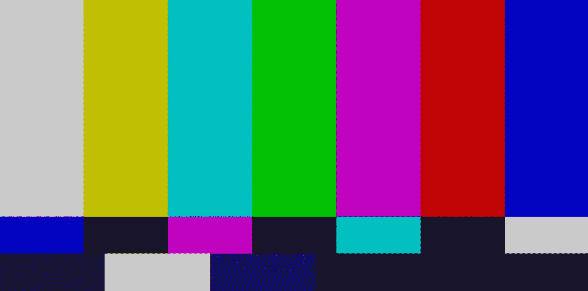
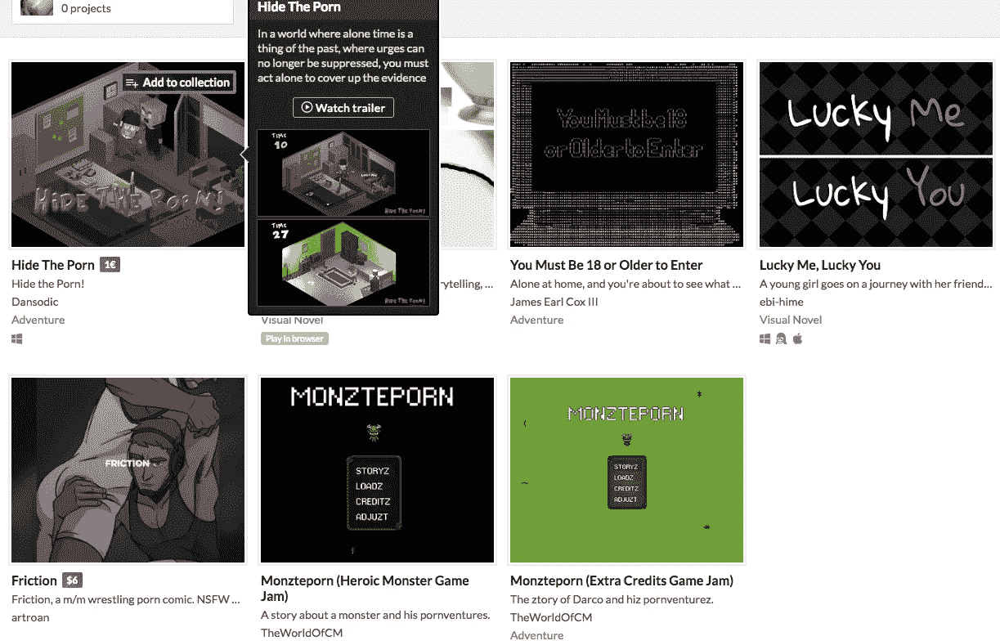
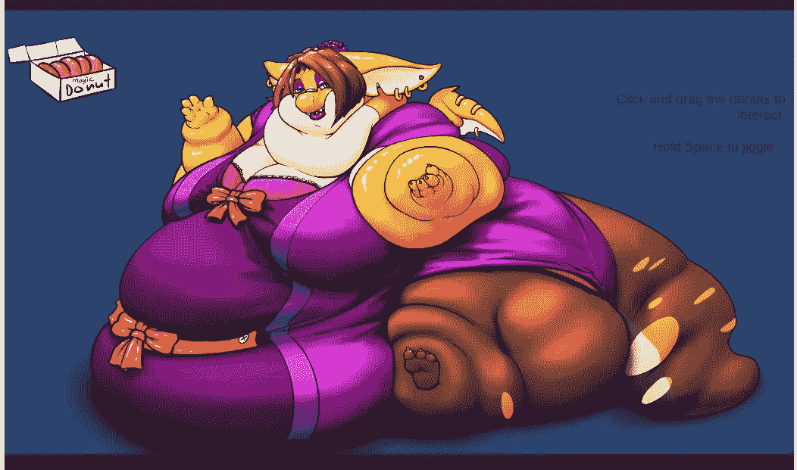

# 审查还是不审查？

> 原文：<https://medium.com/hackernoon/to-censor-or-not-to-censor-28596c77161a>

最近，一个 NSFW(或半安全工作)的内容被添加到我的网站上，这让我开始思考。

内容本身也挺可爱，挺有创意的。那是一个叫“解放乳头”的小平台游戏，开场序列绝对爆笑:

但是我应该允许这样的内容(或者更露骨的)出现在网站上吗？

## 背景故事

我运营着一个网站[分享 WebGL 格式的游戏](https://get.simmer.io),我试图弄清楚我是否应该审查网站上的游戏。在我看来，这个特别的游戏是一件艺术品，而不是色情作品。本质上，写这个游戏的人实际上是在求我弄清楚，我在网站上审查游戏吗？

顺便说一句，如果你在台式机上，你可以在 Medium 上玩这个游戏:

(this doesn’t work on mobile yet, sorry)

## 我的价值观

暴力在电子游戏中司空见惯，而且有一部分游戏包含裸体和性内容。一般来说(至少在美国)，暴力是完全可以接受的，但是如果一部电影中有女性乳头，那会立刻被评为“R”级。

this is apparently OK in a PG13 movie

对我来说，这显然很傻，但对我的观众来说呢？

在我的网站上玩裸体和/或性行为的游戏会损害它的声誉吗？

## 渴望

作为印第游戏的竞争网站，Itch 确实允许一些有问题的内容(我在他们的网站上搜索了“色情”和“xxx”):

但是去年我参加了一个关于《T2》和《T3》的会议，一个教游戏开发的高中老师说他不会让他的孩子在 Itch 网站上分享他们的游戏，因为他们允许太多的性内容。

## 交通

我网站上的另一个边缘游戏是给一个胖胖的毛茸茸的动物喂油炸圈饼:

[https://simmer.io/@FluffRat/~872b42c1-3187-3c89-688b-fc1f3631b657](https://simmer.io/@FluffRat/~872b42c1-3187-3c89-688b-fc1f3631b657)

还是那句话，这个内容制作精良，不直接色情。它给网站带来了大量的流量。如果一种类型的内容给我的网站带来了很多新用户，我觉得我不应该忽视它。我是否应该在网站上添加一个“给毛茸茸的胖子一个甜甜圈”的类别？或者我应该审查所有脂肪毛茸茸的甜甜圈喂养的内容？

## 你会怎么做？

对我来说，我完全持观望态度。如果我允许全面的色情游戏，这是否意味着父母不会送他们的孩子到网站上分享他们的创作？即使我认为血腥暴力游戏比露出一两个乳头更具破坏性，这是否让我成为一个允许血腥暴力游戏的伪君子？

也许我应该开一个成人专区？(孩子们会一直注意成人内容的警告对话框！)。

我真的不知道下一步该去哪里，你能让我知道你的想法吗？

如果你喜欢我的文章，请给这篇文章一两个掌声或者 [*关注煨煨推特*](https://twitter.com/simmer_io)*:-)。*