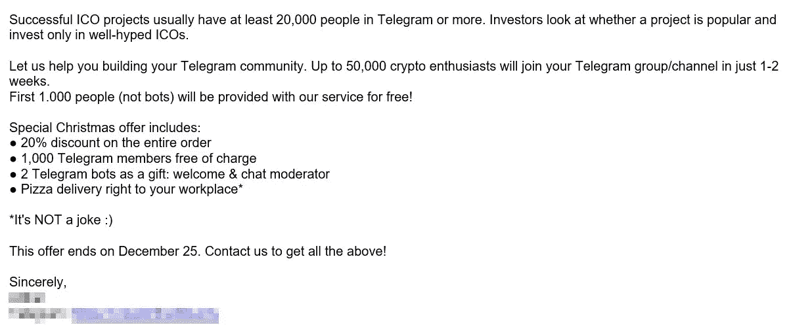

# 致 ICO 营销人员:谢谢，但不用谢。

> 原文：<https://medium.com/hackernoon/to-ico-marketers-thanks-but-no-thanks-638227c78aa>

在“早安”和热咖啡的早晨办公室日常事务中，有一件事一直令人讨厌:ICO 营销人员和他们复制粘贴的电子邮件在一夜之间泛滥成灾。

它们都以相同的信息开始:

> “你的项目很了不起，但你的社区还不够大。我们可以帮忙！”

在区块链项目上工作了大约两个月后，我开始理解这个行业的不幸现实。ICOs 的世界受到了现代伪数字瘟疫的困扰。而我们收到的消息在这个事实上是相当无耻的。

Some examples of the messages we receive

一些信息承诺有 100 万名真正的投资者，而一些 ICO 营销人员试图向我们推销他们在这个行业有 *15 年的经验*(如果你想骗我，至少再努力一点)。我们最近最喜欢的一项优惠是，如果我们购买的数量达到 50，000，就可以额外获得 1，000 名 Telegram 追随者。还有披萨。多好的交易啊！！

Inside a click farm where “bots” build your community (GIF via [English Russia](https://twitter.com/EnglishRussia1/status/862661011882561537))

或许我们迄今为止见过的最大胆的举动是一名 ICO 营销人员在 LinkedIn 上冒充 ICO 投资者。他给我们的一位经理发了一条消息，说要组织一次电话会议，电话一接，这位营销人员就开始告诉我们为什么他的 ICO 营销比竞争对手的要好。我们很快挂断了电话。

在一个缓慢的夜晚，我们收到大约五条这样的信息。在比较忙的晚上，大约 10 点。随着对这个行业的研究越来越深入，我们意识到这是一种常态。不知何故，数量胜过了质量，损害了对我们行业的信任。

Fake followers is not uncommon to ICOs (taken from [ICOHolder](https://icoholder.com))

这种策略背后的心态是可以理解的——你的项目周围的追随者越多，意味着人们看到了它背后的潜力，对吗？但是这些虚假的追随者并不是对你的项目感兴趣的人——他们是旨在提升你受欢迎程度的机器人。但是随着虚假追随者被更好地理解和认识，我们不禁想知道这种营销是否真的有一席之地。有吹捧，就有撒谎。当一个电报组有 35，000 名成员，但每天最多只有 10 条消息(大多来自管理员或营销人员)时，策略是什么就很明显了。如果没有参与，社区还有什么意义？

但这才是重点。当投资者看到一个项目时，他们需要一个快速的解释。他们不关心深入研究社交媒体平台，看看它建立了什么样的**社区，只知道有一个“社区”如果你的社区没有很多人，那么你就不会被重视。投资者会认为你的项目没有准备好，而 ICO 评级在给你的项目评级时会把这些数字看得很重。**

归根结底，问题仍然是一个有意义的社区是否比一个数字社区更重要。对这个行业来说不幸的是，答案似乎已经决定了。所以，下次你看项目的社交媒体资料时，不要被骗了。

我们正在尽最大努力建立一个诚实的社区，让我们的追随者参与进来，感兴趣，更重要的是，成为真正的人。但我们不禁怀疑这是否真的是可持续的。这正是问题所在。

声明:这里写的所有想法和观点都是我自己的，不代表 [BEXAM](https://bexam.io/?utm_source=hackernoon&utm_content=To%20ico%20marketers) 或 Hacker Noon 的观点。