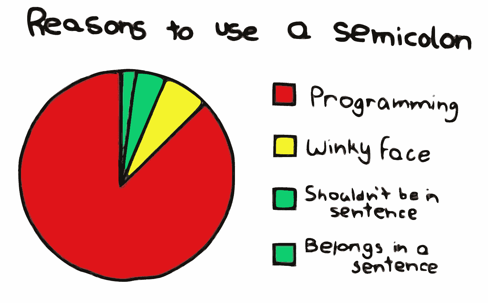

# 省略还是不省略

> 原文：<https://medium.com/hackernoon/to-omit-or-not-to-omit-2a6da5538509>



[分号](https://hackernoon.com/tagged/semi-colons)！不可否认，这并不是最有趣的话题，然而，这段语法却是 Javscript 中最有争议的特性:自动分号插入。

现在，这个特性，像大多数语言版本一样，本来是对语言有用的版本，但是，由于它的实现，它的用例被认为不值得冒险。

阿西似乎工作…但只是大部分时间。如果没有，它会让开发人员非常困惑，到处都是神秘的编译器错误。

在它被引入语言后不久，它的有用性就不仅仅是被一些数字质疑了。像道格拉斯·克洛克福特这样的导师仍然在谴责这个特性，现代公司在他们公司的代码风格指南中忽略了它们，在何时或者是否应该使用分号的问题上仍然存在很大的分歧。

## Javascript 中分号背后的一点历史

[Javascript](https://hackernoon.com/tagged/javascript) 是一种 C 风格的语言。这意味着，其语法的主要部分，如代码块的花括号或标准函数声明，直接继承自 C 语言。所以很自然地，分号是这种浏览器编程语言中继承的特性之一。

尽管如此，最终还是发布了这种语言的新特性。这被称为自动分号插入(ASI)。这个特性是为了防止代码中由于遗忘分号而导致的讨厌的解析错误。

ASI 的一般规则是，只要语句之间有一个换行符，它就可以在编译器中很好地运行。

关键词是**应该**。这意味着规则也有例外。

这就是我们要深入研究这些规则的例外的地方，以便瞥见这些虚幻的解析错误，因为它们发生在野外。希望这能给你一个确切的概念，告诉你在编写代码时什么时候应该使用分号。

## 示例#1

分号插入经常失败的第一个例子是在任何类型的变量声明期间。这意味着无论你使用的是 const、var 还是 let 分号应该总是跟在声明后面。

```
let lemon = {
  taste: “sour”,
  color: “yellow”,
  texture: “idk, it’s a lemon”
};
```

## 实施例 2

```
Function giveUserADog(){
  return
  {
      Emotion: “eternal happiness”
  }
}
```

第二个例子是一个著名的例子。因为与大多数 C 程序员认为的相反，这个函数将返回一个“未定义”值。当 return 语句的内容从下一行开始时，就会发生这种情况。在这里，ASI 将 return 语句视为完整的，并在 return 语句后插入一个分号。

但是有一个快速解决方法！只需在 return 语句后放置一个左括号[和另一个括号](https://developer.mozilla.org/en-US/docs/Web/JavaScript/Reference/Operators/Grouping)在返回代码的末尾。例如:

```
function giveMeMoney(){
  return (
    " reverse me baby ".trim()
                       .split("")
                       .reverse()
                       .join()
    )
}
```

这是一种常见的绕过 ASI 返回语句行为的 React 编程实践，适用于任何情况。

注意:如果你要返回一个对象或数组，只需在 return 语句的同一行使用左括号。

## 实施例 3

每当一行代码以括号开头时，就会出现下面的例子。

```
let steak = bbq.grill("rib-eye")
(function(){
  ///some code and stuff
})()
```

前面的语句中必须有一个分号。这是绝对必须的！如果前一行没有分号，Javascript 解释器将尝试运行前一行上的对象，作为函数或属性评估器(访问数组内容时考虑括号)。

看，这有那么难吗？大概吧。语法细节可能很难学。但是如果幸运的话，它可以防止你一次又一次地犯同样的编译错误。

希望这至少能帮你省下一个不必要的麻烦。