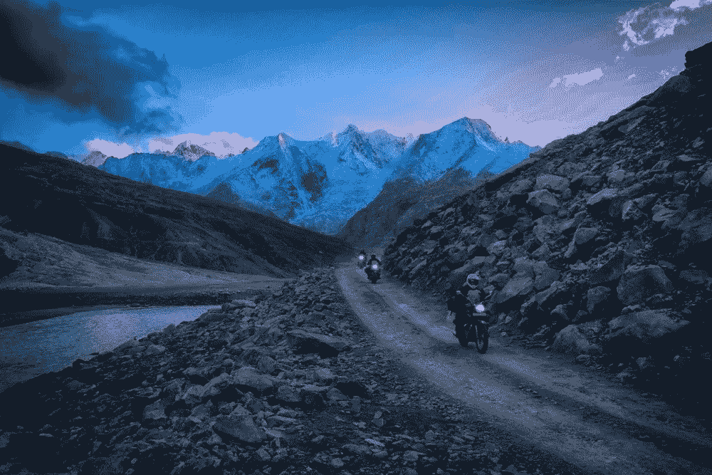
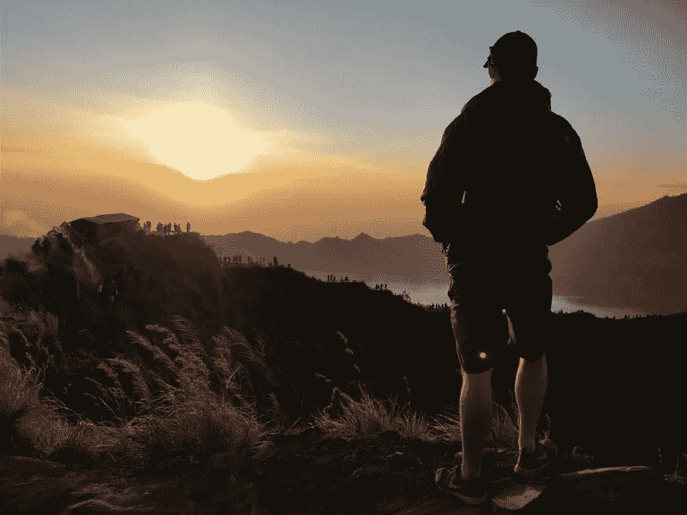
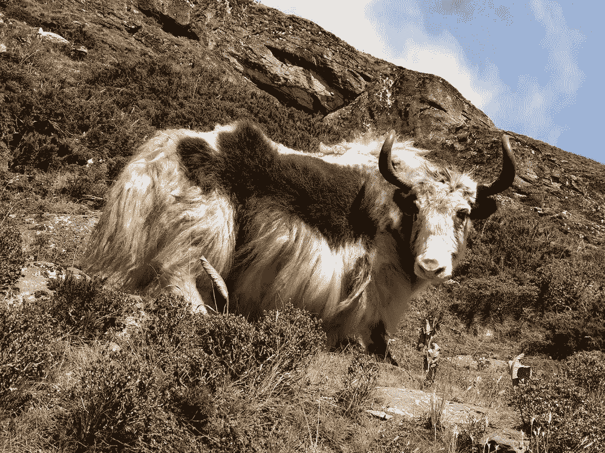
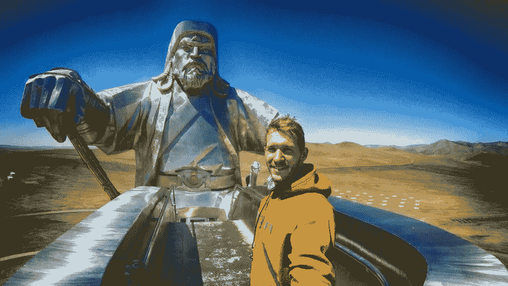

# 与狼共舞

> 原文：<https://medium.com/hackernoon/to-run-with-the-wolves-73a1e064f60a>

## 休假能激发创造力吗？

我礼貌地笑了笑，当一个人玩得开心的时候，我又抛出了一个关于时间飞逝的陈词滥调。这个评论实际上是在讽刺，因为每个人都知道，从心理和化学角度来说，在你的工作场所是不可能有乐趣的，不管你在等待点菜的时候咖啡机是否会播放音乐。

是的，我休假回来了。但是对我来说，过去的一年是我记忆中最长的一年。

从 50 摄氏度的沙漠，被无情的季风太阳烤焦，到零下 25 摄氏度的夜晚，在海拔 5000 米以上的缺氧环境中挤成一团，坐立不安。从与半吨重的摩托车搏斗，穿过齐膝深的丛林泥潭，到把我的蒙古摩托车扔在草原上，开始死亡行军。感觉当然不像“就在昨天”。

那么，除了这种物有所值的时间偏差，休假真的能给员工或企业带来任何切实的好处吗？

*以下是我关于休假的最佳建议。*

当你在海拔 4200 米的印度喜马拉雅山上露营时，逃离日常的服饰并不困难

休假不是我心血来潮的事情。我已经存了很多年的钱了，我很清楚，当那个时刻到来的时候，我需要像维姬过去所说的那样“与狼共舞”。具体来说，在我休假前，我和父母一起住了三年——用基本上是房子的存款进行了一年的冒险。这并不适合所有人。这取决于你如何看待自己的抱负、幸福和发展。你不仅需要资源，还需要投入其中的心态和意愿。印度是我旅行的第一站，也是最长的一站，它可能是经典的职业休息/精神启蒙目的地，这里的游客通常都是 20 多岁的年轻人:

1.  寻找某些东西——一个令人厌恶的陈词滥调，即“寻找自我”，或者…
2.  逃避什么

这两者都不是我的本意——我只是想在某个有足够危险的地方骑行，让它变得令人兴奋。尽管如此，内省式的询问最终渗透进了我的内心，我加入了破碎玩具的洪流中，寻找意义。

我找到了吗？不知道——但我确实观察到了成群结队的旅行者，他们厌倦了在生活的仓鼠轮子上沮丧地蹒跚而行，他们幸福的无知不知何故破灭了，开始了漫长而艰难的自我发现之旅。所以只是一个提醒，你的休假可能是一条崎岖不平的，不一定舒适的路…一个完美的赛格威进入我们的下一部分！

这个怎么样？巴图尔火山日出——对凌晨 4:30 起床的奖励！

从很多方面来说，很难概括休假的好处，因为它们可能适用于你整个企业中所有不同的角色和人物。你真正得到的是**远离你的日常琐事**，释放出一些**重要能量**和**时间来富有成效地反思你的工作、兴趣、人际关系和抱负**。

对我来说，这变成了认识和挖掘我在工作中挫折的根源。我是众所周知的温水中的青蛙，被加热得如此之慢，以至于我没有意识到我必须跳出来。这种挫败感的原因？简单。我个人致力于企业的社会事业。我在乎我在做什么。

现在，我并不是说解决方法是停止关心你所做的事情，尽管冷漠的毯子看起来是多么受欢迎。远非如此。相反，我必须适应。

企业，即使是非盈利和慈善机构，也不仅仅依靠社会主义。它们依靠官僚主义、资产负债表、董事会会议和一些看似无脑的决定运行，你永远也不可能完全理解这些决定。所以合作吧——拥抱混乱——不要为小事情流汗(但是保持激情，直到使用它的时候，它是易燃的！).

具体到创新，我总结了一些注意事项，以帮助我穿越大企业的思维迷雾:

*   停止制作不必要的文档——挑战每一张纸！
*   与转型计划和长期业务战略明确关联，利用两者来确定工作流程的优先顺序。
*   将它保留在家庭中——在让其他人参与之前，耗尽实验室设计师和概念团队可以完成的工作(更多人=更多拖延)
*   通过能动性来激励——跟踪支撑设计的工作包(许多连续的测试/研究活动可以设计出合适的东西！)而不仅仅是整体的、臃肿的概念
*   如果一个概念有停滞不前的危险，组织一次 7 天的冲刺来排除障碍并进入下一阶段
*   数字仪表盘——我们在这里得不到任何帮助，所以让我们像以前一样在 PowerBi 上模拟一些东西。这让凯蒂每周从 15 个不太热心的更新者那里收集信息。
*   周五阅读清单——你必须跟上潮流！
*   玩更多的电子游戏——为什么这是最差的？？

喜马拉雅牦牛不担心风险日志或变更请求。更牦牛。

除了是一面巨大的自我反省的镜子，我的休假还教会了我，如果你做任何事情，背靠背，几乎没有分心，它就会变老——不管它有多有趣。老实说——即使骑着摩托车闲逛，这可能比走路更成为我的第二天性，也会变老。这是一个经典的“*草更绿*”难题。在我对即将到来的冒险做白日梦的所有日子里，我有一天在路上思考我的回归常态——在某种程度上，我在脑海中设计了我梦想的公寓布局，忽略了一些你可以想象的最美丽的喜马拉雅山风景。我想象着倦怠(‘老实说，’*)我们现在已经看过多少寺庙了？！*’)这可能是旅行中饮酒如此频繁的原因。一切平衡是关键。

现在，我总是为自己的双手工作感到自豪，但我没有意识到在办公室简单地完成工作或主持一场精彩的、精力充沛的会议也会带来满足感(尽管很小)。这些小胜利实际上积累得相当快，如果没有它们，我得出结论，也许我会依赖它们——并试图将一些个人目标和抱负带到桌面上——来实现这种平衡。你需要自己的项目，这才是你有趣的地方..老实说，我需要比撞坏摩托车和摔断骨头更值得尊敬的兴趣——我再也不会恢复得这么快了！

想到假期，我再谈一点。考虑到我的大部分启示仅仅是创造顶部空间的结果，难道没有另一种(更快的)方法可以达到同样的结果吗？对于有些人，我并不怀疑。但是这些人有一天早上醒来，可能在跑了 10 公里，吃了藜麦和甘蓝(不管是什么)早餐后，决定开始冥想，并设法继续练习足够长的时间以获得回报。烦人。面对现实吧，那不是我们。所以我们就不能去度假吗？

除非你要离开几个星期以上，否则你的大脑很可能会保持工作节奏和无情的节奏，所以你实际的“休息”比你想象的要少得多。我花了几个月才完全脱离。因此，用一个肮脏房间的比喻来说:假日就相当于把你的 t 恤扔回到抽屉里，而休假就是把你所有的东西都放在地板上，开始把慈善袋子装得干干净净。床下的吸尘器干净了。有一个系统到位，并彻底禁止杂乱。因此，我带着对我的角色和业务的新承诺回来了，带着对不久的将来的设想轨迹和政治责任，而不是简单地被一个似乎每天都在系鞋带的政府剥夺了公民权。但这不是品客薯片罐头爆炸的时间/地点！

蒙古——这个突然的决定让我大吃一惊。当今世界上最迷人的地方之一。

我不知道。你很有可能无可救药。但是如果你正在考虑，答案可能是肯定的。我最近读到一份对暂停职业生涯的人的调查显示，他们都会毫无例外地向他人推荐它。不管它的未知来源，我不会逆这个潮流而动。我也会全心全意地推荐它。

**出去吧——别再找借口了。**

Tom Hartland 于 2014 年加入 Bromford，担任全新创新实验室的设计师，利用他在产品设计方面的背景来开发创新渠道，通过测试和试点加速新想法。

他喜欢喝太多咖啡，喜欢第三人称叙事，喜欢用伤疤给人留下深刻印象。

你可以在 Badventuring.com 的[关注他的冒险旅行博客](http://badventuring.com/)

[1 条评论](http://www.bromfordlab.com/labblogcontent/2018/7/17/runwithwolves#comments-outer-wrapper)

*最初发表于*[*www.bromfordlab.com*](http://www.bromfordlab.com/labblogcontent/2018/7/17/runwithwolves)*。*