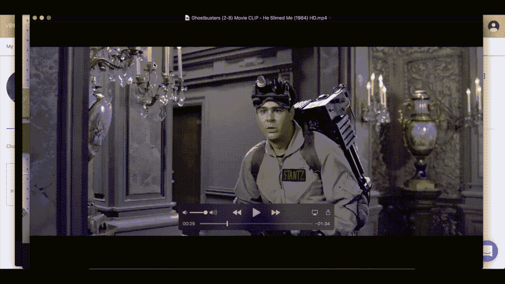
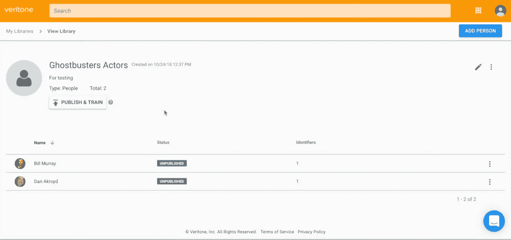
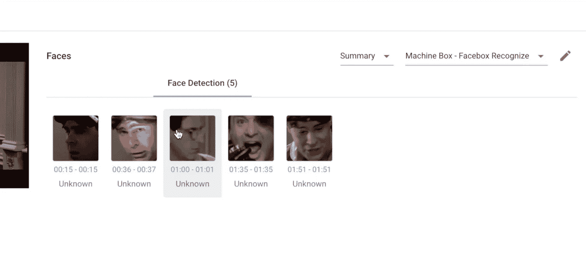
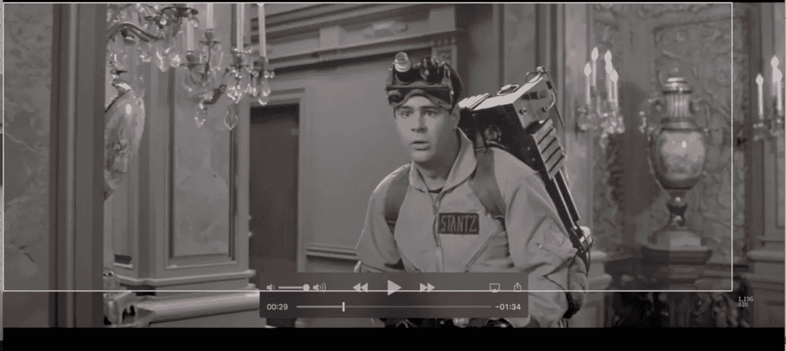
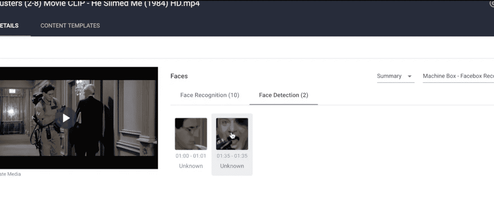

# 要赢得人工智能，你必须作弊

> 原文：<https://medium.com/hackernoon/to-win-at-ai-you-have-to-cheat-d6630b77455f>

拥有最准确和最有用的机器学习并不意味着拥有最好的算法或最大的数据集。太 2017 了！

人工智能和机器学习是非常棒的新工具，我亲自看到它们被用来解决无数的用例，并为大大小小的公司带来大量的生产力。它实现了以前不可能实现的事情，比如在数百万张照片中标记人脸，过滤收件箱中的垃圾邮件，以及让大量媒体内容变得更加可搜索。

> 但是如果你要求我为你的特定用例提供最准确的机器学习模型，我会作弊。

I have aces up my machine learning sleeve

## 请允许我解释一下。

以前，对机器学习的兴趣的爆发部分是由于 API 服务的流行、可用性和易用性，这些服务将用户的数据与预先训练的模型联系起来。上传一个名人的照片，得到一个名人名字的标签——简单！

这些工具适用于一些通用用例，也为机器学习的能力做了很好的演示，但这只是一切可能的开始。

正如你们中的一些人发现的那样，巨大的、预先训练的机器学习模型在一些用例中表现不佳。原因是这些大模型不是在你的用例上训练的，它们是在通用数据集上训练的，试图服务尽可能多的不同种类的用例。你可以向这些模型抛出许多不同的问题，但代价是更高程度的准确性。

所以我提高精度的方法是作弊。我在你的数据集上训练一个模型，而不是我独立于你的用例收集的一些通用数据集。

## 我怎么也能做到呢？

机器学习变得越来越便携。有了像 [Machine Box](https://machinebox.io/?utm_source=Medium&utm_medium=Post&utm_campaign=cheating%20at%20machine%20learning) 这样的工具，人们可以很容易地开始在他们的堆栈中编排数以千计的机器学习模型。当您达到这种规模时，您可以开始为特定用例快速构建模型，对它们进行实时训练，然后在不再需要或不再相关时停止构建。

这将焦点放在数据集和训练上。我的目标是为您提供尽可能多的工具，将您的现有数据转换为训练数据集，使用它来训练模型，部署模型，验证模型，然后让您实时改进它(无需重新部署)。

这就是最佳精确度的来源。我举个例子吧；

在这里，我用 Veritone 平台上传了一张比利·穆雷和丹·艾克罗伊德的照片，用于面部识别训练。

Using Library within the aiWARE platform

当我对《捉鬼敢死队》的视频片段进行训练识别时，我最终发现一些人脸没有被识别出来。

我没有试图找到一个更好的算法，而是从那个剪辑中截取一个截图，将其添加到那个人的 Veritone 库中，并重新运行引擎。

Taking a screenshot with COMMAND-SHIFT-4 on a Mac

请注意，现在有更少的未知面孔，因为他们已经正确地与他们所代表的人相关联。

你不会找到比你自己的数据更好的算法训练数据。在[机盒](https://machinebox.io/?utm_source=Medium&utm_medium=Post&utm_campaign=cheating%20at%20machine%20learning)和 [Veritone](http://www.veritone.com) 之前，释放自身数据的训练潜力是极其困难的。但是这些工具拥有特殊的技术来最大限度地减少您需要的训练数据量，并且它们还解决了部署、规模、可移植性和安全性问题，因此您可以专注于为您的用例创建最佳模型。

## 错误呢？

你的第一个模型不会是完美的，事实上，没有任何机器学习会 100%正确。你对错误答案的例子所做的是，你可以区分你的机器学习实现。在 [Machine Box](https://machinebox.io/?utm_source=Medium&utm_medium=Post&utm_campaign=cheating%20at%20machine%20learning) ，我们鼓励开发人员在引擎中构建一个反馈工作流(API 有很好的端点)来纠正出现的错误。应该是比利·穆雷的时候却写着丹·艾克罗伊德？抓拍违规帧，贴上标签，并教它使用 [Facebox](https://machinebox.io/docs/facebox?utm_source=Medium&utm_medium=Post&utm_campaign=cheating%20at%20machine%20learning) 。你会惊讶于这将会对模型有多大的改进。

## 尝试

不要只相信我的话，现在就去下载[机盒](https://machinebox.io/?utm_source=Medium&utm_medium=Post&utm_campaign=cheating%20at%20machine%20learning)工具，或者[注册 Veritone](https://www.veritone.com/developers/) 在平台上试一试自己看看。这真的很容易做到，你需要的只是一个要解决的问题。