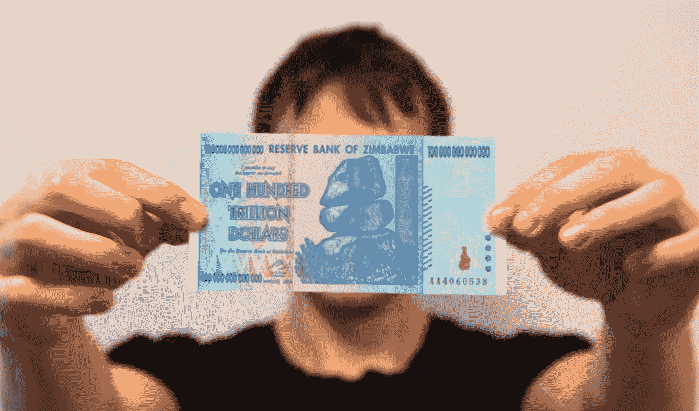
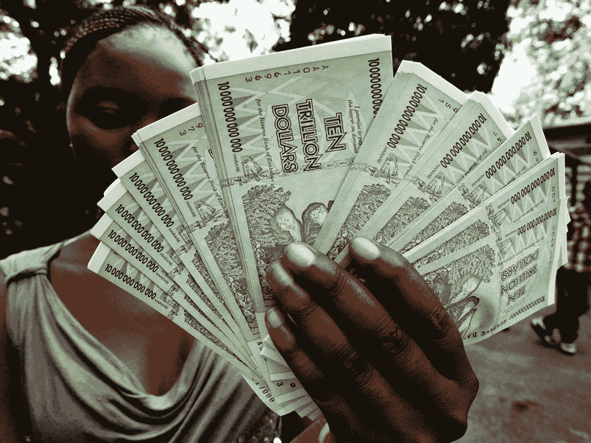
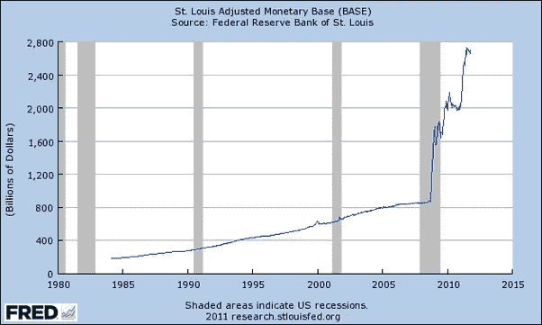
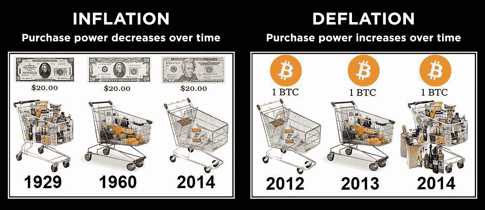
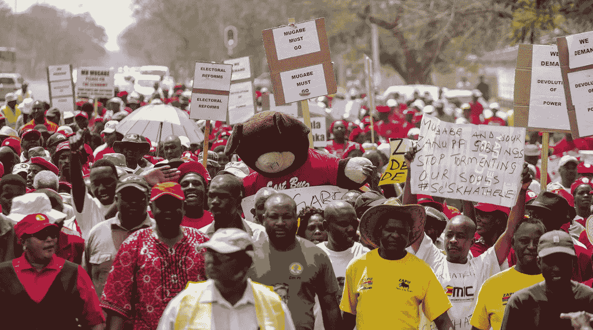

# 我成为亿万富翁的那一天

> 原文：<https://medium.com/hackernoon/today-i-became-a-trillionaire-15ba02ddf4a3>

这是一张来自津巴布韦的 100 万亿美元的钞票。目前它的价值约为 0.40 美元。我得到它是为了提醒人们，当政府和银行做出鲁莽和不负责任的金融决策时，会发生什么。

早在 1980 年，1 津巴布韦元大约相当于 1 美元。但在重创经济后，政府开始拼命印钞以挽救经济。这导致了恶性通货膨胀的恶性循环。2009 年，[津巴布韦的通货膨胀率为 231，150，888.87%](https://en.wikipedia.org/wiki/Hyperinflation_in_Zimbabwe#Inflation_rate) ，相比之下，世界平均水平为 3.5%。

想想那些一生努力工作可能只为了存 10 万美元的人。然后，在短短几年内，他们看到他们的政府用 1000 亿美元的钞票充斥市场，这些钞票甚至不能给他们买一顿饭。这些人看到他们一生的收入价值化为乌有，他们对此无能为力。

津巴布韦是恶性通胀最严重的例子，但这种情况也发生在许多其它国家，如委内瑞拉、阿根廷、巴西，甚至美国。

# 美元印钞机

自 1971 年以来，美元就没有得到黄金或其他任何东西的支持[。目前，私人银行通过贷出高达 10 倍于他们没有的钱来凭空创造钱。自 2008 年以来，政府印刷了超过 4 万亿美元，实际上使流通中的美元总量翻了两番。谢天谢地，政府设法控制住了通货膨胀，但这种情况令一些经济学家非常担忧。](https://en.wikipedia.org/wiki/Nixon_shock)

Total USD in circulation since 1980\. Today, we’re at about 3.9 trillion.

在一个以债务为基础的经济中，政府印钞多少有些好处，因为降低货币价值也会降低他们的债务。然而，这也影响了每个试图省钱的人。2%的通货膨胀率可能看起来没什么，但它本质上意味着 20 年后，你将失去一半的储蓄。

# 这就是比特币的用武之地

你可能听说过比特币。这是一种新形式的数字货币。

比特币的许多特性让它对津巴布韦等国家的人们非常感兴趣。首先，它不在任何政府的控制范围之内。因为它是全球性的，所以也不受当地市场和政策的影响。但更重要的是:你不能印比特币。从代码上来说，只会有[2100 万比特币被创造出来](https://en.bitcoin.it/wiki/Controlled_supply#Projected_Bitcoins_Long_Term)。

为什么是 2100 万？没有特别的原因。这是由[比特币的神秘创造者](https://en.wikipedia.org/wiki/Satoshi_Nakamoto)选择的任意数字。目标是模仿黄金等自然货币的特征。地球上的黄金数量有限，比特币数量也有限。

这种有限的供应使比特币成为一种[通货紧缩货币](https://www.investinblockchain.com/bitcoin-is-a-deflationary-currency/)，这意味着与法定货币相比，它随着时间的推移会增值。这对津巴布韦等国家的人民来说是一件幸事，因为他们的货币发生的事情在比特币生态系统中永远不可能发生。

人们会说比特币不是很好的价值储存手段，因为它的价格波动太大。其他人会说，完全依靠比特币这样的通缩货币运行的经济是不可持续的，因为没有人会花他们的钱。这些人是对的，但他们没有抓住重点。尽管存在所有这些问题，比特币仍然带来了极其有价值的东西:**竞争。**

# 语音和退出

正如艾伯特·o·赫希曼告诉我们的，当谈到改变事物时，人们有两种基本的权力形式:发言权和退出权。

当政府变得不计后果时，你可以聚集起来，制作横幅，走上街头表达你的不满。然而，如你所知，这通常被抑制，很少导致变化。所以当声音不起作用时，你就有了第二重要的力量。**退出**。

当人们表达他们的抱怨时，领导者可能不够关心去倾听。但当人们开始开车离开时，他们就会在意。因为你不可能在所有人都离开的时候掌权。

**退出会让当权者吓得屁滚尿流。**

# ***财务退出门***

多亏了比特币，有史以来第一次，政府不再垄断货币。如今，对政府失去信心的人可以选择将资金从国民经济转移到数字经济。

政府可以试图建造他们想要的墙和边界来防止这一点，但比特币在设计上是无国界的。你只需要一部智能手机和一个互联网连接。你的手机上有一整个银行，可以即时访问全球经济。

最终，比特币和其他加密货币是对抗腐败和财政不负责任政府暴政的健康手段。因为没有人想成为一个所有人都试图离开的经济体的领导者。

## 对密码一无所知？在此了解区块链技术的基本原理👇

 [## 人们在数码猫上花费了数百万美元，这就是为什么它是有意义的

### 密码猫不仅仅是猫。

medium.com](/swlh/people-are-spending-millions-on-digital-cats-and-heres-why-it-make-sense-aea431740bcf) 

## 想投资 crypto 但不知道从哪里开始？阅读我的购买比特币和其他加密货币的初学者指南！👇

 [## 如何购买比特币和其他加密货币

### 购买比特币、以太坊、莱特币和其他加密货币的完整指南。

medium.com](/@tonyaub/how-to-buy-bitcoin-and-other-cryptocurrencies-ac9e841c6405)  [## 加密货币-黑客正午

### 在黑客正午阅读关于加密货币的文章。黑客如何开始他们的下午？

hackernoon.com](https://hackernoon.com/tagged/cryptocurrency) 

# 请点击👏如果你喜欢或从中学到了什么。

这是我刚刚在 WAQ18 上的一次演讲的节选。
👉[用英文 CC 看视频](https://www.youtube.com/watch?v=wz_Lbwye7jI)👈