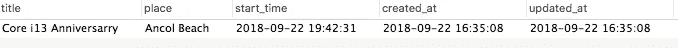

# 今天我学习了:在 Golang 中解组时处理 JSON DateTime。

> 原文：<https://medium.com/hackernoon/today-i-learned-dealing-with-json-datetime-when-unmarshal-in-golang-4b281444fb67>

## 当心日期时间标准！！


Golang taken from google image search

所以今天的故事是关于在 Golang 中从 JSON 解组 DateTime 时的奇怪行为。我不是说这是一个错误，但这只是我的故事，因为我缺乏处理 Golang 中日期和时区的经验

当我想用 Golang 做一个 CRUD API 系统的时候就发生了。所以，我有一个端点，比方说:`/event`，它将从 JSON 接收一个事件对象。

```
{
  "title": "title here in string",
  "place": "place name here in string",
  "start_time": "date time here in string"
}
```

我使用 [labstack/echo](http://github.com/labstack/echo) 作为我的路由库，以方便我处理我的请求。使用 echo，要接收响应体并将其解组到我的结构，我可以用如下简单代码来完成:

因此，当我想测试它时，我制作了如下的请求体，我只是从我们的 API 文档示例中复制粘贴它。因为一开始，我甚至不认为这有什么关系。

```
{
  "title": "Core i13 Anniversarry",
  "place": "Ancol Beach",
  "start_time": "**2018-09-22T12:42:31Z**"
}
```

API 已经部署到了临时服务器上，所以我直接从 Postman 到临时服务器上测试它。但是在获取所有存储的事件项之后，`start_time`与我在请求体中发布的不同。下面就变成这样了。

```
{
  "id": "1", // *auto increment from database*
  "title": "Core i13 Anniversarry",
  "place": "Ancol Beach",
  "start_time": "**2018-09-22T19:42:31+07:00**",
  "created_at": "2018-09-22T16:35:08+07:00",
  "updated_at": "2018-09-22T16:35:08+07:00"
}
```

在数据库中，它是这样存储的:



row in MySQL

看这个`start_time`领域。和我贴的不一样。我想要的是，存储的数据与我从邮递员那里发布的数据相同。

我发现这个问题的发生显然是因为时区。所以我只需要注意时区。这是我的第一个想法。我想我的系统在这方面有问题。

# 解决问题

为了解决这个问题，我做了下面的所有操作。

## 在连接驱动程序中查找连接字符串

因为我使用 MySQL 作为我的数据库存储，所以我需要一个驱动程序来连接我的应用程序和 MySQL。我正在使用 github.com/go-sql-driver/mysql 作为我的连接驱动程序。所以在查找文档并检查我的连接字符串后，没有任何错误发生。我做对了。

```
dsn := root:root@tcp(127.0.0.1:3306)/event?parseTime=true&loc=Asia%2FJakarta&charset=utf8mb4&collation=utf8mb4_unicode_ci
```

## 手动重建日期时间

还是很好奇，为什么会这样。然后我试图在 StackOverflow 甚至 GitHub 中找到任何关于这个问题的问答或问题。

老实说，我花了 2 个小时来解决这个问题🤦‍
直到那时，我才感到沮丧。所以我有两个选择来解决这个问题。

1.  我将在存储到数据库之前重建`start_time`。
2.  问我的队友(*不管怎样，问这个问题会觉得很傻🤦‍)

但是，只想付出更多的努力😶，我通过重建日期时间进行了修复。

```
startTime := e.StartTimeloc, _ := time.LoadLocation("Asia/Jakarta")localStartTime := time.Date(startTime.Year(), startTime.Month(), startTime.Day(), startTime.Hour(), startTime.Minute(), startTime.Second(), startTime.Nanosecond(), loc)
```

然后，出于好奇，我向我的团队询问了这个问题。然后他们看我如何复制它，和我一样，他们也很好奇为什么会发生这种情况。直到几分钟后，我的一个团队找到了发生这种情况的原因。

发生这种情况是因为我在请求体中设置了错误的时区偏移量。

```
{
  "title": "Core i13 Anniversarry",
  "place": "Ancol Beach",
  "start_time": "**2018-09-22T12:42:31Z**" // *look for the `****Z****` indicator*
}
```

因为我在`+7.00 timezone (Asia/Jakarta)`生活过，所以应该收录在我的 JSON 里。

所以，当我把`start_time`从:

```
2018-09-22T12:42:31**Z**
```

到…里面

```
2018-09-22T12:42:31**+07:00**
```

它解决了我的问题。我的系统没有任何问题。一切都很完美。

当我意识到这一点时，我觉得自己很笨🤦‍.我白白浪费了我生命中的两个小时🤦‍.

## 要吸取的教训

*   总是先问你的队友(如果他们有空的话)
*   `2018–09–22T12:42:31+07:00`是 RFC 3339 的[格式，每一个字符都很重要。](https://www.ietf.org/rfc/rfc3339.txt)

*如果你觉得这篇文章值得一读，就给点掌声或者分享到你的网络圈，这样大家也能读到这个。关注更多类似的故事！*