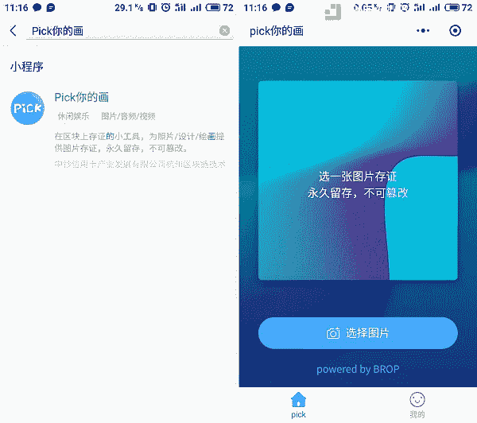
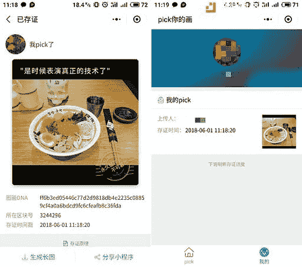

# 今天关于亚洲的加密新闻—6 月 1 日

> 原文：<https://medium.com/hackernoon/todays-crypto-news-on-asia-june-1st-c0df3ed01c61>

币安的 10 亿美元基金；印度对石油说不；日本向交易所发出整改令；TRON livebroadcast 在国内获得 160 万次观看，在海外获得 7.5 万次观看

# **头条新闻**

-多语言加密货币交易所币安宣布计划建立一只 10 亿美元的基金，币安实验室负责人 Ella Zhang 在一次在线会议上宣布。微信报道这里-【http://bit.ly/2J82qIg】T4|英文文章这里-[http://bit.ly/2J7wow7](http://bit.ly/2J7wow7)

*** *仅限中国媒体**** 日本金融厅(FSA)已对多家数字货币公司进行了反洗钱监管和整改，并计划在 6 月中旬围绕改善业务的方法展开进一步讨论。FSA 认为，现在大多数公司过于重视客户开发而忽视管理。在 16 家注册交易所中，金融服务管理局已向其中 10 家发出整改令，2 家公司需要技术改进。翻译新浪页面—[http://bit.ly/2LMLbxU](http://bit.ly/2LMLbxU)

印度外长苏诗马·斯瓦拉吉表示，印度无意使用委内瑞拉推出的石油来购买委内瑞拉的原油。她引用了印度央行发布的一项命令，该命令禁止涉及加密货币交易的交易。[http://bit.ly/2LRPAj5](http://bit.ly/2LRPAj5)

*** *仅限中文媒体**** TRON 昨天的 mainnet 发布会有现场直播，反响不错。英吉利海峡有 75037 次观看。在中国，峰值时有 160 万次观看。

# **硬币和外汇新闻**

EOS 区块链发布:应该发生什么(以及可能出现什么问题)[http://bit.ly/2LQwz0w](http://bit.ly/2LQwz0w)

*** *仅限中文媒体**** 区块链游戏应用 VGame 为 MOAC 平台带来以太坊 14 万用户。VGame 最初是基于以太坊开发的，但是由于网络慢，气体成本高，以太坊远远不能满足日常运营。MOAC 的 TPS 超过 1000。它支持 MOAC、ERC20、ERC721 系列代币，交易费用仅为 0.0005 左右。

-日本的 bitbank 在 30 天波动量中排名第一。该交易所目前正在开展一项零费用活动。[http://bit.ly/2J8eJ7t](http://bit.ly/2J8eJ7t)

# **商业新闻**

-采矿硬件巨头比特大陆因其最新的采矿产品之一“B3”受到批评，中国用户对其营销策略和质量控制提出指控。[http://bit.ly/2J8fc9J](http://bit.ly/2J8fc9J)

****Chinese media only**** The China Banknote Blockchain Technology Research Institute launched a blockchain applet — **Pick your painting (**Pick 你的画)**.** This small program allows individuals to upload images such as images of IDs, certificates, to the blockchain and retain them permanently.

*4 Screenshots below. Top left is the App overview. Top right says “select an image to save it, keep it forever and changes not allowed”. Bottom left is the image saved, with the title of the image on top and the image’s DNA, block number and time recorded at the bottom. Bottom right is the folder in which holds all your images.*

*** *仅限中国媒体**** 众安保险(市值约 100 亿美元)与 100 多家国内医院签署了数据共享协议，以简化与区块链的记录验证和自动理赔流程。

- GMO Internet 于 2018 年 8 月推出“加密芯片 byGMO ”,允许在游戏应用程序中分发比特币作为报酬。【http://bit.ly/2LQEU47 

# **宏和调节表**

-印度犯罪调查部门(CID)已经接受了一名发狂的印度商人的陈述，该商人从欺诈性加密货币项目 Bitconnect 的发起人那里勒索了 2000 个比特币，以调查该公司的工作。[http://bit.ly/2xxLsBR](http://bit.ly/2xxLsBR)