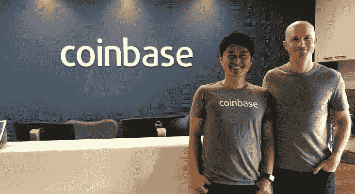

# 今天关于亚洲的秘密新闻——6 月 5 日

> 原文：<https://medium.com/hackernoon/todays-crypto-news-on-asia-june-5th-79c94a58b453>

imToken 中的 200 亿美元比特币基地资产；比特币基地冒险进入日本；比特大陆半个 Z9 mini 在中国的价格；OKEx 发行指数

要获得中国和亚洲加密货币事件的最新消息，请订阅下面的时事通讯。这将是一个快速，无障碍更新到您的收件箱每天。

我们刚刚添加了一个活动日历！它的目的是为我们的读者提供更多了解亚洲公司的机会。如果你在一家总部位于亚洲的加密货币公司，并且你有即将到来的活动，请确保让我们知道！

**即将到来的事件**

Reddit 上的币安·AMA:美国东部时间 6 月 6 日下午 5 点至 8 点

EOS 月 9 日:香港 EOSHackathon

本体 7 月 15-19 日:微软灵感，拉斯维加斯
本体 6 月 29 日:Block Co +大会，东京

Vechain 月 19 日:旧金山分布式 2018 大会

**头条新闻**

世界上最大的以太坊钱包正在将其全球总部迁至新加坡，以扩大其全球影响力。据比特币基地的一位发言人称，ImToken 的应用程序存储了超过 350 亿美元的资产，其中包括超过 200 亿美元的比特币基地客户资金。[http://bit.ly/2M2VON0](http://bit.ly/2M2VON0)

**中国媒体* *比特大陆限时将最新 ASIC 矿机 Z9 Mini 的价格降至每台 5900 元人民币的一半。这比原本 11000 元的价格下降了将近一半。 *Google 翻译链接—*[*http://bit.ly/2M1sfeY*](http://bit.ly/2M1sfeY) *这个公告似乎只出现在中文网站上。*

比特币基地想扑向另一个加密货币天堂:日本。https://on.wsj.com/2LWT43M 绝对是一个大胆的举动，上一次我们看到美国大型科技公司冒险进入亚洲是在优步。现在，我认为同样地，比特币基地将不得不面对与当地居民的激烈竞争。

**硬币和外汇新闻**

OKEx 推出了一只加密货币交易所交易基金，上周五 Huobi 宣布了类似的计划。篮子将由比特币、以太坊、莱特币、比特币现金、EOS 组成。火币指数囊括了前 10 名币。[http://bit.ly/2LYqD5P](http://bit.ly/2LYqD5P)

Bodhi 和 Qtum 正在寻求建立一个交易协议、分散交易和浏览器钱包。[http://bit.ly/2Jk0pce](http://bit.ly/2Jk0pce)
*我认为我们应该开始看到更多前十名市值之外的公司开始合作，最终可能联合起来加入他们的代币，因为他们和前十名公司之间的差距越来越大。*

**商业新闻**

Pundi X 已开始在印度尼西亚推出其加密货币销售点(POS)设备，押注印尼央行将在三年内放弃当前的反加密货币立场。[http://bit.ly/2LZ2pYQ](http://bit.ly/2LZ2pYQ)

汇丰银行和 ING 银行通过区块链技术成功完成了阿根廷对马来西亚的首笔大豆现货交易。[http://bit.ly/2LYGe5i](http://bit.ly/2LYGe5i)

KMP 首尔医疗中心表示，该医院将向使用加密货币支付的顾客提供医疗服务。[http://bit.ly/2LYouHj](http://bit.ly/2LYouHj)

**宏和调节表**

**中国媒体* *中国人民银行发表了习主席关于网络安全和信息化的讲话。[http://bit.ly/2xQkN3s](http://bit.ly/2xQkN3s)
*该网站屏蔽谷歌翻译。但该行向党员强调的信息是，服务经济，防控金融风险，通过安全和技术深化金融改革。*