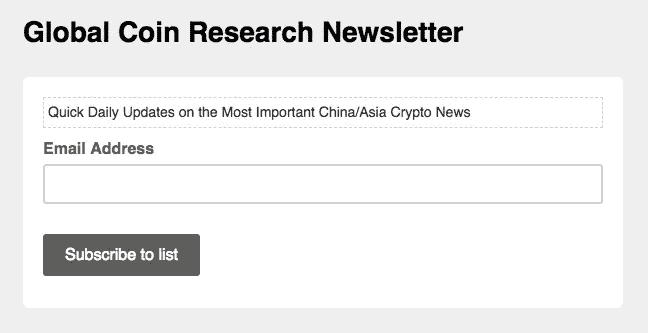

# 今天关于亚洲的秘密新闻——6 月 7 日

> 原文：<https://medium.com/hackernoon/todays-crypto-news-on-asia-june-7th-77023bd1a1e8>

*泰国发展数字货币；比特大陆酝酿 IPO，币安·AMA 和马尔他银行；越南可能禁止采矿设备；中国央行降低“金融”风险*

要获得中国和亚洲加密货币事件的最新消息，请订阅下面的时事通讯。这将是一个快速，无障碍更新到您的收件箱每天。

🌟**头条新闻**

泰国央行行长暗示，在该国推动区块链发展的更广泛努力中，将开发一种批发央行数字货币。【http://bit.ly/2Jm7hWs 

币安在马尔他开设银行账户。[http://bit.ly/2sNI4x8](http://bit.ly/2sNI4x8)

我们代表未能参加此次活动的币安 AMA 读者提问。AMA 挤满了伟大的问题和答案，看看这里

比特大陆正在考虑首次公开募股。该公司去年的营收为 25 亿美元，其联合创始人吴(音译)和 Micree Zhan 共持有该公司约 60%的股份。[https://bloom.bg/2JsjrNi](https://bloom.bg/2JsjrNi)

越南财政部已正式提议该国禁止进口加密货币开采设备。[http://bit.ly/2JrW46V](http://bit.ly/2JrW46V)

**中国媒体* *央行上海副主任声称，中国成功抑制了加密货币交易所和 ico，反映了国家防范金融风险能力的有效性。[谷歌翻译链接](https://translate.google.com.hk/translate?hl=zh-CN&sl=zh-CN&tl=en&u=http%3A%2F%2Ffinance.jrj.com.cn%2F2018%2F06%2F07162124651208.shtml)

**硬币和外汇新闻**

韩国警察局表示，将建议对加密货币交易所 Coinone 提供保证金交易提出指控。[http://bit.ly/2JnywzL](http://bit.ly/2JnywzL)

💼**商业新闻**

《福布斯》列出了韩国最富有的人，他们中的许多人都是通过加密技术赚钱的。找出泡菜溢价意味着什么。[http://bit.ly/2Jmeq8](http://bit.ly/2Jmeq8Z)

Bad Packets 报告发现，美中商业协会网站正在窃取访问者的计算能力，以挖掘加密货币。[http://bit.ly/2JoYCma](http://bit.ly/2JoYCma)

🏢**宏观调控观察**

印度的一些加密货币交易所正在申请撤销印度央行对加密货币交易所和其他加密相关业务的禁令。【http://bit.ly/2Jslgd6 

📅**即将到来的事件**

EOS 月 9 日:香港 EOSHackathon

本体 6 月 29 日:Block Co +大会，东京
本体 7 月 15-19 日:微软 Inspire，拉斯维加斯

Vechain 月 19 日:旧金山分布式 2018 大会