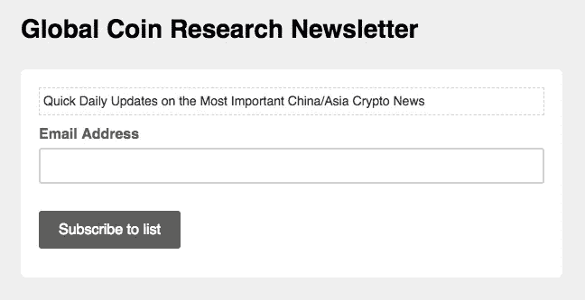

# 6 月 8 日，今天的亚洲加密新闻

> 原文：<https://medium.com/hackernoon/todays-crypto-news-on-asia-june-8th-673ee1eadc3d>

*韩国线开设 6 家密码交易所；比瑟姆征税 2800 万美元；新加坡称 ICO 不安全*

要获得中国和亚洲加密货币事件的最新消息，请订阅下面的时事通讯。这将是一个快速，无障碍更新到您的收件箱每天。

# 头条新闻

**Korea Line** 正在寻求开设 6 家密码交易所。【http://bit.ly/2M6l7xP 

韩国向 Bithumb 征收 2800 万美元的税。[http://bit.ly/2McxRD0](http://delivery.substack.com/wf/click?upn=ZV99yCVdOII0QH-2BnH-2BWjEiSPi1MO3TWKHpnB3A4Suhw-3D_A1wzkq7pry7S8UUMhTBISnfyQCoeDjpj53G3MIeQv2hw1PIsgbz4RfZ-2FiMdN79-2F-2BBeXEn484FisVwZZG8g6pqS2Fl18P5IL-2B5wK5yGB95qHZN6tx1eSCf8TlvAycAFBOsijcDQEkj4-2Fw0jA4Wxw5vp5DHxOQxQ2ZKlMTRrvTjW6GtOy7BlDY0TR9sHxd8tU3R3MGI01pHrPjrkvAuziUVBe7IMQfUPMdgC4ecsV6iUkwStLFI4sc2-2Ffdcqv0VWhgU309T2b5pBGwBQYn-2BY-2Bwck-2Fe2blZHxayt0o1V7QG-2F6Ook-2FzLXaOV1TBvjNo1fFa-2B)

****中国媒体* *新加坡金融管理局** : ICO 本质上不是证券。[谷歌翻译链接](http://delivery.substack.com/wf/click?upn=ZV99yCVdOII0QH-2BnH-2BWjEq-2FPt8X74wPWhiC13K41nF0-3D_A1wzkq7pry7S8UUMhTBISnfyQCoeDjpj53G3MIeQv2hw1PIsgbz4RfZ-2FiMdN79-2F-2BBeXEn484FisVwZZG8g6pqS2Fl18P5IL-2B5wK5yGB95qGlVmIV5BIvW7o7JBMbJ24KLIfokhW-2BFmeHrfypqp-2Fp8ormkTfvx4g1-2F8NUXebG2v5pjHd9G7QA1RVrQE0MzG15Hu2B1ozSBl2AWMkURj7u98k9ZKgS0mcoQuYI-2Ff3ehzCHJRQ7XkmJnBd7YRl0LT4cRQ6raUV-2BjZzIwmObrhtdY000JbCAEWjCPyWx9c8dxQiI9fU2b3U3J46GnYNqrO8n)

**韩国政府**继涟漪之后成立沃尔顿连锁研究所。[https://prn.to/2MaxaKt](http://delivery.substack.com/wf/click?upn=Xm84KdBkCi7o-2F5-2FLgn91Fo9TCF2jb0kEgS0UlMDpEgs-3D_A1wzkq7pry7S8UUMhTBISnfyQCoeDjpj53G3MIeQv2hw1PIsgbz4RfZ-2FiMdN79-2F-2BBeXEn484FisVwZZG8g6pqS2Fl18P5IL-2B5wK5yGB95qFOKfxj-2FJWG7neQ7YmDCyIj8gULATXEzHhOX0YKAHqHb4mJJmPY2wBN7MC5Cq09GoOBSmPDs-2By06373AklalAXVrgMrc4aA2F-2FKItEGMr-2FyJE01Ud6qQfoCXq5ySk64r69qkY1gvtGHvWeL-2FF8nu9EukJdXk-2FKZAEOF58XDqLx5TGK5X1vfgzmoTUYZT5WyE23oogBbU0MyOaXDDyHQOee3)

# 硬币和外汇新闻

**VeChainThor Testnet** 现已在 [Github 上发布。](http://delivery.substack.com/wf/click?upn=ZV99yCVdOII0QH-2BnH-2BWjEmu6osnOqpZtJNLqbRCSnl8-3D_A1wzkq7pry7S8UUMhTBISnfyQCoeDjpj53G3MIeQv2hw1PIsgbz4RfZ-2FiMdN79-2F-2BBeXEn484FisVwZZG8g6pqS2Fl18P5IL-2B5wK5yGB95qGLgQVOqEOQZ5PTKZHAQrgJATQkBtHtZ2He0zpzzfB-2F2Ga5SB1O-2F4W1LcQkzfvA3WXxtkxnOPlqQ27EtAzhd511sGHkNIAlaJmXcwb2JTN5MJRxlWQjI3JbQ083WnSqRGhf1YZKlykI8Ql2-2BGNOGf5J2X7Mf8xETRJ2ottFpBdKhbkOZcaRIqiAxyQJ9hQTi-2FzeIX-2F250UFc8XYwkI1fVQW)

**日本**证实首次正式拒绝交换。[http://bit.ly/2sFXnZw](http://delivery.substack.com/wf/click?upn=ZV99yCVdOII0QH-2BnH-2BWjEnPfMqvvC-2FhfFHAkMXwMt24-3D_A1wzkq7pry7S8UUMhTBISnfyQCoeDjpj53G3MIeQv2hw1PIsgbz4RfZ-2FiMdN79-2F-2BBeXEn484FisVwZZG8g6pqS2Fl18P5IL-2B5wK5yGB95qHA-2Fis-2FhcYz5O06c-2FR0MsNUnn8POwwkl08qz3dwy-2BrDpQDXL8bQ22GZYiWVbXOXqIxzV0dItDLqS8pv3Z6ejhmtQMvuAKEjo-2FnW7S7nqemSFsHx3GAvnbLV88QIUslthVYDFziKU5JW0pcJAIe7L0Op2DHF1j8CV8unc5TNsmUIM-2BJM68MeWbMuugDwDdAAr1zJ-2BmRx6rONjc2vGulUMoVX)

**ICON 和德勤**创业顾问团合作。[http://bit.ly/2MbKOxc](http://delivery.substack.com/wf/click?upn=ZV99yCVdOII0QH-2BnH-2BWjEpjfpyet2ar8rrGjxUezyr4-3D_A1wzkq7pry7S8UUMhTBISnfyQCoeDjpj53G3MIeQv2hw1PIsgbz4RfZ-2FiMdN79-2F-2BBeXEn484FisVwZZG8g6pqS2Fl18P5IL-2B5wK5yGB95qH5g9jrKciOkNq46gfFwz-2FCffOiEsO5PJHnAreUCWp0TCjq59g1W-2FcNw82nzXr9RxD3McT-2FxFBn-2FpG-2BiKjX9OPKwPDRGZgwmGBpZbtzxVODSPjLVDL3AJWq2GS1xMYZO8ybsar8heCD17j1LYwIk5uEsH13eKwEQfUybF-2Bct6y7-2FEzOs4FXdMEbzSHMoMTjgtVid2YXm72OvNfirPsnb1Xv)

# 商业新闻

**Quartz 对印度激增的加密货币犯罪的看法**。[http://bit.ly/2sG09ho](http://delivery.substack.com/wf/click?upn=ZV99yCVdOII0QH-2BnH-2BWjElFr8b6MizJ0RXgU8GemzqQ-3D_A1wzkq7pry7S8UUMhTBISnfyQCoeDjpj53G3MIeQv2hw1PIsgbz4RfZ-2FiMdN79-2F-2BBeXEn484FisVwZZG8g6pqS2Fl18P5IL-2B5wK5yGB95qGGPTgf4VYcv-2FqJraz1Hwk-2FW7kwi7w7KR-2FgRZnJzPFiISSQLU4-2BH-2B-2BGzUzjqvtoN7fZAr0YboTco-2B9DoXOfPm9tCFs7MtMQbIXccF3McIEn29s-2FribJEK-2Bx0DAUmFITjspryJk-2FFX5PqaooxYGtZE1t8yDLrjxA88-2BEEja-2BoztcIT9WOzm4QFT3Ze-2FD-2BW4-2BrrpIo-2FwN81JPwm7c6kNd3ZGA)

百度推出首个区块链本地应用。它是关于宇宙的，而且非常漂亮。http://bit.ly/2sHXIL3

**BinanceLabs** 已经把他们的 Reddit AMA 放在了媒体上。[http://bit.ly/2sC9Q0f](http://delivery.substack.com/wf/click?upn=ZV99yCVdOII0QH-2BnH-2BWjEmGFkCdKjExwMU54vkCpzzk-3D_A1wzkq7pry7S8UUMhTBISnfyQCoeDjpj53G3MIeQv2hw1PIsgbz4RfZ-2FiMdN79-2F-2BBeXEn484FisVwZZG8g6pqS2Fl18P5IL-2B5wK5yGB95qHxA-2FUFQ1qHoofMpnPLuAePmUdOg-2F8ErqysbhzPnZ0ypDpj5ju1qdVms8MtcJcfgM6ab0orzXSdn1XXJoD5ky0DwoetgaC5ugN7omZT5ESi8Xjq4P4C48DL-2FI1O-2FEahxQc9sroa2k96w79z0f027bktIMZlAg3ytldS5f591s16TKHOs0Z4hY4ZcJgqtD7GQkf8kH-2BiI4WAGYGVvYiRIl7E)

蚂蚁金服融资 140 亿美元。[https://s.nikkei.com/2sH1ioU](http://delivery.substack.com/wf/click?upn=Xm84KdBkCi7o-2F5-2FLgn91Fr-2FYRPFdnxHfIeXcbZPiAuS-2BoLOVL5Pe-2BnCIfYjSvDHt_A1wzkq7pry7S8UUMhTBISnfyQCoeDjpj53G3MIeQv2hw1PIsgbz4RfZ-2FiMdN79-2F-2BBeXEn484FisVwZZG8g6pqS2Fl18P5IL-2B5wK5yGB95qG5G9kUd98ZgATMrwHDyBpr5PXgd4LFXC7bCe-2FmKzeS0piDPxgQcoVeq9xUOJjczaV4Mv3CiYzsQigtLA1x-2BS8Jy09m-2Bf1Zgqqgbc8uchZj7z6QfvMY8MOoQVEzrNOPsznOC3w4o1aLRCk2u4gR73gvWm26vEfh5jTzxWEM8xlHvv7r9890qogCXFhYmsoMBx00Ajffi1D3MRNqGi-2FMCKzA)

寻找我们的亚洲公司日历？我们已将其移至我们的[网站！](http://delivery.substack.com/wf/click?upn=Qqd8G5qz4XK-2FAOJzQZDLrB3TLlYTGB-2FS1XoFMa8VeWds9x311XH0vN2IocdKQLfX_A1wzkq7pry7S8UUMhTBISnfyQCoeDjpj53G3MIeQv2hw1PIsgbz4RfZ-2FiMdN79-2F-2BBeXEn484FisVwZZG8g6pqS2Fl18P5IL-2B5wK5yGB95qE66oLA-2BrkijwEc7-2FqPj-2FomUZ6e31AVWaR4feXh1-2BjdK5dfvZVmGHp8gZwQWljb96ZIdwiIfJzdkqzv0TC0-2BnTwtxgiDCES9dimlMT8Jx-2BOSzcQheky5gaxxGKlTdq5KuASE3L8VgDgRg4BAt47GJRB8d2X-2FZq0eYbx4mZsLpTA4hK3WpusTQwhWysJYLR6Oq3bn7i7JaB-2BJ4UP0DowNlns)