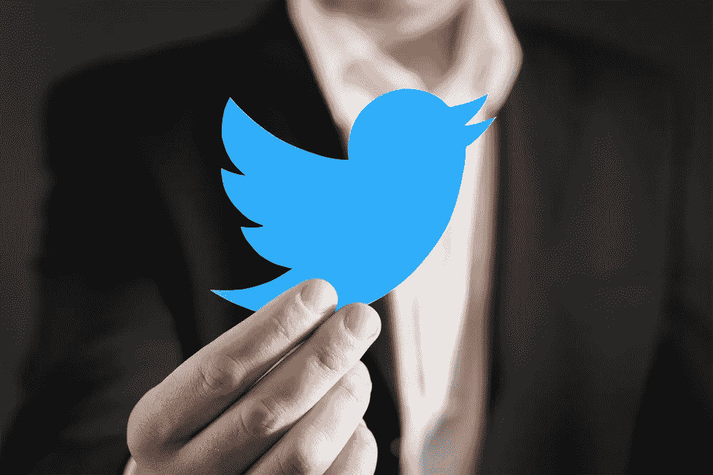

# 今天的科技披上了斗篷

> 原文：<https://medium.com/hackernoon/todays-technology-wears-a-cape-1efd3a963111>

我们都熟悉经典的超级英雄:蝙蝠侠、钢铁侠、神奇女侠和无数其他排列在我们童年墙壁上的英雄。

超人让我惊讶的不是他们的力量，而是他们如何使用这种力量。

超人可以很容易成为一名职业杀手或超级士兵，或者用他的能力去加热他的咖啡。

相反，他选择拯救生命，或者至少让生命变得更容易。

今天的科技与我们的偶像英雄用来打击犯罪和保护人类的超能力有着惊人的相似之处。

两者都实现了曾经认为不可思议的壮举，增强了我们对世界的理解，并极大地改善了我们的生活方式。

但是，虽然 T2 技术 T3 可以被用于正义，但它也有可能成为滥用的平台。

2016 年 11 月，推特[被发现拥有超过 50，000 个俄罗斯机器人](https://recode.net/2018/1/31/16956958/twitter-jack-dorsey-russia-trolls-election-us-trump-clinton-propaganda)，这些机器人在推特上发布与选举相关的内容。

这是技术如何被用于邪恶的最好例子。

与任何人、任何地方交流的能力确实是超人，但伴随着巨大的能力而来的是巨大的责任，Twitter 也不例外。

Twitter 希望通过收购反滥用技术公司 Smyte 来摆脱这种弊端。

**Smyte 将自己描述为“信任和安全服务”,可以防止网络钓鱼、垃圾邮件、虚假帐户和仇恨言论。**

Twitter 不是第一个试图利用技术做好事的社交媒体平台，更不用说公司了。许多人用它来对抗虐待、犯罪和不平等。

脸书正在采用新技术来打击近年来困扰其平台的假新闻。

预计这一策略将减少脸书 80%左右的假新闻。

[区块链](https://hackernoon.com/tagged/blockchain)是科技“超级大国”的一个例子，公司正利用它来促进我们世界的积极变化。

许多人将有犯罪历史的加密货币比特币与其运行的基础区块链技术混为一谈。

然而，事实仍然是，虽然比特币使匿名购买和黑市成为可能，但区块链促进了信任和安全。

这是一个分散的、不可更改的数字分类账，消除了对第三方验证的需求，为公民节省了宝贵的时间和金钱。

区块链的潜力是无限的。就在我们说话的时候，它正在一手改变行业，并将继续这样做。

超级英雄用他们的超能力赋予人们力量，公司用他们的技术刺激创新。

区块链通过[向药品供应链](https://blogs.wsj.com/cio/2018/06/06/under-pressure-to-tighten-supply-chain-drug-companies-look-to-blockchain/)提供从创造到消费的跟踪和验证，对抗价值数百万美元的假药市场。

这项技术不仅给一个经常因不道德的定价和做法而受到指责的行业带来了合法性，还确保了消费者的安全和福祉。

区块链正在[为需要文件](https://technologyreview.com/s/610806/inside-the-jordan-refugee-camp-that-runs-on-blockchain/)来确保就业或获得政府福利的公民建立数字身份。

移民或无法使用传统身份识别方式的个人可以获得一个数字钱包，无论他们去哪里都可以跟着他们。

区块链正在为没有银行账户的人提供银行服务，为新兴市场提供参与全球市场所必需的工具和资源。

围绕服务社会的技术建立公司不仅有好处，还有利润。

**支付公司** [**Veem**](https://veem.com)

区块链正在证明，好男生好女生不一定非要排在最后。

看到技术是如何发展的令人兴奋，看到它经常被用来做好事也令人鼓舞。

区块链的美丽不仅仅在于它无限的潜力，还在于它是一个自我调节的超级大国，不会被邪恶所利用。