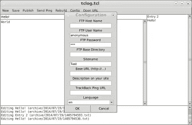
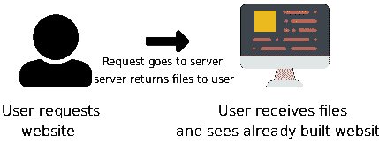
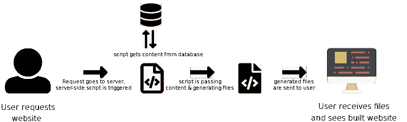
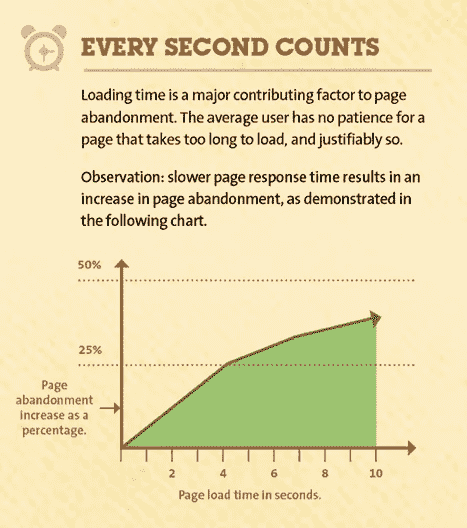
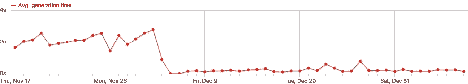

# 今天的网络是乏味的

> 原文：<https://medium.com/hackernoon/todays-web-is-tedious-756e023337bd>

Sleepy Panda. (Image by [https://unsplash.com/@zuoanyixi](https://unsplash.com/@zuoanyixi))

# 在互联网上大约 18600 亿个可用网站中，超过 35%在使用 Wordpress、Joomla 或 Drupal，也就是说有 6.51 亿个网站。

现在做自己的网站真的很容易。只要在 youtube 上看 90 分钟的教程，再花 30 分钟做好准备，瞧，你就大功告成了。很简单。好吧，伙计，但关键在哪里？

# 问题是

近两年来，Joomla 上的 280 万个网站容易受到危险的 SQL 注入病毒的攻击。Joomla 已经用 3.4.5 version⁴修补了这个漏洞。发布两天后，youtube 上有一个如何利用 Joomla >3.4.5 的分步指南。⁵:如果你没有在发布后立即更新你的网站会怎么样？

根据 WP 怀特 Security⁶公司的研究，大约 73%的最流行的 WordPress 安装可以被黑客攻击。要找出可能的原因，你可以使用免费的自动化工具。

Drupal 也在 CMS 漏洞利用的不领情的历史中找到了自己的位置。根据 Drupal 2014 年 10 月 29 日的公告:“你应该假设每个 Drupal 7 网站都被入侵了，除非在 UTC 时间 10 月 15 日晚上 11 点，也就是公告发布后 7 个小时之前更新或修补。”⁷，如果你动作没那么快呢？

考虑到以上所有因素，你应该经常更新你的 CMS，让它平静地睡眠。听起来相当详尽，尤其是如果你使用了过多的附加组件。嗯，你可能使用了过多的附件。⁸

幸运的是，对于那些不想弄乱所有这些更新的人来说(比如我和 Bejamas 团队的其他人)，有很多很棒的静态站点生成器项目，顺便说一下。开源。⁹

# 静态站点生成器的兴起

静态站点生成器又名。静态站点引擎绝对不是一个短暂的新事物。它们已经存在了很长一段时间，但没有人真正关注它们，因为它发生在现在。已知的第一个 SSG 名为 tclog，是用 Tcl/Tk 编写的。第一次发布发生在 2003 年。您可以在[https://web . archive . org/web/20060819194024/http://TC log . SourceForge . jp/](https://web.archive.org/web/20060819194024/http://tclog.sourceforge.jp/)查看该项目

【http://wiki.tcl.tk/40380】来源:

*静态站点引擎背后的想法非常简单，但功能强大:获取动态内容并将其构建到原始的 HTML/CSS/Javascript 文件中，然后将它们作为静态文件部署到服务器。不需要服务器马力，这是这种方法的第一个优点。*

# *托管成本和扩展*

*因此，当你使用静态站点生成器时，网站总是完全建立在你的生产机器上，你唯一需要支付的基本上是存储空间。如果你不精通技术，请让我简短地解释给你听:当你在一台生产机器上建立你的网站，并在你的主机上提供原始文件，它们就可以被浏览了——基本上服务器端什么也没发生。如果有人访问您的网站，他看到的文件是在您的机器上构建的，服务器上没有构建任何东西。*

**

*How static site works?*

**来源:* [*Bejamas*](https://bejamas.io/) *资源**

*另一方面，当你考虑如何建立一个动态网站时，事情变得有点复杂。作品。当一个访问者访问你的网站时，服务器端脚本正在运行。服务器端脚本查询一个或多个数据库以获取数据(内容)，这些数据必须显示给访问者。数据被传递给模板引擎，模板引擎设置了 HTML[文件，访问者可以看到这个文件。现在将这个过程乘以成百上千有兴趣获取你网站内容的访问者。听起来很费力。听起来很贵。](https://hackernoon.com/tagged/html)*

**

*How dynamic site works?*

**来源:*[*Bejamas*](https://bejamas.io/)*资源**

*我认为这里的结论是简单明了的:静态化意味着为处理大量的网络流量做更好的准备，因为与动态网站相比，它只消耗一小部分的服务器马力。*

# *表演*

*在这个不耐烦和信息超载的时代，你的网站加载时间的每一毫秒实际上等于一定数量的美元。我是认真的。根据 www.hobo-web.co.uk·⁰的研究，如果你的网站加载时间超过 4 秒，会导致超过 25%的访问者放弃浏览。*

**

**来源:*[*https://www . hobo-web . co . uk/WP-content/uploads/截图-2015-05-14-01 . 02 . 07 . png*](https://www.hobo-web.co.uk/wp-content/uploads/Screenshot-2015-05-14-01.02.07.png)*

*如果你读了我上面的快速解释，我描述了托管静态站点和动态站点之间的区别，你可能会自己得到这个结论:当涉及到性能时，静态吃掉动态。句号。但是等等！你不会给我们看任何让你的论文更可信的研究！？嘿，当然，我有！跟我来。*

*2016 年底，[https://gettingthingstech.com](https://gettingthingstech.com/)从他们的 WordPress 平台转移到 Hugo。他们的部分动机是提高页面加载性能。当然，他们测量了 WordPress 和 Hugo 上的页面加载速度，并进行了很好的比较。 [11](https://bejamas.io/blog/web-is-tedious#fn-11) 在这种情况下，他们将服务器向用户发送 HTML 的时间从大约 2.5 秒缩短到了 0.3 秒(很难说能准确地看到这张图表，但你可以毫无疑问地说，差别是巨大的)。*

**

**来源:*[*https://getting hingstech . com/Hugo-vs .-WordPress-page-load-speed-comparison-Hugo-leaves-WordPress-in-its-dust/*](https://gettingthingstech.com/hugo-vs.-wordpress-page-load-speed-comparison-hugo-leaves-wordpress-in-its-dust/)*

*当时他们也改变了他们的主机提供商，所以这对时间也有影响。*

*这里是另一个简单比较用 Jekyll 生成的静态站点和 WordPress 站点的例子:[https://bradonomics.com/jekyll-wordpress-speed/](https://bradonomics.com/jekyll-wordpress-speed/)加载时间提高了大约 164%。*

# *安全性*

*正如我已经在这篇文章的 Catch 部分描述的那样——如果你采用“标准 CMS 方式”,你会暴露在几个威胁之下。另一方面，如果你只是用 CSS 和 JavaScript 提供平面 HTML 文件，会有什么问题呢？你没有任何可能成为 SQL 注入受害者的数据库。一切都是静态和安全的，所以你不必太关心你的网站的安全性。*

# *自动备份和版本控制*

*猜猜你需要做什么来备份你的 WordPress 站点？答对了。安装另一个加载项*

*请记住，在文件中保留至少三个备份，以防其中一个损坏或丢失，并将它们存储在不同的地方和不同的介质上，如 CD、DVD、不同的硬盘驱动器等*

*你必须记得偶尔手动备份。如果你的数据库充满了来自 WordPress 插件的统计数据(因为，正如我在上面写的，你的主题很可能被大量的插件打包了)，你必须只选择那些你想要备份的表。嗯，听起来工作量很大。你可以做到这一切，但你仍然不能控制你的网站的每个版本。为了获得它，你必须在每次修改时备份你的站点。玩得开心。*

*随着基于 Git 的分布式版本控制系统如 Bitbucket 或 Github 的出现，这不再是一个问题。每次你提交和推新的变化到你的网站，以前的版本会自动备份！在您的终端中只需要一行代码就可以回到以前的版本。多酷啊！正如你所知，Netlify 和 BitBucket ⁴是完全免费的。*

# *利弊*

*在这篇文章中，我并不是想说使用 WP/Joomla/Drupal 或类似的解决方案没有好处。很明显，至少在开始的时候，设置所有的东西会更容易，但是随着你的深入，你可能会在这个设置中挣扎。*

*另一方面，如果你想静态化，你的网站不是单页的，你可能需要雇佣一个有技术知识的专业人士。如果你认真考虑的话，即使是 WordPress 网站，你也不得不这么做，不是吗？*

*我只是想在这篇文章中强调，有很多更好的选择，老实说，每个人都建议你使用 WordPress，因为它是最受欢迎的，而不是最好的选择。*

# *嘿，等一下！*

*你没有提到任何关于管理内容或在静态网站上添加帖子的内容！这可能吗？*

*是的，静态网站并不意味着静态内容。在我的下一篇文章中阅读更多关于 CMS +静态站点生成器的设置。敬请期待！*

*原帖来自[https://bejamas.io/blog/web-is-tedious](https://bejamas.io/blog/web-is-tedious)
订阅更多！*

# *脚注*

1.  *[https://w3techs . com/technologies/overview/content _ management/all](https://w3techs.com/technologies/overview/content_management/all)*
2.  *[http://www.internetlivestats.com/total-number-of-websites/](http://www.internetlivestats.com/total-number-of-websites/)*
3.  *[https://www.youtube.com/watch?v=2cbvZf1jIJM](https://www.youtube.com/watch?v=2cbvZf1jIJM)*
4.  *[https://www . Joomla . org/announcements/release-news/5634-Joomla-3-4-5-released . html](https://www.joomla.org/announcements/release-news/5634-joomla-3-4-5-released.html)*
5.  *[https://www.youtube.com/watch?v=Ai3MmwQ7yIE](https://www.youtube.com/watch?v=Ai3MmwQ7yIE)*
6.  *[https://www . WP white security . com/WordPress-security-news-updates/statistics-70-percent-WordPress-installations-vulnerable/](https://www.wpwhitesecurity.com/wordpress-security-news-updates/statistics-70-percent-wordpress-installations-vulnerable/)*
7.  *[https://www . Drupal . org/forum/简讯/security-public-service-announcements/2014-10-29/Drupal-core-highly-critical](https://www.drupal.org/forum/newsletters/security-public-service-announcements/2014-10-29/drupal-core-highly-critical)*
8.  *[https://torque mag . io/2015/09/32-must-free-WordPress-plugins/](https://torquemag.io/2015/09/32-must-free-wordpress-plugins/)*
9.  *【https://www.staticgen.com/ *
10.  *[https://www . hobo-web . co . uk/your-website-design-should-load-in-4-seconds/](https://www.hobo-web.co.uk/your-website-design-should-load-in-4-seconds/)*
11.  *[https://getting thingstech . com/Hugo-vs .-WordPress-page-load-speed-comparison-Hugo-leaves-WordPress-in-its-dust/](https://gettingthingstech.com/hugo-vs.-wordpress-page-load-speed-comparison-hugo-leaves-wordpress-in-its-dust/)*
12.  *[https://codex.wordpress.org/WordPress_Backups](https://codex.wordpress.org/WordPress_Backups)*
13.  *[https://www.netlify.com/features/](https://www.netlify.com/features/)*
14.  *[http://bitbucket.com/](http://bitbucket.com/)*