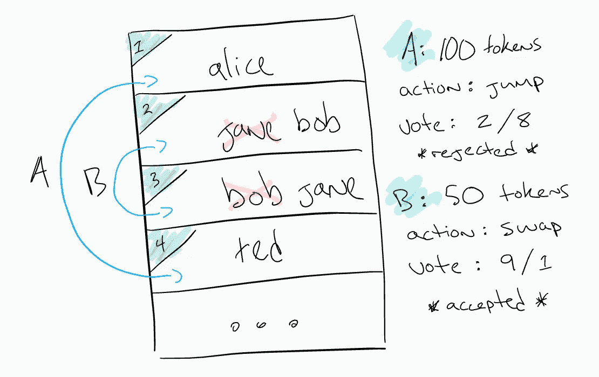

# 令牌管理的注册中心(TCR)设计模式

> 原文：<https://medium.com/hackernoon/token-curated-registry-tcr-design-patterns-4de6d18efa15>

Who is making these amazing 80s memes? 😍

令牌管理注册中心(TCR)是基于可替换令牌(ft)和数字稀缺性的去中心化应用的构建块。它们正迅速成为去中心化[区块链](https://hackernoon.com/tagged/blockchain)应用最热门的[令牌构建模块](https://blog.oceanprotocol.com/towards-a-hierarchy-of-token-building-blocks-6c8dd7b42341)之一。TCR 的用例意义深远，从简单的白名单到全面的分散治理。在这篇文章中，我将讨论 TCR 的一些[设计](https://hackernoon.com/tagged/design)模式和潜在的用例。我并不想知道谢林点参数，也没有建立这些 TCR。这是为了设计思考和用例探索，以刺激社区的创新。

对于 TCRs 的入门和热身，我建议:

 [## 城墙& Bo-石涛:探索令牌管理注册中心的力量

### 最近一个令我非常兴奋的密码经济设计模式是令牌管理注册中心(TCR)。很简单…

medium.com](/@simondlr/city-walls-bo-taoshi-exploring-the-power-of-token-curated-registries-588f208c17d5)  [## 用利益机器策划治理

### 由 Gautam Dhameja、Tom Debus 和 Günsu Pancar 合著。特伦特·麦康纳的直接或间接智力输入…

medium.com](/@DimitriDeJonghe/curated-governance-with-stake-machines-8ae290a709b4) 

我们还应该阅读反对的[论点，以获得充分的信息。](https://blog.coinfund.io/curate-this-token-curated-registries-that-dont-work-d76370b77150)

# TCR 基础📝

TCR Diagram courtesy of [Dimitri De Joghe](/@DimitriDeJonghe/curated-governance-with-stake-machines-8ae290a709b4)

从概念上讲，TCR 是由令牌持有者生成的列表的注册表。列表可以是任何东西，从名字到存储在 IPFS 的完整记录的散列。持有者下注一部分代币来执行动作，即添加列表。令牌持有者可以使用他们的令牌投票决定是接受还是拒绝该操作。多数赢得投票，行动被接受或拒绝。该列表已更新，并应变得更有价值，因为改进后的列表和赌注代币现已退出流通。也许这是一个有限的名单，独家成员谁有权获得贵宾服务？

> 代币持有者出于自身利益，将通过获得和下注有限供应代币来产生有价值的列表。挂牌越多，代币就越稀缺；列表越有价值，代币就越有价值…

# TCR 示例

在下面的 5 个例子中，我将把 TCR 的元素称为“列表”,通常简称 TCR 为“注册中心”或“列表”。一些示例扩展了注册管理机构本身的加密经济机制设计，而其他示例则更依赖于注册管理机构的应用层解释。

# 1.无序 TCR

无序的 TCR 是事情开始的地方。这些可以是有限的，也可以是无限的。正如在上面的基础知识中所解释的，执行一个动作是有利害关系的:添加或删除一个列表。如果用户选择删除她自己先前接受的列表，则赌注被返还。对于许多开发团队来说，诸如股份数量、接受或拒绝的最少票数以及行动被拒绝时削减的股份数量(通常支付给其他令牌持有者)等参数仍然是公开的问题。

领域专业知识在确定谢林点参数时很重要，因为列表的目的通常与[信号](https://en.wikipedia.org/wiki/Signalling_theory)或[游戏机制](https://en.wikipedia.org/wiki/Game_mechanics)相关。TCR 和接口层的应用也很重要，如下例所示。

## 摘要

*   动作:进/出
*   应用程序:大多数 TCR 应用程序的公理基础
*   可行性:几个正在开发中

有关可行性和技术细节，请参见“[令牌管理注册管理机构的发展](/@tokencuratedregistry/token-curated-registries-in-development-4533a52cc9ba)”。

# 2.有序 TCR

有序 TCR 向列表中的每个条目添加索引。这些列表可以用作队列、等级或指令集。在上面的例子中:Alice、Jane、Bob 和 Ted 已经被列表接受。也许有人出高价让爱丽丝和鲍勃在头两个位置上下注？提议在(1)爱丽丝和(4)特德之间进行“交换”。它被拒绝。在(2)简和(3)鲍勃之间提出了一个更小的“交换”。它被接受并且两者被交换。

真实世界的例子可能包括粉丝在音乐节上使用他们的令牌来设置他们最喜欢的 DJ 的播放列表，正如 Felipe 在他的帖子“[令牌管理的播放列表](/paratii/token-curated-playlists-1-thoughts-on-staking-and-consumer-applications-2a50bc837a94)”中建议的。有趣的是，粉丝们不需要到场参与投票，就可以在 YouTube 上现场观看最终的表演。在播放列表的例子中，在列表中排名第一的歌曲没有一首歌曲相对于其他歌曲的位置重要。在这种情况下，赌注和交换投票机制与“前 40 名”音乐列表完全不同。

## 摘要

*   动作:输入/输出，交换
*   应用:指令集、治理程序、播放列表
*   可行性:为列表数据添加索引，并添加额外的功能来标记和交换索引

# 3.分级 TCR

Courtesy of

[Me in NYC with the](https://medium.com/u/b0a55f61d505#永远在一起#🤗</h1><figure class=) [0xcert](https://medium.com/u/106c9d734ba5?source=post_page-----4de6d18efa15--------------------------------) team, CEO of [bitcoin.com](https://www.bitcoin.com/) (not taking sides) and anonymous Monero Fan(man)boy