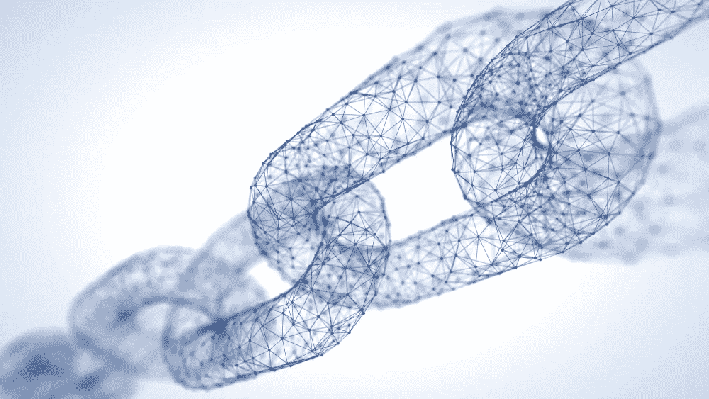
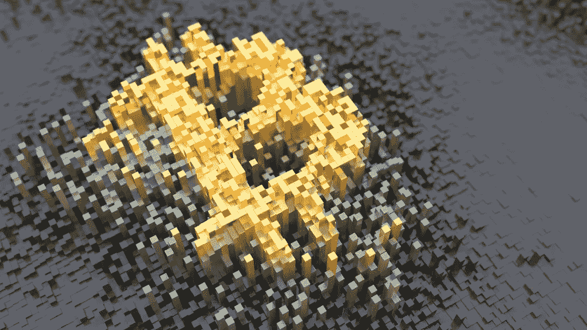

# 代币经济学:代币如何估值？

> 原文：<https://medium.com/hackernoon/token-economics-how-to-value-tokens-722c985c00d4>

在之前的[文章](https://www.blockchains-expert.com/en/decoding-a-revolutionary-business-model/)中，我们描述了基于区块链的生态系统的革命性组织，以及它们的多样性和复杂性。面对过去几年中出现的各种结构，中心问题是如何最好地评估这些网络发行和使用的代币的价值。

**与传统公司不同，每个项目都有自己的商业模式。**因此，很难开发出一种适用于所有使用区块链技术的初创企业的估值方法。

另一方面，传统公司有很多方法如“贴现现金流”和很多指标如“市盈率”。**代币发行生态系统的主要区别在于没有现金流**，因为代币本身确保了价值的流动。

同样重要的是要记住，区块链产业仍处于萌芽状态，生态系统评估的历史很少或没有。因此，要分析过去令牌的行为几乎是不可能的。

因此，有必要设想新的方法来评估项目的价值。正如我们已经提到的，每个 Altcoin 都是一个分散的网络，旨在解决一个或多个问题。代币的发行是为了让这个网络交换价值和发展，就像国家经济中的货币一样。**因此，代币因其在生态系统中的使用而具有功能价值**。这一功能价值特别难以确定，因为数据的数量(通常是主观的)会影响这一估价(如“赌注”或筹码的速度)。

由于代币的价值不仅是功能性的，而且是投机性的，这一事实加剧了估价的难度。难以量化的代币的部分价值与投机直接相关。后者可以定义为代币交易对加密货币交换的影响所产生的价值。正如某些代币的高波动性所证明的，这种价值可能与代币的功能价值或实际价值完全不相关。它通常基于对价格曲线的纯技术分析，而不是对代币所基于的生态系统的彻底分析。

decentralized idea

然而，有几种方法已经出现，试图对一个以区块链为基础的生态系统进行估值，并推断出代币应有的价格。Chris Burniske 提出的估值模型是迄今为止最著名的模型，我们将重点讨论这个模型。你还可以看看由[维塔利克·布特林](https://vitalik.ca/general/2017/10/17/moe.html)、[布雷特·温顿](/@wintonARK/how-to-value-a-crypto-asset-a-model-e0548e9b6e4e)、[威利·吴](https://www.forbes.com/sites/wwoo/2017/09/29/is-bitcoin-in-a-bubble-check-the-nvt-ratio/#3d9dd30f6a23)和[珀西·维尼加斯](/@economymonitor/how-does-cryptocurrency-gain-value-d8f2700f7e77)开发的模型。

**交换方程式**

Chris Burniske 是第一个提出将交换等式概念应用于基于分散注册技术的项目的人。**这个等式传统上用于确定一个经济体中货币的价值**。正如我们提到的，代币在他们的生态系统中扮演着货币的角色，所以这个公式可以应用到他们身上。

然而，Chris Burniske 指出，他不使用这种技术来确定代币在现在或未来的价格，因为我们可以收集的关于这些生态系统的信息仍然处于萌芽状态。他更多地使用它作为一种方法来提出正确的问题，并更好地理解项目发展的环境。该等式以如下方式表示:

**M x V = P x Q**

在哪里

M =筹码的总价值

V =筹码的周转率，也就是在一定时期内交易的次数。

P =在加密资产的情况下，P 代表由网络货币化的资源的价格。如果我们以 SiaCoin 为例，它将用于确定千兆位可用存储的美元价格，以美元/ GB 表示。

Q =网络使用的总资源。在 SiaCoin 的情况下，这将是网络上可用的千兆字节数。如果我们将 P 和 Q 相乘(其中 P = $ / GB，Q = GB)，我们会得到一个以美元为单位的值。

**PQ 代表生态系统中的价值交换。它在某种程度上是由协议和网络创造的微观经济的 GDP**。但是这个 GDP 是记录在区块链上的。因此，一个生态系统的国内生产总值对应于交易量的参考令牌，即使这一指标必须相对化，因为许多交易所之间的交易，根据克里斯伯恩斯克，相当于约 30%的交易，纯粹是投机性的。

Bitcoin

一旦我们有了以美元为单位的 PQ 值，我们必须找到“V”才能推导出“M”。后者将允许我们对所有令牌进行估值(M = PQ / V)。一旦我们知道了这些要素，并且能够获得“M”的值，我们就能够确定代币的“当前效用值”或“CUV”。CUV 是通过将“M”除以流通中的筹码数量获得的(除了“保税”或“霍德”代币)。

**令牌速度**

“V”是代币的流通速度，即代币在给定时期内的易手次数。但是这个速度取决于网络成员在开发协议时对令牌的使用。**协议规定网络成员之间使用的令牌越多，这些令牌的流通就越多，因此速度就越重要。**筹码的周转率是你想买的筹码的波动性的一个重要指标，即使它的确定将是不可能的，如果它是一个正在开发的项目。实际上，网络令牌的速度通常是根据以下方法在一年的时间内计算的:

**速度=总交易量/网络平均交易量**

让我们以克里斯·布鲁尼斯克在他的文章中使用的例子为例:

> “例如，2016 年，网络(比特币)平均每天处理价值 1.6 亿美元的美元交易，一年共计 580 亿美元。比特币 2016 年的平均资产规模为 89 亿美元(M)。因此，V = 580 亿美元/89 亿美元，即 6.5。6.5 的速度意味着在 2016 年，每个比特币转手 6.5 次。事实上，一小部分比特币的交易量可能远远超过这一数字，而更高比例的比特币则滞留在霍德勒夫妇手中，但这是后来的事了。相比之下，美元 M1 货币供应的速度目前为 5.5，尽管自 2008 年金融危机以来已大幅下降。”

Nate Nead[和](https://investmentbank.com/token-velocity/)**表示，一个鼓励用户保留代币的项目将会创造价值，而不像网络那样速度非常重要。**但根据他的说法，如果流速太低，网络上就会缺乏流动性，导致价格下跌。令牌达到其真实值需要最小的速度。

在两个最著名的从价税公式(Burniske 和 Buterin 的公式)中，代币的价值与代币的价值成反比。

因此，为了增加令牌的价值，协议必须提供在令牌的流通(速度)和保存(“赌注”)之间实现平衡的机制。

例如，几种方法允许限制令牌的速度:

-基于令牌的**【标桩】**的共识方法，如 NEO 开发的标桩证明或节点共识。

- **游戏化**鼓励拥有代币:这是一种鼓励用户使用协议和应用获取更多筹码的机制。Steemit 就是一个很好的例子:你的筹码越多，你在网络上的影响力和赚取筹码的能力就越大。所以你的筹码越多，参与协议赚的筹码就越多。

-让它成为一个**价值商店**:比特币/以太。

如果你喜欢这篇文章，请毫不犹豫地分享到你最喜欢的社交媒体上！！