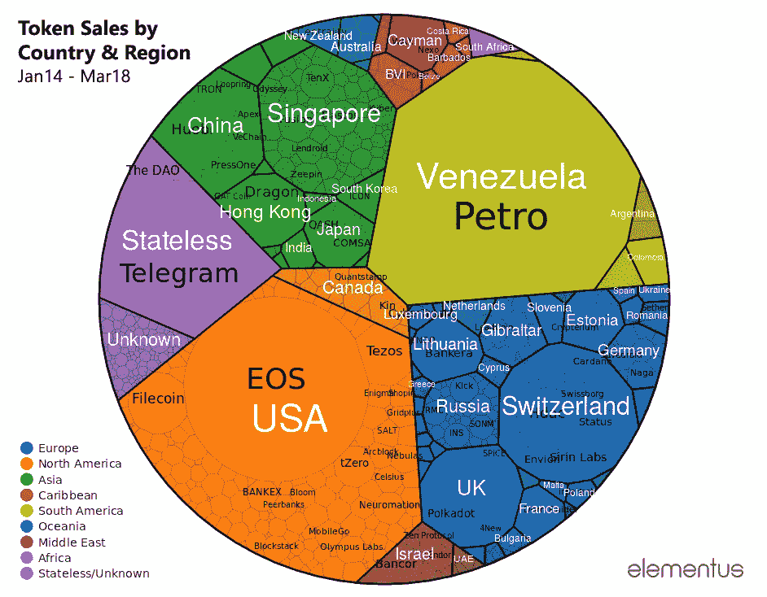

# 代币销售市场概述:2018 年 Q1 世博会

> 原文：<https://medium.com/hackernoon/token-sale-market-overview-q1-2018-b319f92eadd2>

以下七张图总结了截至 2018 年 3 月 31 日的代币销售市场状况。

# 迄今为止，通过代币销售已经筹集了超过 230 亿美元

代币销售历史可视化，2014 年 1 月—2018 年 3 月( [**互动版**](https://elementus.io/token-sales-mar-2018) )

[View interactive version](https://elementus.io/token-sales-mar-2018)

# 仅在前 3 个月，2018 年的代币销售筹款就已经超过了 2017 年全年

2018 年第一季度，**通过代币销售筹集了 142 亿美元**，而 2017 年筹集了 90 亿美元。

# 经过 12 月份的下跌后，月度代币销售数量在 3 月份创下新高

# 最大的代币销售额越来越大

有史以来 5 次最大的象征性筹款活动中有 4 次发生在上个季度(EOS ICO 自 2017 年 6 月以来一直在进行)。

# 安全令牌和 SAFT 协议越来越受欢迎

# 按国家和区域分列的筹资数额

代币销售，2014 年 1 月至 2018 年 3 月

## 方法学

筹款金额通过 [**Elementus 协议**](https://elementus.io/) 获得，这是一个提取和解释链上交易数据的专家系统。相比之下，网上提供的大多数代币销售统计数据严格依赖于第三方报告的数量，这些数据可能已经过时且不完整。

筹资金额按照销售结束时的现行加密汇率转换成美元。对 EOS ICO 的捐款自 2017 年 6 月以来一直在进行，每天按 ETH-USD 汇率进行转换。

通过 SAFTs 和其他代币可转换证券筹集的资金来源于 [SEC 备案文件](https://www.sec.gov/edgar/searchedgar/companysearch.html)。石油数据是由委内瑞拉总统尼古拉斯·马杜罗报道的。

*最初发表于*[*elementus . io*](https://elementus.io/tokens-q1-2018)*。*