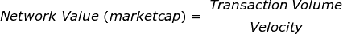

# 了解令牌速度的危险

> 原文：<https://medium.com/hackernoon/token-velocity-a455173d69e3>

Michael Jackson understood dangerous.

许多密码爱好者似乎忽略了一个被称为“[令牌速度](https://hackernoon.com/tagged/token-velocity)的小怪兽他们有他们的理由。有些人从未听说过这个变量；其他人对其表面的复杂性感到沮丧。

> 然而，严肃的投资者明白隐藏在变量(V)背后的危险，特别是对于那些使用**单一令牌作为某种单一资源**的交易媒介的项目(例如[公式导数](https://medium.com/u/8b0d088e8160#)来说明最有意义的速度关系。我们将在接下来的讨论中引用这个版本:
> 
> 
> 
> > 回想一下**网络价值**是整个代币生态系统的货币价值(即货币基础)。**另一方面，交易量**最好被认为是用户从使用网络中获得的实际效用(即网络 GDP)。
> 
> 现在让我们通过简单的寓言来探索这个速度问题，并回顾一些已经开始出现的解决方案…

# 当激励失效时

在传统经济体中，美元不断在生态系统中流动。然而，在我们的代币经济中，事情开始分崩离析，因为代币不能在这个生态系统中畅通无阻地移动。

循环基本被打破了。参考我们最初的例子(见上文)，我们可以在传统经济和新兴代币经济之间得出一个推论。现在想象一个世界，面包的主人耶稣决定只接受一种特殊的代币来出售他的面包。

在传统经济中，耶稣可以用美元来支付他的面包制作费用，并用销售的利润来投资他的业务，甚至向一些犹太教堂捐款，但现在他只剩下一个象征。这给每个人带来了毫无意义的摩擦，让他别无选择:

1.  向另一个面包经营者出售代币——以换取面包。
2.  向想买面包的人出售代币，以换取美元。
3.  向货币兑换商出售代币(*即兑换* ) —以换取美元。

Jesus considering his token options.

那么耶稣会怎么做呢？当然**耶稣不会选择第一个选项**，因为他自己已经是面包的所有者。最后两个选项似乎是更合理的选择。

## **选项二**

耶稣必须找到一个需要面包的人，然后用他的代币换他们的美元。一旦这个人有了这个代币，他们就可以从耶稣那里购买更多的面包。然后，耶稣可以用这些钱来支付他的开销，希望还能剩下一点利润(当然是捐给慈善机构)。

这里的流程相当繁琐。耶稣必须找到每一个需要面包的人，然后用他的代币换美元。哦，天啊，货币兑换机现在可能会派上用场。

## **选项 3**

与其处理第二种选择的复杂性，耶稣实际上可能会与货币兑换商交朋友(*即*交换)。货币兑换商非常乐意协助兑换过程，但要收费！

最初，事情是好的。一群人(*即*投机者)被吸引到这家企业，因为与他们当地的面包师不同，耶稣的企业使用分散的代币网络销售面包！这在拿撒勒很流行。

Jesus bread.

有些人甚至蜂拥到货币兑换处购买比他们买面包实际需要的更多的代币。这些潜在客户显然已经成为十足的投机者。他们持有一个简单的假设:出售多余的代币以获取利润或盈亏平衡。什么会出错？

在那短暂的一瞬间，耶稣(和他的货币兑换商)在不得不烤任何面包之前就已经在美元中游泳了！最终，人们开始用代币换面包，耶稣又开始烤面包了。

只要人们继续把他们的美元换成代币，生意就会增值。这被非常精确地重申:当**交易量**超过**速度**时，总体**网络价值**将继续增加。下面再来一遍 Samani 的版本供参考:

现在想象一种情况，加密经济基础设施的进步减少了一系列高摩擦过程:*交易成本、认知负担、流动性问题等。*由于**摩擦力**与**速度成反比，**这些发展导致速度快速增加。

只要交易量*与速度呈线性*增长，网络价值就不会发生变化。从表面上看，一切似乎都是合法的。事实上，越来越多的人参与到网络中，但 marketcap 并没有反映出真正的变化。现在这里发生的是网络激励结构的缓慢但确定的解开。

## 速度论题

这个严重问题的核心，现在被许多人称为“速度论题”，是令牌的效用价值(*例如*购买面包)与网络价值的逐渐分离。论文预测了以下最终结果:

**⇣(Friction) →速率(MV > PQ) → ⇣(Token 值)→网络崩溃**

在传统经济中，速度不是一个主要问题，因为摩擦和速度之间的平衡是稳固的。这个问题对于储值加密货币(*如* [比特币](https://hackernoon.com/tagged/bitcoin)、以太等)来说也不是什么大问题。)因为交易的目的是代币本身，而不是像面包这样的代币可交换的最终产品。

耶稣寓言旨在为现有的许多专有支付令牌网络提供一个方便的范例——不胜枚举。这个故事的寓意很简单。如果你果断地选择从这些项目中购买一个代币(而不是立即消费)，你应该反思你的行为并“称之为代币”

Just call it what it is…speculation.

现在，作为一个自称的投机者，你需要问 3 个重要的问题:

> 1.我的投资论点是基于基本面价值还是持有可取性？
> 2。网络价值有多少部分是纯投机的产物？
> 3。速度何时会开始超过交易量？

这些问题很难回答。幸运的是，一些非常聪明的人已经开始系统地解决这些问题。我们将在以后的文章中回顾这一新的讨论，并探索目前正在测试的解决方案。感谢阅读，敬请关注😉

# 为了进一步阅读

*   
*   **
*   **[***刘伟东***](https://medium.com/u/6ef731d64619?source=post_page-----a455173d69e3--------------------------------)**
*   **[***凯尔萨马尼***](https://medium.com/u/2e8de4ec5cc0?source=post_page-----a455173d69e3--------------------------------)**
*   **[***亚历克斯·埃文斯***](https://medium.com/u/b5b7faf7149d?source=post_page-----a455173d69e3--------------------------------)**
*   **[***许海波***](https://medium.com/u/179098095af6?source=post_page-----a455173d69e3--------------------------------)**
*   **[***弗雷德·厄尔萨姆***](https://medium.com/u/b947efe0a51a?source=post_page-----a455173d69e3--------------------------------)**
*   **[***约翰·普费弗***](https://medium.com/u/47b98efcd618?source=post_page-----a455173d69e3--------------------------------)**