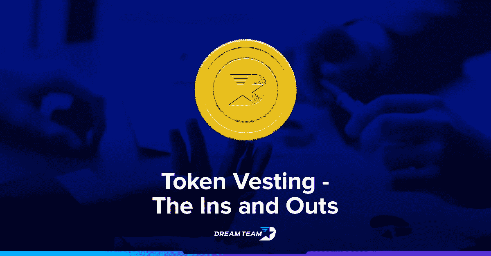
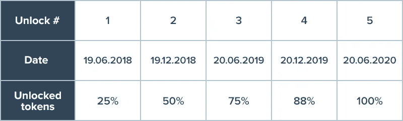

# 令牌授予流程——为什么这是一个好主意？

> 原文：<https://medium.com/hackernoon/token-vesting-process-why-is-this-a-great-idea-34933e9e8bc5>

区块链项目通过众卖活动向公众发布令牌。希望支持新代币的人通过使用以太坊或比特币购买代币来参与众筹。在众筹期结束时，每个参与者都会收到与他们捐款多少相对应的代币。但是一些组织更喜欢授予一定数量的代币。

## **什么是归属？**

这是一定数量的令牌，为团队、合作伙伴、顾问和其他为项目开发做出贡献的人保留一段时间。智能合约通常会锁定一定数量的资金，直到满足合约条件。例如，使用区块链技术的创业公司可以锁定一定数量的代币:例如，团队可以保留 15%的硬币，在项目过程中每月/季度/每年逐步释放一次，用于财务目的。一般来说，释放这些硬币的过程称为归属。授权通常用于表明团队对项目非常感兴趣，并将继续从事项目开发。此外，授权降低了市场价格操纵。通常会有几年的“悬崖”，这意味着个人必须在公司工作几年才能发放第一批增量代币。

这是一个可行权时间表的例子:20%的可行权股票在 6 个月内发行；50% —一年内；两年内达到 100%。这种结构有益的原因是，如果一个或几个实体控制了例如从代币生成事件之日起发行的所有代币的 20%,则它们可以容易地产生供应波动，这可能对代币生态系统和价格有害。简单地说，这给给定的令牌稳定性带来了一定的风险。

授权过程在某些方面类似于央行的储备基金。储备越多通常意味着法定货币越强。市场上的纸币越多，它们的价值就越低。这是一个粗略的例子，说明为什么在一段时间内授予一定数量的代币可以帮助新成立的项目拉平代币的价格和受欢迎程度。

可能是受到越来越多来自行业之外的管理团队的影响，我们看到的趋势是，管理层保留更多的代币作为激励，将他们对创建一个充满活力、繁荣的社区或项目的兴趣与代币持有者和用户的兴趣结合起来。虽然内部人保留大量股份显然是一种微妙的变化，但总体趋势似乎是从 2015-16 年持有 6-8%令牌的团队向今天接近 20-25%的团队转变。可以说，更重要的是延长了内部人士代币持有的授权时间表。2016 年之前，授予时间表通常为 0-24 个月——在此期间，授予非常罕见——现在，授予时间表延伸至 36-48 个月，是管理层对项目承诺的另一个有力衡量标准。

## **梦之队授权流程**

那么 DreamTeam 的代币授予流程是怎样的呢？

该公司获得了已发行的所有**梦之队代币**的 25%。锁定这些令牌是为了向我们的投资者保证，我们有最好的意图，并保持对项目的长期愿景。这些代币通过智能合同进行保护，并将在两年内支付给 DreamTeam 顾问、合作伙伴和专业团队。这有助于保持他们的利益一致。15%的代币作为奖金留给职业队和锦标赛组织者；10% —团队和早期投资者。此外，还有 10%的公司准备金和 5%通过个人授权智能合约授予投资者。已经分发的令牌使用得越多，保留的令牌就变得越有价值——因此，创建一个拥有许多用户的成功项目，在这个过程中增加他们的令牌的价值，符合每个项目团队成员的最大利益。
例如，下面是在授权智能合约中锁定一些 DreamTeam 令牌的交易之一:[https://ethers can . io/tx/0x aa 94 DDB 6 B2 C3 DD 2 f 7 ea 23 aab 5836 cfcb 0580 B2 ff 0 e 0607797773630 e 55 b 8 daebe](https://etherscan.io/tx/0xaa94ddb6b2c3dd2f7ea23aab5836cfcb0580b2ff0e060779773630e55b8daebe)

事实上，适当的授权时间表是众筹发生后帮助团队成员专注于交付伟大项目的关键因素之一。在众筹结束后，团队成员并没有获得全部份额的代币，而是在项目创始人确定的定期授权期后获得代币。这样，一个孤独的不道德的团队成员就不能带着令牌跑掉，而不继续为项目做贡献。DreamTeam 本可以在代币生成活动期间立即向他们支付代币，但 DreamTeam 得到了我们的顾问和合作伙伴对代币价值的支持和信任，代币已被授予 2 年。以下是职业队和锦标赛组织者的 DreamTeam 代币归属示例。

## **其他项目成功行权**

以下是其他公司进行代币授权以支持其基础设施和发展的例子。它们代表了随时间发展的不同方法。

[https://blog . Aragon . org/Aragon-network-token-sale-terms-8998 f63a 3429/？source=search_post - 7](https://blog.aragon.org/aragon-network-token-sale-terms-8998f63a3429/?source=search_post---------7)
经典的代币授予流程以 2017 年的**阿拉贡网络**代币出售为代表。70/15/15 分配:70%给购买者，15%支持网络开发，15%给参与项目的创始人和早期贡献者，没有给合伙人或顾问。

[https://medium . com/@ squeezer/token-distribution-137404 F3 B4 Fe](/@squeezer/token-distribution-137404f3b4fe)
**squeezer . io**是他们代币发售更新代币发行策略的绝佳范例。如果以前，公司保留大约 6-8%的代币销售总额，Squeezer 遵循 2018 年的趋势，保留 30%用于运营需求，20%用于团队，只有 5%用于顾问，5%用于营销和合作伙伴。

[https://medium . com/insure pal-blog/insure pal-crowd sale-terms-founder-vesting-pricing-and-IPL-distribution-e5ad 723 a 2181](/insurepal-blog/insurepal-crowdsale-terms-founder-vesting-pricing-and-ipl-distribution-e5ad723a2181)
**insure pal**在 2018 年 1 月进行了一次代币销售，展示了另一种授权策略，其中授权被细分为多个目标小块:10%的授权给创始人，6%给团队，6%给支持团队，6%给顾问，3%给用户激励，以及

[https://medium . com/Smilo-Platform/airdropandvesting-c 1204d 539606](/smilo-platform/airdropandvesting-c1204d539606)
另一个更激进的例子是**Smilo 平台**在最初的 2 亿令牌生成事件中，一半的令牌被保留用于各种目的:7200 万被授予平台支持，其中每月有 2%的令牌在交易所出售。第二部分包含 2800 万个 Smilo 令牌，相当于 Smilo 令牌总量的 14%,将在团队中分发，作为他们在 ICO 之前开发项目的时间和金钱投资的补偿。每六个月，在 ICO 之后，他们的代币的 25%将被释放。因此，两年后，所有的 Smilo 团队令牌都将被释放。这一分阶段授权的实施表明了我们对平台和概念开发成功的承诺。

## **结论。为什么说归属至关重要？**

正如你所看到的，随着时间的推移，越来越多的初创公司获得了更多的代币，越来越多的业外人士加入了区块链的筹款活动。这类似于标准的天使投资，即公司的很大一部分仍然掌握在创始人手中，并为他们提供一种在市场上融资和利用公司的方式。

随着代币授予流程变得越来越复杂，越来越多的代币被留给公司，项目清楚地向创始人、早期投资者和其他人解释代币的分配是至关重要的。投资者需要知道项目团队有足够的利益在游戏中，没有太多的集中控制的令牌。此外，应明确传达创始人授权时间表和悬崖的详细信息。

# 关于梦之队:

DreamTeam 是一个终极的团队建设和技能增长平台，为数亿希望找到队友、提高技能、管理团队和赚钱的游戏玩家解决问题。随着区块链和智能合约技术的推出，梦之队正在为球员、球队、锦标赛和赞助商构建独一无二的支付网关。

**保持联系:** [脸书](https://www.facebook.com/DreamTeam.Token) | [推特](https://twitter.com/DreamTeam_Token) | [领英](https://linkedin.com/company/25024462/)|[BitcoinTalk.org](https://bitcointalk.org/index.php?topic=2194078.new)

更多关于梦之队的信息，请访问[https://token . dream team . gg](https://token.dreamteam.gg/)