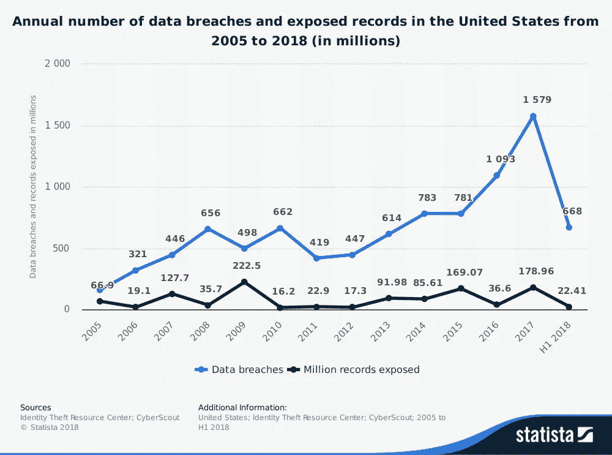

# 令牌化与加密:选择时需要知道的事情

> 原文：<https://medium.com/hackernoon/tokenization-vs-encryption-things-you-need-to-know-to-choose-1555988a5aeb>

没有保护层，数据就无法传输，我们今天面临的安全威胁实在太多了。虽然数据加密可以提供强大的保护，但加密并不是万无一失的，企业可能需要额外的安全措施。让我们比较一下令牌化和加密，看看哪种方法能够更好地满足您的数据保护需求。

Statista 表示，从 2005 年到 2018 年上半年，美国的数据泄露次数达到 668 次，超过 2200 万条记录被泄露。

根据 Gartner 的调查，35%的组织目前使用多种数据安全工具，到 2020 年，这一比例将上升至 60%。其中一个工具是[数据令牌化](https://eleks.com/blog/benefits-data-tokenization-highly-regulated-industries/?utm_source=medium&utm_medium=refferal&utm_campaign=Republ-Encryption-Blog)。虽然令牌化通常比加密更安全，但它并不总是答案。让我们回顾一下令牌化与加密的优势和弱点，看看哪一种最适合您的组织。

# 加密和令牌化的区别

数据加密是一种常见的工具，已经成功使用了几十年，但事实上，它在设计上是可逆的，这使得数据加密成为一种脆弱的选择。因此，根据普华永道为 PCI 进行的调查，令牌化已经成为受监管行业用来确保信息安全的顶级技术之一[。](https://www.bankinfosecurity.com/bankinfosecuritycom-interviews-alan-paller-a-1809)

然而，为了理解为什么数据令牌化在某些情况下是更好的解决方案，我们必须首先澄清加密和令牌化之间的区别。

# 加密

数据加密是使用与唯一代码相结合的算法将数据转换成与原始数据不相似的形式的过程，并且在缺少唯一代码或解密密钥的情况下没有任何意义。

如果:解密密钥被盗，或者通过暴力尝试发现加密密钥，加密可能被逆转，数据可能被泄露。加密数据的脆弱性就在于此:实际的数据仍然被传输，并且可能被确定的参与者非法泄露。

# 标记化

数据标记化采用了不同的方法。任何高度敏感的数据(如信用卡号)都被替换为一个令牌，该令牌唯一地标识数据而不包含敏感信息。

令牌没有内在的价值或意义，但它允许交易发生，因为令牌映射到敏感数据，而敏感数据本身保持安全存储，不被传输。然而，令牌化可能是资源密集型的，并且存在数据加密所没有的实际障碍。

# 这取决于您的用例

由于令牌化避免了敏感数据的传输，因此它是加密的更安全的替代方案，但令牌化不适合非结构化数据或大量数据。

## 何时考虑加密

数据加密可以有效地对大量数据应用保护层，而不会妨碍数据传输或接收者的访问。事实上，对于许多一般的数据保护用例，数据加密提供了便利性、实用性和安全性的最佳组合。考虑加密用于:

*   **非结构化数据，大量数据**:当您的企业传输大量数据(如图像或视频镜头)时，数据加密可以提供有效的保护，而不会产生大量成本。同样，当数据缺少令牌关联加密所需的结构类型(ID 号、信用卡详细信息等)时，加密是一种合适的替代方法。
*   **降低合规要求**。有些数据需要像 Fort Knox 一样的保护，而 PCI 合规性和 HIPAA 等法规要求采取相应的保护措施。其他数据集只需要足够的保护，相关的减少了数据盗窃的动机。在这些情况下，加密是最具成本效益的保护措施。

## 在这里，标记化是答案

某些数据集(如信用卡信息)会带来数据被盗的风险，因此最好不要传输实际数据，而是对其进行标记。在下列情况下，标记化可能是一个很好的选择:

*   **非常严格的合规要求**。在法规遵从性要求确实繁重的地方(想想 PCI DSS ),最好根本不要处理底层数据。令牌化提供了在不处理数据的情况下进行交易的机会，从而限制了您对法规遵从性要求的暴露。
*   **结构化数据**。安全收益和相关的努力总是需要权衡。然而，当数据具有可预测的结构时，标记化变得更容易应用。如果您的数据高度结构化，请考虑标记化。
*   **现有用途已被证明**。虽然数据加密是标准化的且易于应用，但使用令牌化的数据安全需要对系统和程序进行更广泛的重新思考。然而，在令牌化已经被证明有效的地方，您的企业可以采用已建立的实践来享受同样的安全优势。例如，令牌化已经是一种非常流行的保护支付信息的方式。

# 在加密和令牌化之间选择

加密和令牌化之间的选择并不总是简单明了的。此外，企业可能会对采用标记化犹豫不决:就像[区块链](https://eleks.com/expertise/blockchain-technology/?utm_source=medium&utm_medium=refferal&utm_campaign=Republ-Encryption-Blog)一样，标记化是一个尚未完全理解的新概念。对于决心发现数据令牌化好处的企业来说[，承担感知到的风险可能会带来巨大的安全回报](https://eleks.com/whitepapers/risks-and-rewards-of-blockchain-adoption/?utm_source=medium&utm_medium=refferal&utm_campaign=Republ-Encryption-Blog)。

让我们讨论一下您的安全需求，并找到一种最佳方法来确保您的数据受到保护。[联系我们](https://eleks.com/contact-us/?utm_source=medium&utm_medium=refferal&utm_campaign=Republ-Encryption-Blog)。

*原载于 2018 年 8 月 23 日*[*eleks.com*](https://eleks.com/blog/tokenization-vs-encryption-things-you-need-to-know/?utm_source=medium&utm_medium=refferal&utm_campaign=Republ-Encryption-Blog)*。*