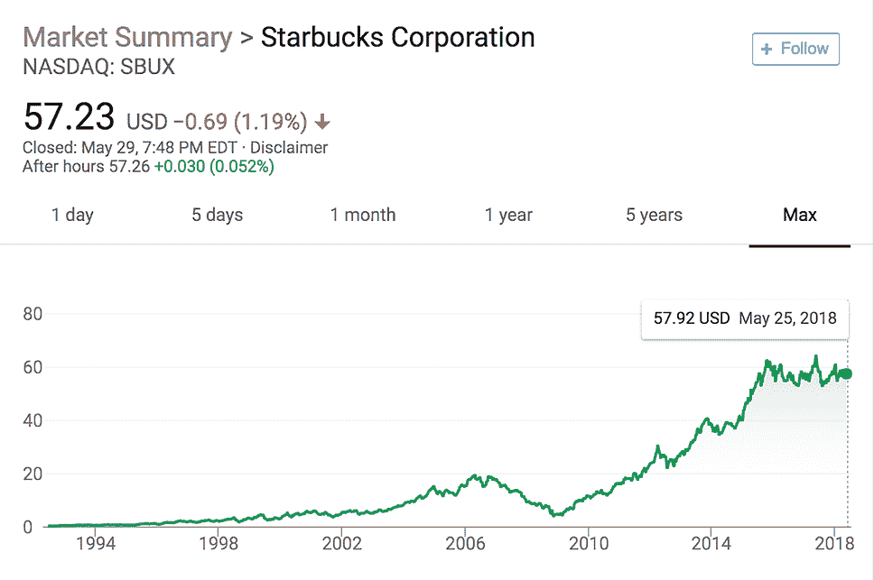
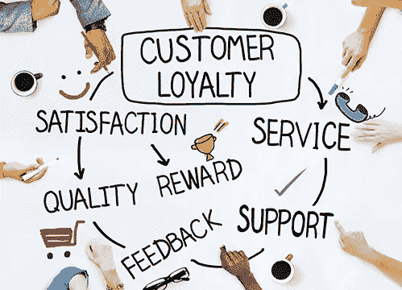

# 令牌化世界:如果我不喝咖啡，为什么我会持有星巴克的股票？

> 原文：<https://medium.com/hackernoon/tokenize-the-world-why-do-i-own-starbucks-stock-if-i-dont-drink-coffee-912301a287e9>

***星巴克在租我***

我从来没有喝过咖啡。一个都没有。事实上，我去星巴克的唯一一次是用他们的洗手间或者他们的无线网络。不用说，我不是星巴克的盈利客户，也不是他们“社区”中有价值的一员。

*然而，在过去十年的大部分时间里，我个人一直持有星巴克(SBUX)的股票。*

理论上，我接受的金融分析师培训使我有能力确定像星巴克这样的公司的价值，即使我不是他们产品的消费者。作为一项投资，你可以说这个决定是有意义的(就像过去十年里的任何股票购买一样)。

但在我的投资组合中，这个职位有几个重要的特点:

1.  除了金钱上的回报，我从拥有这只股票中绝对得不到任何好处
2.  星巴克从我持有他们的股票中绝对得不到任何好处，因为我既不是顾客也不是福音传播者

我的股权纯粹是第三方交易。

***激励不匹配***

股东和公司之间的这种利益不匹配并不是唯一的。深入观察我的个人股票投资组合，我持有的大多数公司都不是我以任何方式关心的产品或公司。我对他们中的大多数人没有个人依恋或忠诚，我不在社交媒体上关注他们或与其他利益相关者接触，我不做任何事情来影响我的财务股份的结果。

相反，不幸的是，我在我每天/每周实际使用的任何产品、服务或资产中都没有经济利益，尽管我对这些产品有真正的热情和情感依恋。这些公司和服务绝对会受益于我在他们的成功中的经济利益，这将导致我更进一步地传播福音，并比我已经做的更多地利用他们的服务。同样，我将从拥有我积极帮助成长的公司的股份中获得经济和心理上的好处。常客里程和忠诚度奖励接近达到这种效果(我尽可能经常乘坐达美航空公司的航班以赚取里程，我在全食超市和亚马逊购物以获得信用卡返现)。但那些项目只给我提供了很少的个人储蓄，我的回报与公司本身的成功无关。而所有权股份将激励我不仅仅关注自己的使用。

看看我上周末周六的实际日程安排:

*   我和妻子带着孩子在 [Gulp](http://playavista.gulpbrewco.com/) 吃早餐，这是我们最喜欢的当地餐馆之一(私营)
*   我们在公园玩耍(没有所有权)
*   我们给孩子们做了 Nutella(私人拥有)和果冻三明治，午餐是海盗战利品(B&G 食品)
*   我们把两个孩子塞进我的大众帕萨特(在美国只作为 ADR 上市的股票)里，听着由 [Music Together](https://www.musictogether.com/about) 提供的“Hello Everybody”儿童 CD(这家私营公司为我女儿提供音乐课程，我们也为其付费)
*   我们带孩子们去了他们最喜欢的室内攀岩场， [Sender One 攀岩](https://www.senderoneclimbing.com/lax/)(私人所有)
*   我们回到家，看了一部关于丛林动物的[地球 II](https://en.wikipedia.org/wiki/Planet_Earth_II) 纪录片(BBC 纪录片，私人资助)
*   我们在 Ipad 上玩 Osmo(Osmo 由风险投资[资助](https://www.crunchbase.com/organization/osmo))
*   孩子们睡着后，我和妻子开了一瓶黑皮诺葡萄酒，这是我们最喜欢的葡萄酒之一(私人拥有)

我愉快地花钱购买各种产品和服务，以便与世界上我最喜欢的人一起享受 13 个小时的一天，同时做我们最喜欢的活动。我们在没有金钱回报的情况下获得了无法估量的快乐。与此同时，在我们冒险的每一个角落，其他人都在星巴克喝咖啡，潜在地影响着我的财务前景。这是一个完全失败的经济激励。

**用区块链标记世界**

我最喜欢的概念之一诞生于[区块链](https://hackernoon.com/tagged/blockchain) [技术](https://hackernoon.com/tagged/technology)的出现，那就是“[标记世界](https://www.nasdaq.com/article/how-tokenization-is-putting-real-world-assets-on-blockchains-cm767952)的想法。对于那些不熟悉的人来说，令牌化本质上创造了实物资产的部分所有权，这些实物资产可以通过区块链上的令牌在交易所自由交易。通常，这些代币中写入了被称为智能合约的代码，用于确定法律和货币权利。

有一个学派认为，所有的资产、服务和业务最终都会被令牌化。[优势是不可否认的](/@apompliano/the-official-guide-to-tokenized-securities-44e8342bb24f):较低的费用、部分所有权、更快的交易执行、自由的市场敞口、更大的投资者基础等。 ***但也许最重要的是，它将企业主与他们的客户联系起来。*** 这与我们已经看到的 ico 没有什么不同。ICO 投资者向公司提供资金来制造投资者自己最终想要利用的产品，从而有可能给投资者带来经济回报(因为对服务的需求增加会导致代币价值增加)和情感回报(从使用技术中获得的积极效用)。公司正在利用他们的热情用户社区来资助他们公司的发展。

回顾过去的这个周六，我很乐意将我的情感回报与潜在的经济回报结合起来。不幸的是，我一天中使用的每一种产品或服务要么是我完全无法投资的，要么要求我购买大型企业集团的股票，这些企业集团没有将我真正关心的产品/服务分离出来。不过，很快有一天，通过令牌化，这些公司将能够直接向我出售所有权股份，或者我将能够在发现它们的服务后随时在交易所购买股份。事实上，这些公司可能要求我拥有股份(代币)才能使用他们的服务。我将能够创建一个模拟我实际生活的投资组合，并成为不同社区的一员，这些社区是围绕着对这些公司的共同兴趣而建立的。

在那之前，如果有人停止喝咖啡，请提醒我。

> 有关投资 Arca 或 Arca 基金的更多信息，合格投资者和合格机构买家可以通过 [**点击此处**](https://arca.vosterra.com/referrals/3A3HFrBZQKU) 访问我们的私人投资者门户网站。

*免责声明:本评论仅作为一般信息提供，绝不作为投资建议、投资研究、研究报告或建议。对本评论中讨论的证券进行投资或采取任何其他行动的任何决定可能涉及本文未讨论的风险，此类决定不应仅基于本文包含的信息。*

本沟通中的陈述可能包括前瞻性信息和/或可能基于各种假设。此处表达的前瞻性陈述和其他观点或意见是在本出版物发布之日做出的。实际的未来结果或事件可能与预期的有很大不同，并且不能保证任何特定的结果会发生。本文中的陈述可能会随时更改。Arca Funds 不承担更新或修改此处表达的任何声明或观点的任何义务。

*在考虑本注释中包含的任何绩效信息时，应注意过去的绩效并不能保证将来的结果，也不能保证将来的结果会实现。此处提供的部分或全部信息可能是或基于观点陈述。此外，此处提供的某些信息可能基于第三方来源，这些信息虽然被认为是准确的，但尚未经过独立验证。Arca 基金和/或其某些分支机构和/或客户持有并且将来可能持有与本评论中讨论的证券相同或基本相似的证券的财务权益。对于此类金融权益的盈利能力，无论是现在、过去还是将来，都不做任何声明，Arca 基金和/或其客户可以随时出售此类金融权益。此处提供的信息无意也不应被解释为出售或购买任何证券的要约。本注释未经任何监管机构审核或批准，且在编制时未考虑可能收到本注释的个人的财务状况或目标。特定投资或策略的适当性将取决于投资者的个人情况和目标。*