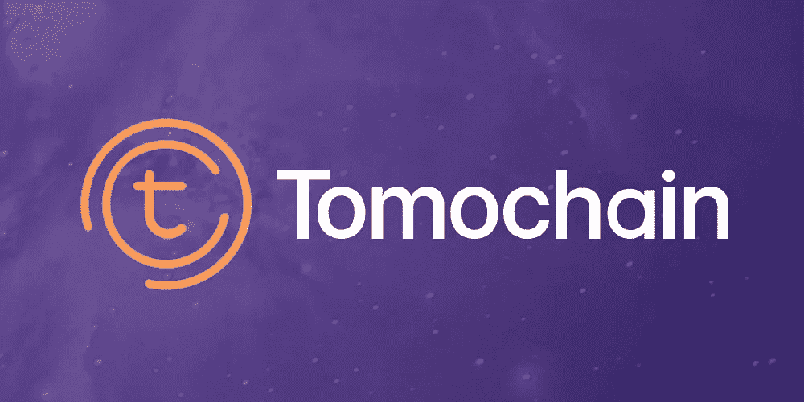

# TomoChain:区块链基础设施，用于分散应用、令牌发放和集成

> 原文：<https://medium.com/hackernoon/tomochain-blockchain-infrastructure-for-decentralized-applications-token-issuance-and-integration-d3827a4c18f1>

**TomoChain**

**价值互联网**

区块链技术的发展正在帮助开创一个互联网的新时代，即价值互联网。20 世纪 90 年代，网络的快速发展使得思想和信息的即时交流成为可能。通过在互联网上增加一层支持区块链的服务，我们的目标是实现同样高效的资产交换。然而，在这成为现实之前，还有几个技术问题需要解决。TomoChain 正试图解决这些问题。

在开发加密货币之前，所有的价值转移都必须通过银行或交易所这样的中介来完成。这个市场是巨大的。全球每年仅跨境支付总额就超过 180 万亿美元，累计成本达 1.7 万亿美元，这还不包括其他资产的转移。将这些交易转移到区块链解决方案的经济价值是巨大的。然而，当前的设置，即每个节点确认每个交易，对于处理那么多的交易来说太慢太麻烦了。为了解决这个可伸缩性问题，需要解决两个因素。

以太坊区块链目前每秒能够处理大约 15 笔交易。如果与每秒处理 45000 笔交易的 Visa 相比，很容易看出当前基础设施的局限性。此外，对以太坊区块链的任何改变都需要由天然气提供资金，这使得小额支付不可行。为了解决这些问题，TomoChain 将实施第二层解决方案，在锚定到以太坊区块链之前，所有交易都在链外处理。

TomoChain 被设计成一个公共许可链，使用符合 ERC 20 协议的智能合约与以太网挂钩。该协议将是开源的，支持每天可以处理数十亿笔交易的区块链，零费用和即时确认。这将促使第三方开发者在 TomoChain 生态系统中构建他们的应用，并发布令牌。TomoWallet 将允许作为平台一部分的代币之间以及以太坊和 TomoChain 之间的原子跨链交易。TomoCoin 将成为管理和规范这一基础设施的协议令牌。它将固定供应 1 亿个代币。

**币名:** TomoCoin (TMC)

**总供应量:** — 1 亿吨/年

**循环供应量:**5500 万托莫

市值:9610.535 万美元

**通过 ICO 筹集的代币/资金:** —代币销售于 3 月 1 日开始，价值 850 万美元

**TomoApp**

第一个利用 TomoChain 基础设施的消费者应用将是一个新的分散式社交网络，内置加密货币。最初的重点将是建立一个来自社区的问题和答案库，贡献者将获得 TomoCoin 奖励。这些都可以用于 app 本身内部的免费即时微交易。每个 Tomo 应用程序帐户都集成了自己的 TomoWallet。

发行的 TomoCoins 的 40%将用于支持开发者和早期贡献者。随着开发人员使用 TomoChain 基础设施发布他们自己的 tokess，这些 toke 将被集成到 TomoWallet 中，并可用于原子跨链交易。

**安全**

TomoApp 和 TomoWallet 都将使用分散的身份数据库，允许用户使用一个帐户登录所有应用程序。已发布的 API 将允许第三方开发者使用相同的服务。

TomoWallet 还允许用户处理来自不同区块链的多个地址。这些将使用 BIP32 和 BIP39 生成的随机密码进行加密，加密过程完全在客户端进行，以确保隐私。

TomoChain 将使用授权证明协议来快速管理大量交易，根据合作排名选择验证者。它使用 masternode 和 servicenode 模型，节点构建在多个位置，以保护数据库的不可变状态。还有一个节点保护算法，防止垃圾邮件和 51%的攻击。

**比赛**

通过区块链解决方案进行在线金融交易的可能性几乎是无限的。对于一个能够安全处理大量交易的系统来说，效率和成本节约是巨大的。Etherum 计划从其当前的工作证明系统转移到一个基于利益证明的系统，这将缓解一些问题。尽管如此，当每天处理数十亿的金融交易时，这个系统也会遇到问题。

TomoChain 的协议在一个安全的链外生态系统中使用了一个权威证明系统，该生态系统安全地连接到以太坊区块链，将能够几乎免费地处理所需数量的交易。当然，还有其他公司试图做同样的事情，如 Steem，Kin 和 OmiseGo。他们都使用略有不同的方法来实现相同的目标。无论哪种生态系统成为在线金融交易的首选平台，都将获得巨大的好处，它们的价值可能会大幅升值。

**社交媒体**

***脸书***

网址:——[https://www.facebook.com/tomocoin](https://www.facebook.com/tomocoin)

喜欢: **6893**

最近 7 天有多少帖子/更新: **2** *帖子*

***碎碎念***

网址:——[https://twitter.com/TomoCoin_io](https://twitter.com/TomoCoin_io)

追随者: **7456** 追随者*追随者*

过去 7 天有多少条推文/转发: **3 条** *条*

***电报***

网址:——[https://t.me/tomocoin](https://t.me/tomocoin)

用户:**16711**成员

**讨论**

**Reddit**

网址:——[https://www.reddit.com/r/Tomochain/](https://www.reddit.com/r/Tomochain/)

**485** 读者:*读者*

***Youtube***

网址:——[https://www.youtube.com/channel/UCXZ2rmjM84qS80RCj6vQ1gw](https://www.youtube.com/channel/UCXZ2rmjM84qS80RCj6vQ1gw)

订户: **145** *订户*

***中等***

网址:——[https://medium.com/tomocoin](https://medium.com/tomocoin)

追随者:**379**追随者

***LinkedIn***

网址:[https://www.linkedin.com/company/tomochain/](https://www.linkedin.com/company/tomochain/)

跟随者:**41**68】跟随者

最近 7 天有多少更新:**0**帖子

***钢锤***

追随者: **—** *追随者*

过去 7 天有多少更新:—

**GitHub**

网址:——[https://github.com/TOMOAPP](https://github.com/TOMOAPP)

最近 7 天有多少更新: **5+** *帖子*

**员工/团队信息:**

名称:**龙凤**

头衔:**创始人&项目负责人**

简历:Tomochain 首席执行官和 Tomo app 创始人，非常成功的 New 区块链(新经济运动)的联合创始人和前项目负责人。经济学博士候选人。

领英:——[https://www.linkedin.com/in/longvuong22](https://www.linkedin.com/in/longvuong22)

额外链接:——[https://twitter.com/longvuong22](https://twitter.com/longvuong22)

姓名:**子阮**

头衔: **CTO**

简历:Tomo app 工程总监。Son 是一位经验丰富、成就卓著的技术领导者，是区块链开发团队的创始人，该团队拥有 800 多名活跃成员。工程硕士学位。

领英:——[https://www.linkedin.com/in/thanhson1085](https://www.linkedin.com/in/thanhson1085)

额外链接:——[https://github.com/thanhson1085](https://github.com/thanhson1085)

姓名:**敏珠**

题目:**区块链和云引领**

bio:—VC Cloud 首席云架构师—东南亚最大的“AWS like”本地云服务之一。Minh 拥有深厚的技术研究专业知识，是一名安全专家。

领英:——[https://www.linkedin.com/in/chu-duc-minh-1773a229/](https://www.linkedin.com/in/chu-duc-minh-1773a229/)

额外链接:——[https://twitter.com/minhcd](https://twitter.com/minhcd)

名称:**东皇**

头衔: **PM &联合创始人**

简历:Tomo app 联合创始人。产品经理，前端工程师，开源贡献者。Tung 是一位多才多艺的工程师，他几乎能在最短的时间内完成所有的工作。

领英:——[https://www.linkedin.com/in/tung-hoang-719b4657/](https://www.linkedin.com/in/tung-hoang-719b4657/)

额外链接:——[https://github.com/tunght91](https://github.com/tunght91)

名称:**多齿雄蛛**

头衔:**CryptXO 投资公司的联合创始人**

简历:CryptXO 投资/交易集团的联合创始人，自 2011 年以来一直参与比特币和加密货币的加密货币资深人士。在他的祖国希腊和欧洲，他是一位著名的天使投资人和慈善家。

LinkedIn:—[https://www . LinkedIn . com/in/crypt-XO-androklis-polymenis-6a 7137 b 2/](https://www.linkedin.com/in/crypt-xo-androklis-polymenis-6a7137b2/)

姓名:**金玟**

头衔:**Bee Token 的业务开发主管**

简历:Blocultural Studios 的创始人，Bee Token 的 BD 主管。之前是思域的参谋长，曾与 Tim Draper 在区块链计划的公关和营销方面共事。

领英:——[https://www.linkedin.com/in/minkimd14/](https://www.linkedin.com/in/minkimd14/)

姓名:**林伟杰**

头衔:**Qlink 基金会董事**

简历:Qlink 基金会主任。Bluzelle、SelfKey、The Key、Coinfi、福尔图娜首都 Jet8 的顾问。一位经验丰富的区块链投资者，一位成功的企业家，他创建并发展了云托管公司 WebVision。

领英:——[https://www.linkedin.com/in/limroger/](https://www.linkedin.com/in/limroger/)

姓名:**偶然杜**

头衔:**Coefficient Ventures 的普通合伙人**

简历:Coefficient Ventures 的普通合伙人，Protocol Lab 和 Atrium LTS 的投资者，炼金术士加速器的导师。

领英:——[https://www.linkedin.com/in/chancejdu/](https://www.linkedin.com/in/chancejdu/)

姓名:**谢卡尔·布桑纳瓦**

头衔:**美达金融科技总经理**

简历。Shekhar 是 Meed Fintech 的总经理和 Timo bank 的业务开发总监，他来自印度，在业务开发、合作伙伴关系、营销和金融技术领域拥有 30 多年的经验。

领英:——[https://www.linkedin.com/in/shekharbhusannavar/](https://www.linkedin.com/in/shekharbhusannavar/)

名字:**安托万·c·纳贾林**

职位:**devery . io 的战略和运营主管**

Bio : —产品验证平台 Devery.io 的战略和运营主管。具有与澳大利亚州政府合作经验的律师，曾师从著名的智能合同安全专家 Bok Khoo。

领英:——[https://www.linkedin.com/in/antoine-najjarin-904828b5/](https://www.linkedin.com/in/antoine-najjarin-904828b5/)

名称:**何乐**

头衔:**投资银行总监**

bio:—CFA 特许持有人，在投资和金融领域拥有 10 年以上的经验。BVIM 前高级投资经理。HSC 证券公司投资银行部总监。

LinkedIn:——[https://www.linkedin.com/in/le-ho-cfa-55922055/](https://www.linkedin.com/in/le-ho-cfa-55922055/)

姓名:**黄阮**

头衔:**wet rust . io 的联合创始人兼研发副总裁&**

简历。WeTrust.io 的 R&D 副总裁，这是一个金融产品的分散平台。目前领导 WeTrust 的工程团队，由著名的区块链科学家担任顾问，如 BitGo 工程主管 Emin Gun Sirer 教授、Benedict Chan 和以太坊创始人 Vitalik Buterin。

领英:——[https://www.linkedin.com/in/hoang-nguyen-a493b158/](https://www.linkedin.com/in/hoang-nguyen-a493b158/)

**公司地址:**

Tomochain 私人有限公司。有限公司（Limited 的缩写）

新加坡总部

安森路 22-15 号 10 号

国际广场

新加坡 079903