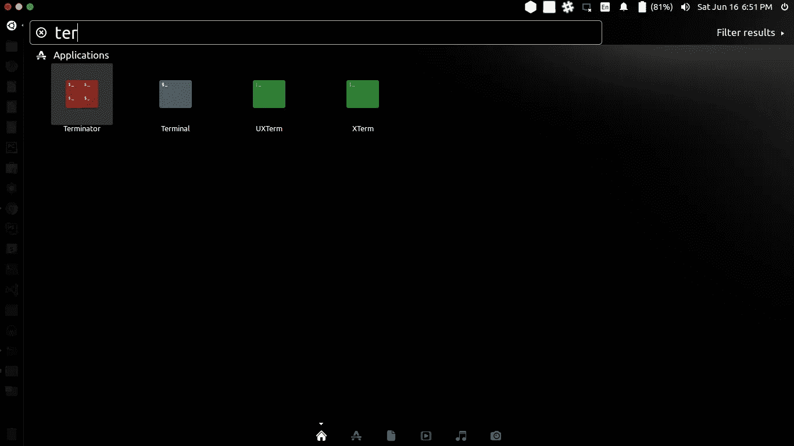

# 太多的终端窗口，找不到什么是什么，那么使用终结者

> 原文：<https://medium.com/hackernoon/too-many-terminal-windows-and-cant-find-what-s-what-aea26363c0ef>


如果你在 Linux 发行版或 mac 上工作，你可能会遇到这样的问题:你打开了太多的终端，却不知道什么在做什么。这是因为你不能很好地按照你的意愿分割终端，也不能给你的终端命名。当我不得不使用几个服务器时，我就遇到了这个问题。我不得不打开 4 个以上的终端窗口来连接不同的服务器实例，并且发现在它们之间切换时非常困难。我也没有办法重命名我的终端窗口来识别它们。

然后我发现了这个解决方案，它真的很棒，我想与你们分享，我知道它对你们也有一定的帮助。

# 是终结者。

是的，应用程序的名字是终结者。


Ubuntu 安装

```
sudo add-apt-repository ppa:gnome-terminator
sudo apt-get update
sudo apt-get install terminator
```

然后搜索终结者 app



这就是它的魔力


您可以右键单击终端并选择水平或垂直分割选项。您也可以双击任何终端标题栏，并根据您的意愿重命名。

希望这些微小的信息能帮助你们管理你们的终端。

干杯！！！！