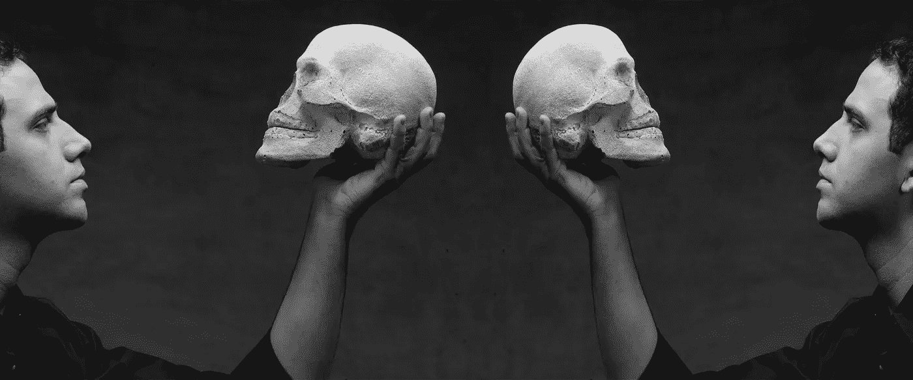

# 资本太多还是太少，这是个问题

> 原文：<https://medium.com/hackernoon/too-much-capital-or-less-capital-that-is-the-question-782cb562cf1f>

有如此多的企业家和创始人认为注入更多的资本意味着更多的成功，但这根本不是真的。筹集更多资本的竞赛导致贪婪，如果你没有方向，这不会有好结果。

另一方面，如果你的重点是获得更少的资本，这不仅会让你成为一名企业家，还能让你的企业成长。这个案例中最突出的例子是 **Zappos** 和 **Wayfair** 。

**资本高效的重要性**

风投界的每个人都知道 Zappos 的成功。他们从市场上一些最好的风险投资家那里获得投资，并通过非正统的方法做大。该公司后来以 8.5 亿至 12 亿美元的价格被出售给亚马逊，其中创始人获得了 2.14 亿至 3.67 亿美元。

Wayfair 展示了电子商务成功的一个更好的例子。这是史蒂夫·科宁和尼拉杰·沙阿的创意。他们没有筹集外部资本，而是将自己的想法付诸实践，并将其转化为成功的业务。他们购买了大量 SEO 友好的网址，产生了巨大的流量，并针对谷歌的算法进行了优化。它从一开始就开始赚钱，尽管风险投资家提出了许多提议，但他们拒绝了所有提议，直到收入达到 5 亿美元。

2014 年，Wayfair 在纽约证券交易所进行了首次公开募股(IPO)。事实上，它的每个合伙人赚的钱和 Zappos 所有股东赚的一样多。他们成功的秘诀是资本高效的企业。当他们的公司变得有价值时，他们才从外部筹集资金。

Wayfair 的联合创始人赚的钱是 Zappos 创始人的 10 倍。

**开始时限制募集资金**

虽然，有些人可能会把 Wayfair 的成功与家具市场的规模联系起来，但是，考虑到低廉的运输成本，重复的顾客等，鞋类市场基本上是一个更好的选择。

毫无疑问，行业动态也有助于公司的成功，但 Wayfair 通过采用有效的资本战略而变得强大。他们在开始时没有筹集任何资本，也没有要求资本来加速早期增长，尽管有风险资本家的提议。

他们唯一一次寻求外部资本是在他们想要大规模扩张的时候。他们毫不犹豫地拿走了巨额资金，收集的金额比 Zappos 高三倍。然而，只有当企业已经建立了自己的名字，稀释程度最小，并能产生巨额利润时，他们才会去做。

**为什么你应该晚一点而不是早一点获得资金？**

这是最重要的问题之一。从以上两种情况来看，很明显，Wayfair 比 Zappos 赚了更多的钱。Zappos 的创始人谢家华表示，由于股东施加的压力，他将公司卖给了亚马逊。尽管赚了很多钱，但屈服于几年前做出的财务决策是相当令人沮丧的。如果谢霆锋对决策过程有更多的控制权，他可能会像 Wayfair 一样成功。

在首次公开募股时，Wayfair 创始人拥有超过 50%的业务，并设法以自己的方式筹集资金，几乎没有稀释。这使他们能够对财务决策行使更多的控制权，这也反映在成功上。

**过度投资导致有限的可选性**

当需要做出财务决策时，资本过剩的企业通常会有两种选择:

*   拿几百万美元投资失败
*   为风险资本家赚钱，或者破产并解雇你的整个团队

但另一方面，Wayfair 由于其创始人的精益融资策略而赚了很多钱。这也使他们能够保留他们的*选择权*。这让他们可以根据自己的风险偏好或业务表现，而不是资本结构来选择出售。仅仅因为你已经成为一家价值数百万美元的[创业公司](https://hackernoon.com/tagged/startup)，并不意味着你不应该继续融资。

重要的是要明白，筹集太多资金有其不利之处。因此，应该采用有效的决策来明智地花钱。