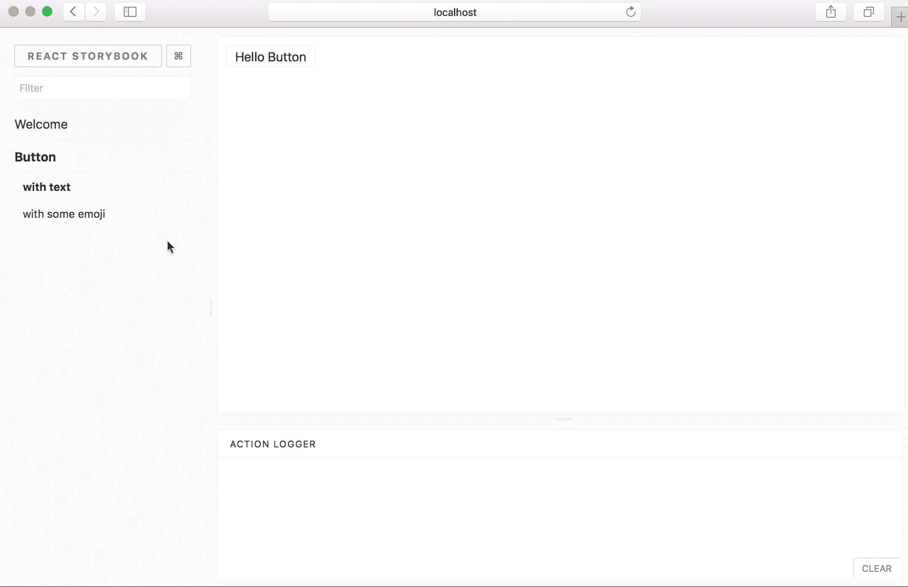
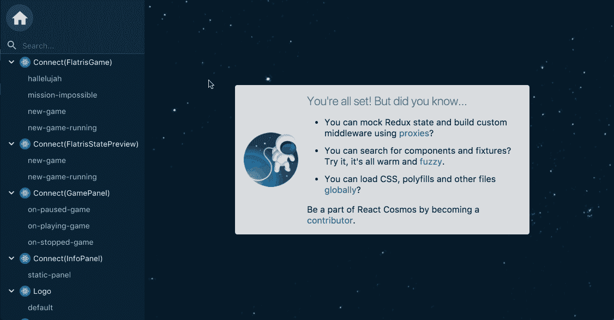
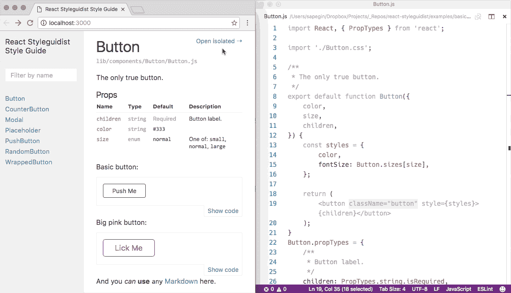
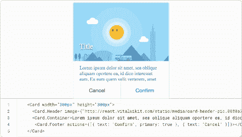
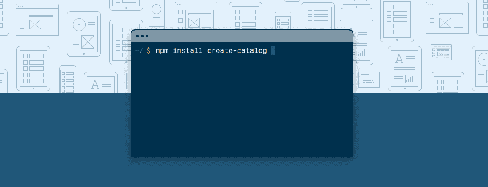

# 在组件开发中需要使用的 React 工具

> 原文：<https://medium.com/hackernoon/tools-you-need-to-use-in-your-react-components-development-26c3de4f81d2>

Photo by [Fleur Treurniet](https://unsplash.com/photos/dQf7RZhMOJU?utm_source=unsplash&utm_medium=referral&utm_content=creditCopyText) on [Unsplash](https://unsplash.com/search/photos/tools?utm_source=unsplash&utm_medium=referral&utm_content=creditCopyText)

作为一名 react 开发人员，我相信从事 react 项目的每个人都必须单独开发所有组件，以便利用这个令人惊叹的前端框架背后的组件哲学。

单独开发组件可以帮助您获得对项目工作流的控制，这允许您首先开发和测试每个组件，而不必担心整个项目逻辑，不仅如此，通过这种方法，您可以提高组件的重用性、可测试性和开发速度，这将简化团队内的组织和任务分配。

如果这是你第一次听说 storybook 或 react styleguidist，那么这篇文章是你最好的起点，但是如果你已经听说过它或者可能使用过它，那么这篇文章对于了解一些令人惊奇的 storybook 替代品也是非常有帮助的。

> 让我们开始吧。

## [故事书](https://storybook.js.org/) : (21K 颗星星)

[Storybook](https://storybook.js.org/) demo

构建组件的最著名和最强大的 react 工具之一，在 GitHub 中被描述为支持 react、react-native、vue 和 angular 的交互式 UI 组件开发和测试。换句话说，storybook 是 UI 组件的开发环境。它允许您浏览所有组件项目，并查看每个组件的不同状态。Storybook 附带了许多组件设计、文档、测试等附加组件。例如，您可以使用故事书道具附加组件轻松地玩您的组件道具。

您可以使用 storybook-preview 和 storybook-deploy 将您的故事生成并部署为一个文档静态网站。

## [反应宇宙](https://github.com/react-cosmos/react-cosmos) : (4k 启动)

[React Cosmos](https://github.com/react-cosmos/react-cosmos) demo

Cosmos 扫描您项目中的组件，并允许您在任何道具、上下文和状态的组合下呈现组件。这意味着如果你已经开始了你的项目，你需要在不失去理智的情况下给你的组件添加新的功能。Cosmos 将模仿每一个外部依赖，比如 rest API 或本地存储。此外，在与正在运行的实例交互时，您可以看到状态的实时演变，为了处理所有这些特性，Cosmos 使用了 fixture 和 proxy 架构。

## [React Styleguidist](https://github.com/styleguidist/react-styleguidist) : (4k 星)

[React Styleguidist](https://github.com/styleguidist/react-styleguidist) demo

React Styleguidist 是一个组件开发环境，带有热重装开发服务器和一个生活方式指南，您可以与您的团队共享。它列出了组件原型，并显示了基于 Markdown 文件的实时、可编辑的使用示例，它可以与 react create 应用程序一起使用。

[**钻头**](https://bitsrc.io/) (1.5k 颗)

Bit demo

Bit 是一个工具构建，用于在不同的项目和应用程序之间共享组件，同时从不同的地方同时开发它们。使用 Bit，您可以直接从任何现有的存储库中共享组件，而无需重构它，组织一个可发现的团队组件库(包括实时渲染、测试结果等)，并使它们可用于您团队的所有不同项目。共享组件来构建多个应用程序有助于加快开发过程，并简化组件的组织和维护。(感谢乔纳森·萨林

## [星表](https://catalog.style/) : (500 颗星星)

Catalog demo

目录是为数字产品创建生活方式指南的工具。它在一个地方将设计文档和资产与真实的组件结合在一起。我认为，当你需要在你的 markdown 页面中展示你的系统设计颜色、排版、音频、视频，当然还有你的 react 组件，以及更多具有多种屏幕尺寸选项的内容时，这个工具会更加强大。

还有其他工具像[atelier](https://github.com/scup/atellier)、[全权委托](https://github.com/carteb/carte-blanche)、 [React BlueKit](http://bluekit.blueberry.io/) 、 [React Cards](https://github.com/steos/reactcards) 、 [React-demo](https://github.com/rpominov/react-demo) 。

如果我缺少好的工具，请在评论中与我们分享。如果你正在使用任何工具，让我知道你的反馈和你的经验？

## 阅读我的订阅源

 [## reactjs-popup 简介🎉—反应弹出窗口、模态、工具提示和菜单—全部在一个中

### 这篇文章是关于给你一个简单的概述，你可以用 react 弹出窗口做什么，以及如何有效地使用它。

hackernoon.com](https://hackernoon.com/introducing-reactjs-popup-modals-tooltips-and-menus-all-in-one-227de37766fa) 

感谢阅读！如果你认为其他人应该阅读这篇文章并使用这个组件，请为我鼓掌，发微博并分享这篇文章。

记得在 Medium 上关注我，这样你就可以得到关于我未来帖子的通知。